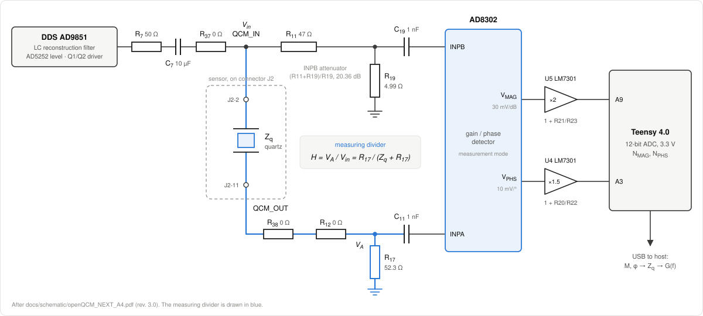
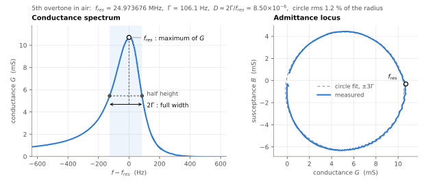
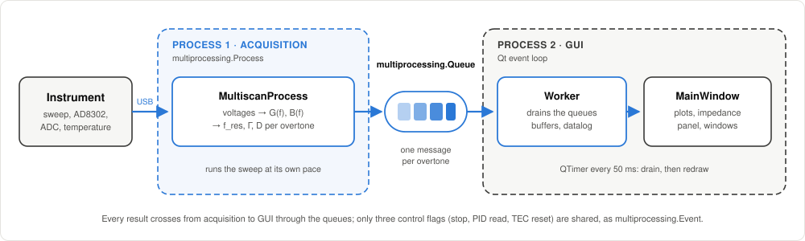
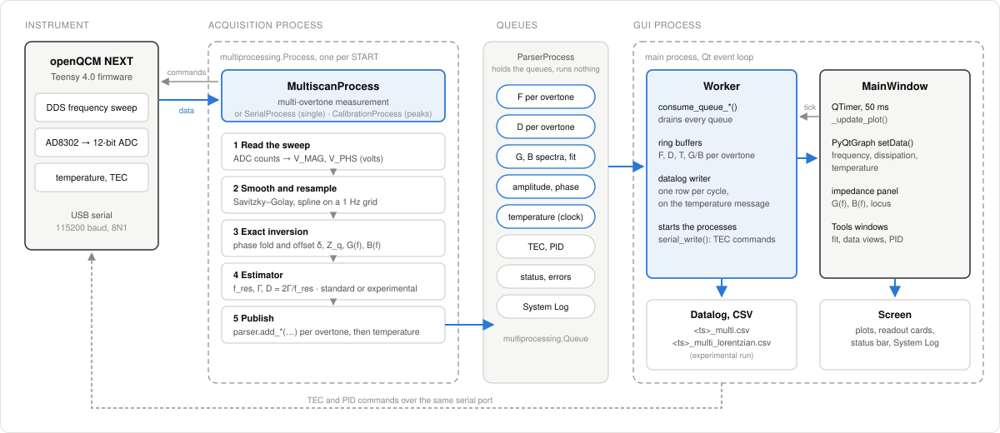

# openQCM NEXT

**Real-time Python GUI software for the openQCM NEXT Quartz Crystal Microbalance with Dissipation monitoring**

[](https://www.gnu.org/licenses/gpl-3.0)
[](https://www.python.org/)
[]()

An open-source Python application to display, process, and store data in real-time from the openQCM NEXT Quartz Crystal Microbalance with Dissipation monitoring. The software tracks resonance frequency and dissipation variations through real-time analysis of the resonance curve, driving a **Teensy 4.0** microcontroller and an **AD8302** gain/phase detector over USB.

> This repository is a monorepo (software + firmware + docs) with a **reconstructed development history**: the chronology is expressed through commits and tags.

---

## Table of Contents

- [About QCM Technology](#about-qcm-technology)
- [Impedance Measurement Method](#impedance-measurement-method)
- [Quick Start](#quick-start)
- [Features](#features)
  - [Acquisition and Operating Modes](#acquisition-and-operating-modes)
  - [Visualization and Analysis](#visualization-and-analysis)
  - [Hardware Integration](#hardware-integration)
  - [User Interface](#user-interface)
- [Installation](#installation)
- [Usage](#usage)
- [Repository Structure](#repository-structure)
- [Architecture](#architecture)
- [Branches and Version History](#branches-and-version-history)
- [Roadmap](#roadmap)
- [License](#license)
- [Acknowledgements](#acknowledgements)
- [Links](#links)

---

## About QCM Technology

A **Quartz Crystal Microbalance (QCM)** measures mass changes and material properties at the nanoscale by monitoring the oscillation of a quartz crystal. When mass is deposited on the crystal surface, the resonance frequency shifts; by tracking frequency and dissipation simultaneously, the technique reveals both the amount of adsorbed material and its viscoelastic properties at the molecular scale.

**[openQCM](https://openqcm.com/)** is an open-hardware initiative — powered by Novaetech S.r.l. — built on the principle that high-quality research does not require expensive proprietary instruments.

**openQCM NEXT** is a QCM instrument for frequency and dissipation monitoring with multiple-overtone support (fundamental and n = 3, 5, 7, 9). It couples an **AD8302** RF/IF gain and phase detector with a frequency sweep driven by a **Teensy 4.0** microcontroller, and connects to the host over a plug-and-play USB serial link. Applications include protein biosensing, bacteria detection, drug discovery, material science, environmental monitoring, and electrochemistry.

---

## Impedance Measurement Method

On the `impedance-analysis` branch, the resonance frequency and the dissipation come from the
crystal's **electrical admittance**. The firmware, the sweep and the serial protocol are the same as on
`main`. The conversion from the two AD8302 voltages to the logged f and D is software only.

### The measuring divider

The crystal impedance $Z_q$ and the resistor $R_{17} = 52.3\ \Omega$ to ground form the measuring
divider, shown in blue in the figure. The AD8302 compares the two ends of the divider, each through a
1 nF DC-blocking capacitor:

- **INPA** reads the node $V_A$ between the crystal and $R_{17}$.
- **INPB** reads the drive voltage $V_{in}$ through the $R_{11}/R_{19}$ attenuator, so it sees
  $V_{in}/K$ with $K = (R_{11}+R_{19})/R_{19} = 10.42$ (20.36 dB).

<p align="center">
  
</p>

The circuit is drawn after [`docs/schematic/openQCM_NEXT_A4.pdf`](docs/schematic/openQCM_NEXT_A4.pdf)
(rev. 3.0).

### AD8302 output characteristics

The AD8302 works in measurement mode: VMAG is tied to MSET and VPHS to PSET. Its two outputs are then
(Analog Devices, *AD8302 LF–2.7 GHz RF/IF Gain and Phase Detector*, rev. B, eq. 8a and 9;
[`docs/datasheet/ad8302.pdf`](docs/datasheet/ad8302.pdf)):

$$
V_{MAG} = 30\ \text{mV/dB} \cdot 20\log_{10}\left(\frac{V_{INPA}}{V_{INPB}}\right) + V_{CP}
$$

$$
V_{PHS} = -10\ \text{mV/deg} \cdot \left(|\phi_{meas}| - 90^\circ\right) + V_{CP}
$$

Here $V_{CP} = 0.9\ \text{V}$ is the centre point, and $\phi_{meas}$ is the phase difference between the
two inputs. The phase output gives only its **absolute value**.

The two outputs reach the 12-bit ADC of the Teensy 4.0 (3.3 V) through two non-inverting stages: ×2 on
V_MAG (pin A9) and ×1.5 on V_PHS (pin A3). The firmware averages 500 readings per channel at each
frequency point (since `0.1.5d` the two sums restart from zero at every point; up to `0.1.5c` each
point carried 1/500 of the previous one, +0.2 % on the counts). The software converts the counts back
to the detector's voltages and removes the attenuator from V_MAG:

$$
V_{MAG} = \frac{3.3}{4096}\,\frac{N_{MAG}}{2} - 0.6\log_{10}K,
\qquad
V_{PHS} = \frac{3.3}{4096}\,\frac{N_{PHS}}{1.5}
$$

The attenuator term is $0.6\log_{10}K = 0.61069\ \text{V}$. Both channels are then smoothed with a
Savitzky–Golay filter (51 points, order 3) and resampled on a 1 Hz grid.

### Transfer function

The divider's transfer function is

$$
H = \frac{V_A}{V_{in}} = \frac{R_{17}}{Z_q + R_{17}}
$$

Once V_MAG is corrected for the attenuator, the AD8302 measures:

- $|H|^{-1} = |Z_q + R_{17}|\,/\,R_{17}$
- $\angle H = -\angle(Z_q + R_{17})$, as an absolute value

### Exact calculation procedure

**Step 1: extract $|Z_q + R_{17}|$ from V_MAG.** From the magnitude law, $V_{MAG} = V_{CP} + 0.6\log_{10}|H|$,
so

$$
M = |Z_q + R_{17}| = R_{17} \cdot 10^{\frac{V_{CP} - V_{MAG}}{0.6}}
$$

The 0.6 is 20 × 30 mV/dB, the detector's volts per decade. It is not the attenuator.

**Step 2: extract the phase from V_PHS.** The reading is

$$
\phi_{meas} = \frac{V_{CP} - V_{PHS}}{0.01} + 90^\circ \quad \text{[degrees]}
$$

This is the magnitude of the phase of $H$, read with an offset of the channel:
$\phi_{meas} = |\phi| - \delta$. The phase $\phi$ is rebuilt in two steps:

- **Offset.** In air the phase crosses zero at resonance, and the reading folds into a V. At the vertex
  $\phi_{meas} = -\delta$, so the offset is measured on every sweep, $\delta = -\min\phi_{meas}$, and
  $|\phi| = \phi_{meas} + \delta$.
- **Sign.** The sign of $\phi$ is inverted beyond the vertex.

A fold is accepted only when the minimum reaches zero relative to the off-resonance baseline. On a
damped load (liquid, higher overtones) the phase never crosses zero, and the reading is used as it is.
$G$ is even in the sign of $\phi$, so only the offset matters to it. The sign matters only to $B$.

**Step 3: reconstruct $Z_q$.** Since $Z_q + R_{17} = M\,e^{-j\phi}$:

$$
R_q = M\cos\phi - R_{17}, \qquad X_q = -M\sin\phi
$$

Here $R_q$ is the resistance (real part of $Z_q$) and $X_q$ the reactance (imaginary part).

**Step 4: calculate the conductance.** $Y_q = 1/Z_q = G + jB$, with

$$
G = \frac{R_q}{R_q^2 + X_q^2}, \qquad B = \frac{-X_q}{R_q^2 + X_q^2}
$$

**Compact formula:**

$$
\boxed{G = \frac{M\cos\phi - R_{17}}{(M\cos\phi - R_{17})^2 + (M\sin\phi)^2}}
$$

where:

- $M = 52.3 \cdot 10^{(0.9 - V_{MAG})/0.6}$, with V_MAG corrected for the attenuator;
- $\phi = (0.9 - V_{PHS})/0.01 + 90^\circ + \delta$, converted to radians.

The conductance is the quantity of interest. In the Butterworth–Van Dyke model, the real part of the
motional admittance is a Lorentzian centred on the series resonance, and the locus of $Y$ is a circle
that the parallel capacitance $C_0$ only translates. Neither property holds for the magnitude channel.
Its peak lies between the series and parallel resonances and moves with $C_0$.

### Resonance frequency, bandwidth, dissipation

The terms and the definition of D follow Johannsmann, Langhoff and Leppin, *Sensors* **2021**, 21,
3490, §2. The paper writes the complex resonance frequency as $\tilde f = f_{res} + i\Gamma$.

- **Resonance frequency** $f_{res}$ is the frequency of the maximum of $G(f)$. The grid is 1 Hz,
  after Savitzky–Golay smoothing.
- **Half bandwidth** $\Gamma$ is the half width at half height of $G(f)$. It is measured two-sided,
  $\Gamma = (f_{right} - f_{left})/2$, above an off-resonance baseline, with both crossings
  interpolated between samples.
- **Dissipation** is the dissipation factor $D = Q^{-1} = 2\Gamma / f_{res}$, logged in units of
  $10^{-6}$. It is not the −0.3 dB magnitude width that `main` logs, so the Dissipation columns of the
  two branches are not comparable.

<p align="center">
  
</p>

*5th overtone in air, board 1920, 2026-09-11, processed by the chain above. The dashed circle is fitted
on the ±3Γ core, as a guide only. The peak is skewed: this is the rotation that the experimental
estimator below models. Reproduced by
[`make_conductance_figure.py`](docs/impedance-analysis/figures/method/make_conductance_figure.py), which
first checks the chain against the worked example of `ALGORITHM.md` §11.*

### Experimental estimator: phase-shifted Lorentzian

On this instrument the conductance peak is a complex Lorentzian rotated by an angle $\varphi$. The
angle runs from −8° on the fundamental to −27° on the 9th overtone, the same in air and in liquid.
This rotation moves the maximum of $G$ to $f_{res} + \Gamma\tan(\varphi/2)$: a few hertz in air, up to
several hundred hertz in liquid.

The optional estimator fits the real part of the rotated Lorentzian (Johannsmann *et al.* 2021,
eq. 3) to $G$ alone, with five free parameters ($G_{max}$, $f_{res}$, $\Gamma$, $\varphi$, $G_{off}$):

$$
G(f) = G_{max}\,\frac{\Gamma\,(\Gamma\cos\varphi - \Delta\sin\varphi)}{\Delta^2 + \Gamma^2} + G_{off},
\qquad \Delta = f_{res} - f
$$

- **Fit:** the window is ±3Γ around the standard estimate, which is also the seed of the fit.
- **Gate:** each fit must pass checks on the rms residual, $|\varphi|$ and the fitted Γ. A sweep that
  fails publishes the standard estimate instead. Every such fallback is counted and logged.
- **Status:** this estimator is **experimental**. It is enabled per run in the Measurement Setup,
  before START.
- **Datalog:** an experimental run writes `<ts>_multi_lorentzian.csv`. It is not comparable with the
  standard `<ts>_multi.csv`.

The full chain, with every constant, guard and validation, is in
[`docs/impedance-analysis/ALGORITHM.md`](docs/impedance-analysis/ALGORITHM.md).

---

## Quick Start

1. Connect the openQCM NEXT device via USB.
2. Install the Python dependencies (see [Installation](#installation)).
3. Launch the application:

   ```bash
   cd software
   python run.py          # or: python -m openQCM
   ```

4. In the GUI, click **Refresh** to scan for connected devices, select the serial port, and click **Connect**.
5. Run **Peak Detection** — the QCM type (5/10 MHz) is auto-detected.
6. Select the desired overtone (F0, F3, F5, F7, or F9) and click **Start** (enabled once connected).

> **Note on `software/openQCM/config.txt`.** The application rewrites it, and its contents are
> per-machine, so it shows up as a local modification on every working copy. It is tracked on
> purpose — it is read with `loadtxt` at start-up, so a clone without it will not run — which means
> `git pull` refuses until the change is put aside: `git stash push software/openQCM/config.txt`,
> pull, then `git stash pop`.

---

## Features

### Acquisition and Operating Modes

**Real-time data acquisition**

- Serial connection to the openQCM NEXT device (Teensy 4.0) with automatic port detection
- Multiprocessing architecture for non-blocking acquisition and UI rendering
- Support for **5 MHz** and **10 MHz** quartz crystal sensors
- Multiple overtones: fundamental, 3rd, 5th, 7th, 9th

**Operating modes**

- **Peak Detection** — Automatic identification of resonance peaks across the frequency spectrum, with QCM type auto-detection (5/10 MHz) and phase cross-validation.
- **Single Measurement** — Single-overtone frequency sweep with real-time resonance frequency and dissipation tracking.
- **Multiscan Measurement** — Sequential multi-overtone acquisition.

**Data logging**

- Automatic CSV export with timestamped filenames
- Single-measurement columns: `Date`, `Time`, `Relative_time`, `Temperature`, `Resonance_Frequency`, `Dissipation`
- Multi-overtone export with per-overtone frequency/dissipation columns

### Visualization and Analysis

- **Resonance Frequency** and **Dissipation** time-series plots, each with a **readout card** above
  it showing the live per-overtone values (F0/F3/F5/F7/F9 · D0/D3/D5/D7/D9) with color swatches
- **Amplitude / Phase** frequency sweep and **Temperature** plots in a **collapsible** top pane
  (hide them to give the frequency/dissipation plots the full height)
- **Temperature** monitoring, with a dedicated **TEC current** window
- **Light / dark theme** (toggle from *View → Theme* or the menu-bar corner button), high-performance
  real-time plotting via PyQtGraph (`setData`, 50 ms refresh)
- Per-plot **right-click menu** (auto-scale, reset zoom, pan/select, grid toggle), an **Autoscale**
  button (X+Y on all plots), and **Δ cursors** (Δt / ΔF / ΔD) on the frequency and dissipation plots
- **Raw Data View** — live visualization of the current sweep (Savitzky-Golay filtered points, spline fit, peak marker, bandwidth region)
- **Log Data View** — load and visualize previously recorded CSV files (single and multi-overtone formats)

**Peak detection algorithm**

Two-phase detection:

1. **Fundamental detection** — scans the frequency range to locate the fundamental peak with `scipy.signal.argrelextrema`, then auto-detects the QCM type (5 or 10 MHz).
2. **Overtone detection** — searches for odd harmonics (3rd, 5th, 7th, 9th) around expected positions, with phase cross-validation (peaks are discarded when the magnitude/phase frequency mismatch or a low phase amplitude indicates a false positive).

A legacy `FindPeak` routine remains available as a fallback.

### Hardware Integration

- **Teensy 4.0** microcontroller firmware (see [`firmware/`](firmware/)), current version **`0.1.5d`**; USB-CDC serial link at 115200 baud, 8N1
- Frequency sweep command protocol (`start;stop;step`) with a magnitude/phase ADC data stream, and
  single-letter commands beside it: `F` firmware version, `S` machine identification number,
  `Q` end the sweep in progress, plus the TEC set
- **Machine identification number** stored in the Teensy EEPROM, written once per board by
  `firmware/openQCM_Next_SerialNumber/` and read back by the software (Tools → Check Board Serial
  Number). Format `SSNN`, one compact integer: series 19 unit 20 is `1920`. Verified on hardware
  across every case — a programmed board, an unwritten EEPROM (`NO_SERIAL`), and a firmware too old
  to know the command
- **TEC (thermo-electric) current monitoring** and temperature/PID control commands
- Bundled platform-specific firmware update tools (Teensy Loader for macOS/Windows) under [`software/openQCM/firmware_update/`](software/openQCM/firmware_update/)

### User Interface

- **Single-window layout**: a collapsible, scrollable **sidebar of control cards** (Connection,
  Measurement Setup, Temperature, Plot Controls) and a **center tab area** with a **Plots** tab and
  a **System Log** tab (mirrors the program's stdout/stderr with timestamps)
- **Light / dark theme** (persisted between launches; toggle via *View → Theme* or the menu-bar
  corner button)
- Explicit **Connect / Disconnect** and **Refresh** controls: the serial connection is a separate
  step (with a per-port lock against multiple instances), and **Start** is enabled only once connected
- Single **Start / Stop toggle** button (▷ play / □ stop glyphs; blue when idle, brown while running)
- Single **temperature ON / OFF toggle** (blue to enable, brown to disable; enabled once connected),
  with a settable setpoint (**T SET**) and a live temperature readout
- **Overtone quick-select** chips (F0/F3/F5/F7/F9): pick the measured overtone in single mode, or
  highlight traces in multiscan; the **frequency selector** is shown only in *Single Measurement*
- **Plot Controls** card: **AUTO** · **SET REF / UNSET REF** (toggle) · **CLEAR**
- Consistent lightweight **"secondary" button style** (blue outline, brown for the "deactivate"
  state, grey when disabled) sized to fit each label, and **bold card titles**
- **Bottom status bar**: program state, message, live F/D/T/S readings and the progress bar
- Real-time datalog **filename indicator** (sidebar + window title) during acquisition

---

## Installation

### Requirements

- Python 3.9
- An openQCM NEXT device connected via USB

### Recommended: conda environment (reproducible)

```bash
cd software
conda env create -f environment.yml
conda activate openqcm-next
python run.py
```

### Alternative: pip

```bash
cd software
pip install -r requirements.txt
```

> **Note:** PyQt5 is pinned to **5.9.2** — the GUI uses the classic `QtGui` widget
> namespace, and newer PyQt5 (≥5.11) moves widgets to `QtWidgets` and would break it.
> On modern systems (including Apple Silicon) the conda environment is the more
> reliable route; pip may not find PyQt5 5.9.2.

### Linux — serial port permissions

On Linux, grant your user access to the serial port:

```bash
sudo usermod -a -G dialout $USER
sudo usermod -a -G uucp $USER
```

Log out and back in for the change to take effect.

---

## Usage

```bash
cd software
python run.py          # or: python -m openQCM
```

---

## Repository Structure

The tree below is the `impedance-analysis` branch. Files marked *runtime* are rewritten by the application
and are not versioned, except the two `PeakFrequencies` files, which the application needs at start-up.

```text
openqcm-next/
├── software/                                  # Python application
│   ├── run.py                                 # entry point (thin launcher)
│   ├── environment.yml · requirements.txt     # conda / pip dependencies
│   ├── openQCM/                               # main package
│   │   ├── __main__.py · app.py               # `python -m openQCM`, OPENQCM bootstrap
│   │   ├── core/
│   │   │   ├── worker.py                      # queues, processes, ring buffers, datalog writer
│   │   │   ├── constants.py                   # configuration parameters and tunables
│   │   │   ├── resonance.py                   # peak detection, dissipation band, filtering chain
│   │   │   ├── lorentzian.py                  # phase-shifted Lorentzian on G (experimental estimator)
│   │   │   ├── averaging.py                   # robust averaging of the ring buffers
│   │   │   ├── logAnalysis.py                 # two-window statistics over a logged run
│   │   │   └── ringBuffer.py                  # circular buffer for time series
│   │   ├── processors/
│   │   │   ├── Multiscan.py                   # multi-overtone acquisition, exact inversion to G(f), B(f)
│   │   │   ├── Serial.py                      # single-overtone acquisition
│   │   │   ├── Calibration.py                 # peak detection
│   │   │   ├── Parser.py                      # holds the multiprocessing queues
│   │   │   └── Sigma_Clip.py · Simulator.py · SocketClient.py
│   │   ├── common/
│   │   │   ├── fileStorage.py                 # CSV datalog
│   │   │   ├── tecStatus.py · tecReset.py · pidQuery.py   # TEC controller (MTD415T) over serial
│   │   │   ├── sweepDump.py                   # raw sweep dump (development only)
│   │   │   └── architecture.py · arguments.py · fdLimit.py · fileManager.py · logger.py · switcher.py
│   │   ├── ui/
│   │   │   ├── mainWindow.py · mainWindow_ui.py   # main window: controller and programmatic layout
│   │   │   ├── impedanceFitWindow.py · impedanceDataView.py · admittanceCircle.py   # impedance views
│   │   │   ├── rawDataView.py · peakDataView.py · dataLogView.py                    # data views
│   │   │   ├── pidControlDialog.py · tecCurrentView.py                              # TEC windows
│   │   │   └── theme.py · widgets.py · plotMenu.py · popUp.py
│   │   ├── sweep_data/                        # offline analysis scripts; sweep files are runtime
│   │   │   └── plot_conductance.py · fit_admittance.py · plot_sweep_spline.py
│   │   ├── util/                              # serial line reader, matplotlib-in-Qt helper
│   │   ├── res/ · icon/                       # icons and images
│   │   ├── firmware_update/                   # Teensy loaders (macOS, Windows) and the 0.1.5d images
│   │   ├── config.txt                         # sweep / sampling parameters (per machine)
│   │   ├── PeakFrequencies.txt · PeakFrequenciesRT.txt   # detected peaks (runtime, versioned)
│   │   └── Calibration_5MHz.txt · Calibration_10MHz.txt  # peak-detection sweeps (runtime)
│   ├── tests/                                 # unittest suite (PYTHONPATH=. python -m unittest discover tests)
│   ├── *.ino.hex                              # older firmware release images
│   └── docs/                                  # sweep file format, license (GPL)
├── firmware/                                  # Teensy 4.0 sketches: 0.1.5a/b/c/d, -TEST variants, serial-number writer
├── docs/
│   ├── impedance-analysis/                    # ALGORITHM.md, plans, method notes, reference sweep, figures
│   ├── figures/                               # architecture diagrams
│   ├── schematic/                             # openQCM NEXT schematic (original and A4)
│   └── datasheet/                             # AD8302, AD9851, AD5251/AD5252, MTD415T, Teensy 4.0
├── research/                                  # measurement campaigns and analyses (air, water, isopropanol)
├── CHANGELOG.md · HANDOFF.md                  # history and developer notes
└── README.md
```

---

## Architecture

The program is built as a **multiprocessing pipeline**: acquisition and display run in two separate
processes linked by queues, so redrawing the plots does not hold up the sweep.

<p align="center">
  
</p>

In detail:

<p align="center">
  
</p>

- **Acquisition process** — a `multiprocessing.Process` started at every START: `MultiscanProcess`
  (multi-overtone), `SerialProcess` (single overtone) or `CalibrationProcess` (peak detection). It drives the
  sweep over USB serial and processes each one: ADC counts to volts, Savitzky–Golay and spline on a 1 Hz
  grid, the exact inversion to G(f) and B(f), and the estimator (f_res, Γ, D). Results go out through
  `parser.add_*()`, one message per overtone and then the temperature.
- **Queues** — `ParserProcess` only holds the `multiprocessing.Queue` objects (frequency, dissipation, G/B
  spectra, amplitude/phase, temperature, TEC/PID, status, System Log); its own `run()` does nothing.
- **Worker** — lives in the GUI process. It creates the queues, starts the acquisition process (handing it
  the estimator chosen before START), drains every queue into ring buffers, writes the datalog (one row
  per cycle, clocked by the temperature message) and sends TEC/PID commands to the board.
- **MainWindow** — a Qt timer (`Constants.plot_update_ms`, 50 ms) calls `_update_plot()`, which drains the
  queues through the Worker and redraws the plots with PyQtGraph `setData()`.

---

## Branches and Version History

| Tag | Branch | Highlights |
|-----|--------|-----------|
| `v0.1.5` | `main` | Production baseline (working, stable). |
| `v0.1.6-dev` | `main` | Automatic peak detection, TEC current monitoring, dark UI + high-performance real-time plotting. |
| `v0.1.6-dev-073` | `main` | GUI reorganized into an "Add-On" menu, I/O robustness, exit confirmation; firmware `0.1.5a` (POT_VALUE 240). |
| *(unreleased)* | `main` | **GUI redesign** — programmatic single-window shell: sidebar control cards, light/dark theme, Plots/System Log tabs, single Start/Stop toggle, overtone chips, per-plot frequency/dissipation readout cards, collapsible amplitude/temperature pane, plot right-click menu + Δ cursors, bottom status bar. **Robust trimmed-mean anti-outlier averaging** of the raw acquisition buffer; development plot auto-range. See `CHANGELOG.md`. |
| `v0.1.6G-test` | `impedance-analysis` | **Experimental**: impedance analysis via conductance spectrum `G(f)` derived from the AD8302 signals. |
| `v0.1.6G-pre-merge` | `impedance-analysis` | State of the impedance branch just before it was aligned with `main`. |
| *(unreleased)* | `impedance-analysis` | 📌 **Algorithm reference: [`docs/impedance-analysis/ALGORITHM.md`](docs/impedance-analysis/ALGORITHM.md)**: the full chain from the two AD8302 voltages to the published frequency and dissipation. Method summary: [Impedance Measurement Method](#impedance-measurement-method).<br><br> Aligned with `main` by cherry-pick. The **exact** complex-divider inversion is the published path. The **standard** estimator is the maximum of G with the two-sided half width at half height, and the logged dissipation is D = 2Γ/f_res. The **phase-shifted Lorentzian** fit on G is an **experimental** mode, chosen per run, with its own datalog (`_multi_lorentzian.csv`). A **live impedance panel** shows G(f), B(f) and the admittance locus for all overtones. Tools > *Impedance Fit (live)* and *Impedance Data View* show what the acquisition published and compute nothing. Two measurement bugs are fixed: the INPB attenuator compensation (0.600 → 0.61069 V, up to −22 % on `R_m`) and the phase-channel offset, which is now **measured** on every sweep at the vertex of the phase fold. Validated in air, water and isopropanol: in liquid, ΔΓ follows Kanazawa–Gordon within 8 % on overtones 3–9. See `CHANGELOG.md`. |

The `impedance-analysis` branch is experimental and not merged into `main`. `main`'s changes reach
it by cherry-pick, never by merge (see `HANDOFF.md`); its documentation lives under `docs/impedance-analysis/` on that branch,
and the raw sweep format it consumes is described in `software/docs/DATA_FORMAT_sweep_data.md`.

---

## Roadmap

Selected planned work (non-exhaustive):

- GUI polish (the redesign, the scientific menu and the **PID Control** window are done): harmonise
  the remaining status colors toward the blue/brown palette, and a few minor layout refinements.
- Port selected backend improvements from the mature **openQCM Q-1** codebase: **disconnected-sensor
  detection**, **tracking safety** (auto-disable/resume), and peak-detection validations.
- Retire the superseded firmware folders (`0.1.5a`, `0.1.5b`, `0.1.5c`) once no board runs them; `0.1.5d` is
  the current pair, and the no-TEC `-TEST` variant is kept while the prototype board is in use.
- Merge the `impedance-analysis` feature once stabilized (make the conductance method selectable
  rather than hardwired). The exact complex-impedance formula is **done** and is the published path
  on that branch; what remains is the selector, reference-load calibration for metrological use, and
  a sweep window sized for liquid work.

---

## License

This project is distributed under the [GNU General Public License v3.0](https://www.gnu.org/licenses/gpl-3.0). See the license text under `software/openQCM/docs/`.

---

## Acknowledgements

Developed by the [openQCM Team](https://openqcm.com/) at [Novaetech S.r.l.](https://openqcm.com/), with contributions from the open-hardware community.

*Repository history reconstruction and documentation assisted by [Claude Code](https://claude.com/claude-code).*

---

## Links

- **Website**: [openqcm.com](https://openqcm.com/)
- **Repository**: [github.com/openQCM/openqcm-next](https://github.com/openQCM/openqcm-next)
- **Contact**: [info@openqcm.com](mailto:info@openqcm.com)
