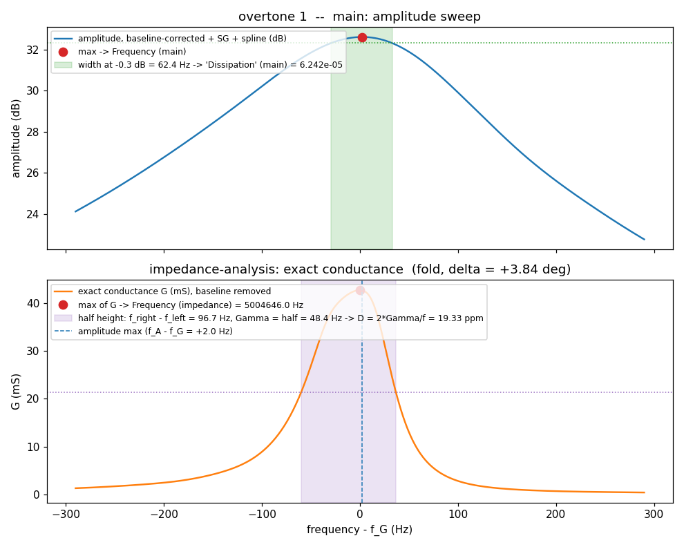
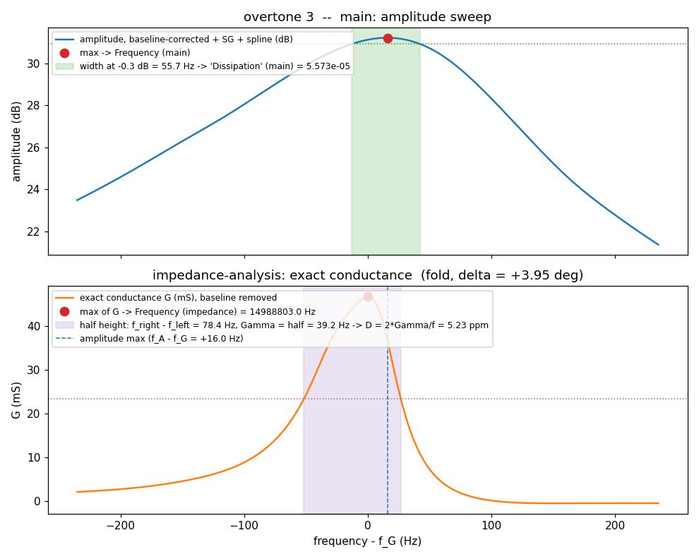
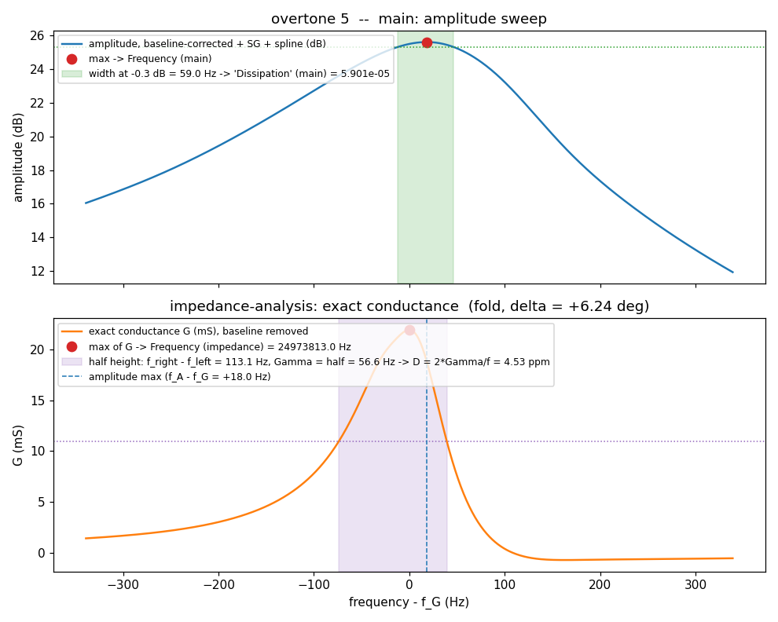
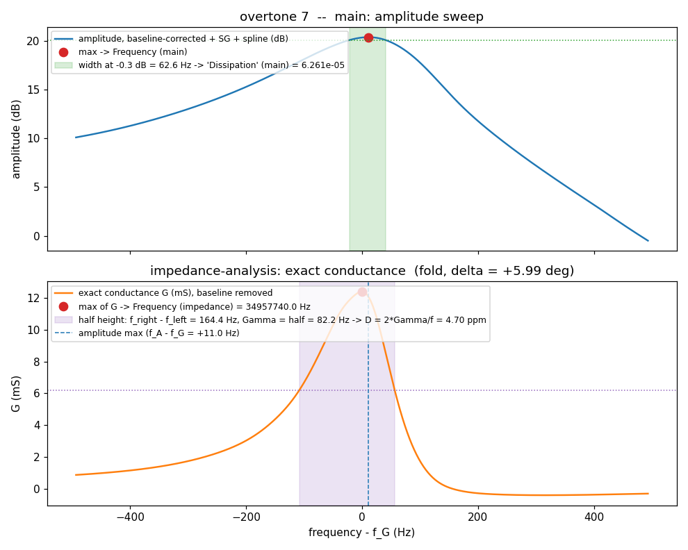
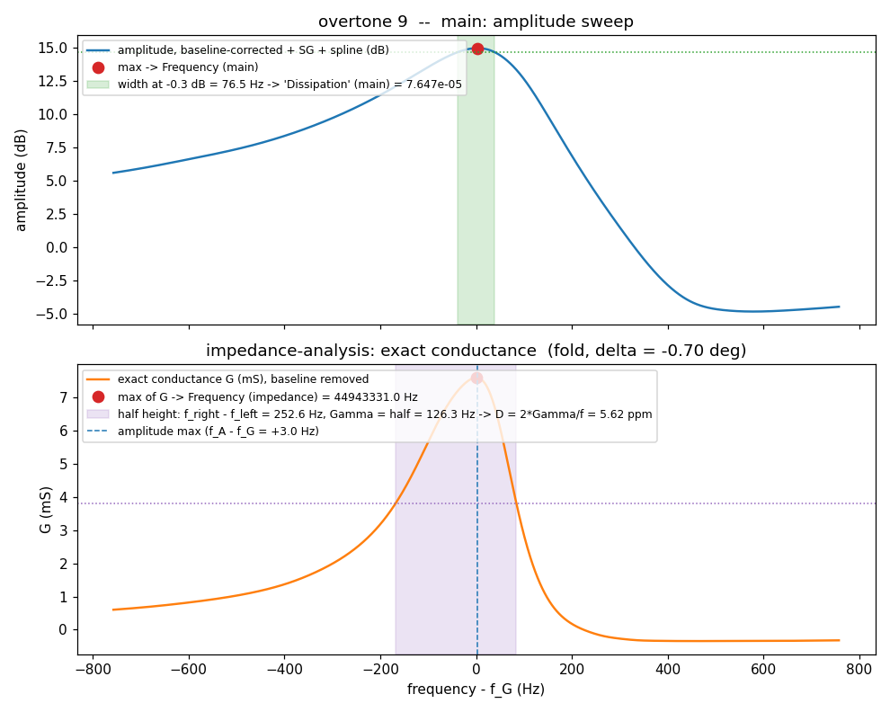

# What the two datalogs actually record — `main` versus `impedance-analysis`

*2026-09-10. Analysis before adding the second, `main`-style datalog to this branch for the
comparison test. Written because two statements in the plan were deductions, not readings, and
both were wrong or imprecise. This file is what the code does; the numbers come from today's
bench sweep.*

## The question

The test needs, side by side, the quantities `main` logs and the ones this branch logs. Two
claims had to be checked against the code:

1. *"`main`'s Dissipation column is the half-width Γ_A in MHz."* — **Wrong.** It is the **full
   width** between the two crossings at **0.3 dB below the maximum** of the amplitude sweep,
   divided by 10⁶. Marco's reading was right.
2. *"The frequencies are directly comparable."* — **Imprecise.** They are in the same unit, but
   they are two different estimators: `main` takes the **maximum of the amplitude sweep** (dB,
   baseline-corrected, filtered, spline-fitted); this branch takes the **maximum of the exact
   conductance G**. On today's sweep they differ by 2 to 18 Hz depending on the overtone. Marco's
   reading was right here too.

## Where each number comes from

Both processes start from the same raw sweep and share `core/resonance.py` (identical on the two
branches, checked with `git diff`).

### `main` — `processors/Multiscan.py::elaborate_multi`, `core/resonance.py`

| step | code | what it is |
|---|---|---|
| magnitude in dB | `_mag_bit_mag(Xm)` | AD8302 magnitude channel |
| baseline | `mag - polyval(coeffs_all, freq)` | polynomial from the Peak Detection calibration |
| filter + fit | `savitzky_golay(window 51, order 3)` → `spline_fit(s = 1, points = span + 1)` | `Constants.SG_WINDOW_SIZE`, `SPLINE_FACTOR` |
| **Frequency_n** | `find_peak_and_band(...).peak_frequency` | **the sample where the fitted amplitude is maximum** |
| **Dissipation_n** | `find_peak_and_band(...).bandwidth / 1e6` | **f_trailing − f_leading at `peak − 0.3 dB`** (`Constants.THRESHOLD_DB`), sub-sample by linear interpolation, **divided by 10⁶** — a full width in MHz, not D, not Γ |

Both values go through `robust_mean` over the last `environment` sweeps before being logged.
`find_peak_and_band` is the same function Raw Data View draws (`band 62.4 Hz @ peak − 0.3 dB`).

### `impedance-analysis` — the same function, then the exact chain

`elaborate_multi` still runs the amplitude chain above and calls `find_peak_and_band` on it —
**but only for the two error flags** (`_err1`, `_err2`). Its frequency and width are discarded.
What is logged comes from the conductance:

| step | code | what it is |
|---|---|---|
| V_MAG absolute, V_PHS | `_Vmag_bit_mag`, `_Vphase_bit_phase` | AD8302 outputs in volts; V_MAG **not** baseline-corrected (the exact inversion needs the absolute divider level) |
| filter + fit | SG(51, 3) → `UnivariateSpline(s = 0.001)` on the sample index | `Constants.SPLINE_FACTOR_G` |
| phase | `(1.8 − V_PHS)/0.01` = `90 − abs(Δφ)`, offset δ and fold decision | `_phase_offset_fold`, `_phase_fold_decision` (peak-depth criterion, latched over two sweeps) |
| exact inversion | `Z_q = M·e^(−jφ) − R17`, `Y_q = 1/Z_q`, `M = R17·10^((0.9 − V_MAG)/0.6)` | `_RX_exact`, `_G_exact` (R17 = 52.3 Ω) |
| **Frequency_n** | `_Freq_G`: `argmax(G)` | **the sample where G is maximum** (no sub-sample refinement) |
| Γ | `_half_bandwidth_G_exact`: `(f_right − f_left)/2` at **half height of G** (baseline = mean of the first 100 samples), sub-sample crossings | the paper's "half bandwidth at half height", in Hz |
| **Dissipation_n** | `2·Γ / f_G · 1e6` | **D = Q⁻¹ in ppm** (Johannsmann, Sensors 2021, 21, 3490, S2) |

Same `robust_mean` before logging. The CSV header is identical on the two branches
(`Frequency_0 … Dissipation_4`), which is exactly why the columns must not be read as the same
quantity.

## Today's sweep, both chains reproduced offline

Source: the `OPENQCM_SWEEP_DUMP` files written at 16:00 on 2026-09-10 on this worktree, board 1920,
in air, last sweep of the Conductance Data test; copied out of the repo before analysis, not
tracked. Every measurement below is made with the processes' own functions
(`MultiscanProcess` methods and `core/resonance.py`), on the same axis (`span + 1` points).

Two departures from the live process, stated so nobody reads more into the numbers than they
hold: the amplitude baseline is a **straight line through the sweep's outer 5 percent** instead of
the calibration polynomial, which the dump does not carry; and the fold decision is taken on
**this sweep alone**, not latched over two.

| n | f_A [Hz] (main) | f_G [Hz] (branch) | f_A − f_G | width −0.3 dB [Hz] | width −3 dB [Hz] | main "Dissipation" | Γ_G [Hz] | 2Γ_G [Hz] | D [ppm] (branch) | fold / δ [deg] |
|---|---|---|---|---|---|---|---|---|---|---|
| 1 | 5004648 | 5004646 | +2 | 62.4 | 222.9 | 6.242e-05 | 48.4 | 96.7 | 19.33 | fold +3.84 |
| 3 | 14988819 | 14988803 | +16 | 55.7 | 197.3 | 5.573e-05 | 39.2 | 78.4 | 5.23 | fold +3.95 |
| 5 | 24973831 | 24973813 | +18 | 59.0 | 213.8 | 5.901e-05 | 56.6 | 113.1 | 4.53 | fold +6.24 |
| 7 | 34957751 | 34957740 | +11 | 62.6 | 231.9 | 6.261e-05 | 82.2 | 164.4 | 4.70 | fold +5.99 |
| 9 | 44943334 | 44943331 | +3 | 76.5 | 287.0 | 7.647e-05 | 126.3 | 252.6 | 5.62 | fold -0.70 |

The D column reproduces what the GUI showed during the same run (D1 19.2–19.6, D3 5.3, D5 4.6,
D7 4.8, D9 5.6 ppm), so the offline chain is the published one.

## What the table says

- **Frequency.** Two estimators of the same resonance, 2–18 Hz apart on this crystal in air. The
  amplitude maximum sits on a curve that mixes G and B (the magnitude of Y, in dB); the G maximum
  is the series resonance proper; the phase offset δ moves the first and not the second.
  Comparable, with that caveat; not identical by construction.
- **"Dissipation".** Not the same quantity at all. `main` logs a **width at −0.3 dB on the
  amplitude**, in MHz: 62–77 Hz here, so 6.2e-5 … 7.6e-5 in the file. This branch logs
  **D = 2Γ/f in ppm** with Γ the half width **at half height of G**: 19.3 ppm at the fundamental,
  4.5–5.6 at the overtones. The −0.3 dB level is a 3.4 percent drop of the magnitude, so that
  width is a small fraction of the resonance (the −3 dB width, computed only for orientation, is
  200–290 Hz here); the half height of G is the physically defined one. **There is no constant
  that converts one column into the other**: the ratio depends on the overtone (through f in D)
  and on the peak shape (through the level at which the width is read).
- The width at −0.3 dB and 2Γ_G happen to be within a factor of 1.5–3 of each other here, which is
  a coincidence of this crystal in air, not a relation.

### Overtone 1

### Overtone 3

### Overtone 5

### Overtone 7

### Overtone 9

## Consequence for the comparison datalog

The second file this branch will write, `<ts>_multi_amplitude.csv`, must carry **exactly `main`'s
quantities**: `Frequency_n` = maximum of the fitted amplitude, `Dissipation_n` = width at −0.3 dB
divided by 10⁶ — computed by the same `find_peak_and_band` call that already runs in
`elaborate_multi` for the error flags, on the same sweep, at the same instant as the impedance
values. Its header is `main`'s, so `main`'s tools read it unchanged. The impedance file keeps its
name and content. When the two are put side by side: frequencies compare directly with the
2–18 Hz caveat above; the two dissipation columns are different physical quantities and must be
labelled as such in any table or plot.
