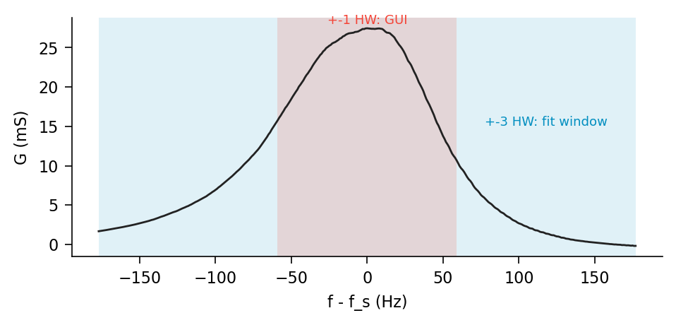
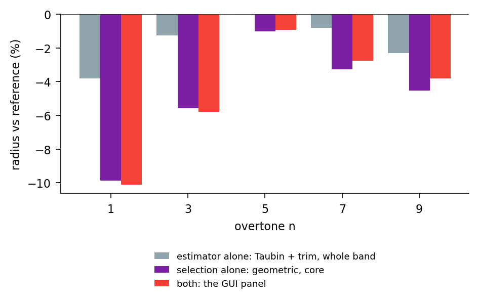
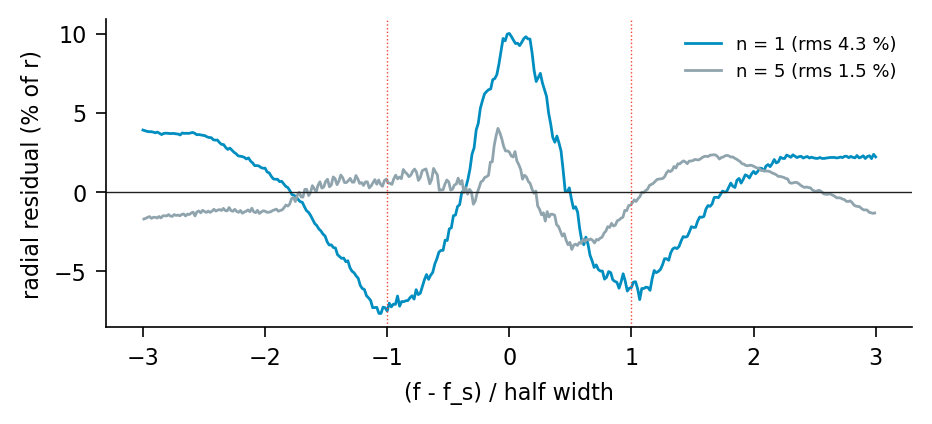
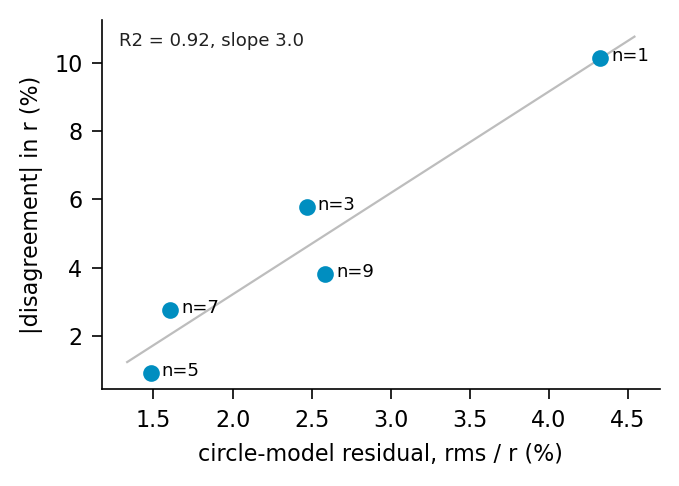
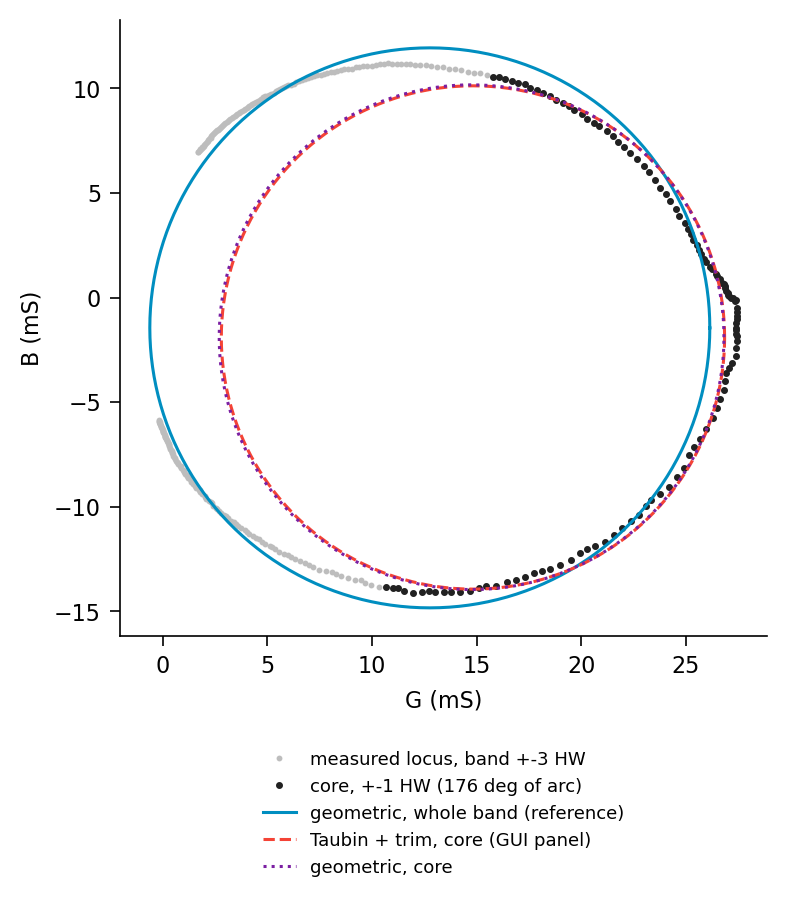

# Two circle fits on one admittance locus

Quantitative comparison of the two Butterworth–Van Dyke circle estimates openQCM
NEXT computes from the same measured admittance: the overlay in the main
window's impedance panel and the fit in the live admittance-fit window.

Branch `impedance-analysis`. Measurements taken 2026-08-28 on an archived
five-overtone air sweep; every number is reproduced by `compare_circle_fits.py`
in this directory.

## Summary

The two circles differ by 0.9 % to 10.1 % in radius, hence 0.9 % to 11.3 % in
the implied `R1`, with a sign that never changes: the panel's circle is always
the smaller one.

The cause is **which points are fitted**, not which algorithm fits them.
Restricting the fit to `abs(f - f_s) <= 1` half width reproduces almost the
entire difference on its own; swapping the estimator while keeping the whole band
accounts for at most a third of it, and on some overtones for nothing.

That selection matters at all only because the measured locus is **not a
circle**. Its radial residual against the best-fit circle is 1.5 % to 4.3 % of
the radius and is smooth and systematic, not scatter. The disagreement between
the two estimates scales with that residual across the five overtones —
`R^2 = 0.92`, slope 3.0.

So the quantity that separates the two views is a **model-error diagnostic**,
not a numerical accident. Where the BVD circle describes the data (`n = 5`,
residual 1.5 %) the two agree to 0.9 %; where it does not (`n = 1`, residual
4.3 %) they diverge by 10 %.

Neither estimate reaches the datalog. Both views are display-only, and the
logged frequency and dissipation come from a different code path.

---

## 1. The two estimators

Both read the same three buffers — `get_G_exact_buffer`, `get_B_exact_buffer`,
`get_F_G_values_buffer` — populated by `MultiscanProcess` from the exact complex
inversion, and both draw a dashed circle over the measured locus.

| | main-window panel | live fit window |
|---|---|---|
| implementation | `MainWindow._fit_circle_taubin` (`ui/mainWindow.py`) | `fit1_circle` (`sweep_data/fit_admittance.py`) |
| domain | decimated to ~250 samples, then `abs(f - f_s) <= 1` half width (`IMPEDANCE_PANEL_FIT_GAMMA = 1.0`) | decimated to 250 samples (`IMPEDANCE_FIT_POINTS`), whole published band, `+-3` half widths |
| cost function | Taubin algebraic, then up to 6 rounds of 2-sigma trimming, floor at 25 % of samples | Taubin as initial guess, then orthogonal-distance (geometric) least squares |
| derived output | none; the circle is the whole result | rotation `theta`, `f_s` and `Gamma` from the arc, `R1`, `L1`, `C1`, residual |

The producer publishes `+-IMPEDANCE_PANEL_BAND_GAMMA = 3` half widths, so the
two domains differ by a factor of three in span and roughly a factor of three in
sample count. In angular terms, measured against the reference centre, the band
subtends 293–304 degrees and the core 176–187 degrees.



*Conductance of the fundamental. Blue: the published band, and the whole of what
the fit window fits. Red: the core the panel restricts itself to.*

## 2. Magnitude of the disagreement

Archived air sweep, five overtones, both estimators started from the identical
array. `R1 = 1 / 2r`, so a radius short by 10 % is a resistance high by 11 %.

| n | r reference (mS) | r panel (mS) | dr | R1 reference (ohm) | R1 panel (ohm) | dR1 | band / core points |
|---|---|---|---|---|---|---|---|
| 1 | 13.385 | 12.029 | -10.1 % | 37.36 | 41.56 | +11.3 % | 355 / 119 |
| 3 | 20.025 | 18.868 | -5.8 % | 24.97 | 26.50 | +6.1 % | 255 / 85 |
| 5 | 9.407 | 9.320 | -0.9 % | 53.15 | 53.65 | +0.9 % | 387 / 129 |
| 7 | 6.250 | 6.077 | -2.8 % | 80.00 | 82.27 | +2.8 % | 259 / 87 |
| 9 | 3.855 | 3.708 | -3.8 % | 129.71 | 134.84 | +4.0 % | 251 / 84 |

The centre moves consistently as well: on the fundamental from
(12.761, -1.445) mS to (14.824, -1.904) mS, towards higher conductance. The
displacement is along the direction of the retained arc.

## 3. Decomposition: domain against estimator

The two views differ in two respects at once. Running the four combinations
separates them. Reference is the geometric fit on the whole band; all values are
radius relative to it.

| n | Taubin + trim, whole band | geometric, core | Taubin + trim, core (the panel) |
|---|---|---|---|
| 1 | -3.8 % | -9.9 % | -10.1 % |
| 3 | -1.3 % | -5.6 % | -5.8 % |
| 5 | -0.0 % | -1.0 % | -0.9 % |
| 7 | -0.8 % | -3.3 % | -2.8 % |
| 9 | -2.3 % | -4.5 % | -3.8 % |



The domain dominates. Keeping the geometric estimator and restricting it to the
core already yields -9.9 % of the -10.1 % measured on the fundamental; the
estimator alone, on the full band, yields -3.8 %. Once the domain is the core,
which estimator runs on it is close to irrelevant: -9.9 % against -10.1 %.

The effects are not additive, which is consistent with both being expressions of
the same underlying cause rather than two independent errors.

## 4. Why the domain matters: the locus is not a circle

If the data lay on a circle, any consistent estimator on any subset containing
three non-collinear points would return the same circle, and both columns above
would be zero. They are not, so the model is incomplete. The residual quantifies
by how much.



*Signed radial residual against the best-fit circle, as a percentage of the
radius, versus frequency in half widths. Dotted lines mark the core boundary.*

The residual is a smooth function of frequency, not noise: on the fundamental it
is +10 % of the radius at resonance and -7 % near `+-1` half width, changing sign
three times across the band. The turning points sit at the core boundary, which
is precisely why the choice of domain is consequential. A circle constrained to
pass through an arc that bulges outward in its middle and inward at its ends
settles at a smaller radius; a circle fitted to the whole band averages the
excursion out.

Across the five overtones the disagreement tracks the residual:



`R^2 = 0.92`, Pearson 0.961, Spearman 0.900, slope 3.0 — each percentage point
of circle-model residual buys about three percentage points of radius
disagreement. With five points this is an association, not a law, but the
ordering is unambiguous and the mechanism in the figure above is visible
directly.

The residual also settles which fit is preferable on its own terms. Evaluated
over the whole band, the reference circle leaves 4.33 % rms on the fundamental
and the panel's circle 17.91 %. Evaluated over the core only, the ordering
reverses — 5.88 % against 2.95 % — as it must, since that is the domain the
panel optimised. Each estimator wins where it was fitted. That is the signature
of model error, not of one estimator being numerically better.



*Fundamental. Grey: the published band. Black: the core. Blue: geometric fit on
the whole band. Red: the panel. Purple: geometric fit on the core, which almost
coincides with the panel and confirms the domain as the cause.*

## 5. What this affects

Within the fit window, the radius enters `R1 = 1 / 2r` and through it `L1` and
`C1`. `f_s` and `Gamma` are read from the arc — from the centre and the rotation
`theta`, not the radius — so they are affected only through the centre
displacement, and second-order in it.

The panel reports no numbers at all; it draws a circle. The figure above is
therefore the entire visible consequence, and the practical rule is that the
panel's overlay must not be read as an estimate of `R1`.

Neither path reaches the datalog: `_update_impedance_panel` is display-only, and
the logged frequency and dissipation still come from the approximate formula in
`MultiscanProcess`. A disagreement of 10 % between the two overlays leaves the
logged record untouched.

The fit window is the reference of the two, and by construction rather than by
argument: `ui/impedanceFitWindow.py` imports `sweep_data/fit_admittance.py` by
file path, so the live figures and the offline reference script cannot diverge.

Keeping both is deliberate. Two estimates whose difference is a measure of model
error are more informative than one number that looks authoritative.

## 6. Method

```bash
cd software
QT_QPA_PLATFORM=offscreen python3 \
  ../research/admittance-circle-fit/compare_circle_fits.py openQCM/sweep_data
```

The argument is a directory of `g1.txt … g9.txt` as written by the sweep dump,
and defaults to the path above. Those files are overwritten by every
acquisition, so pass a copy when the numbers have to stay put.

The script rebuilds the admittance with the offline `admittance()`, applies the
AD8302 ratio mask and the `+-3` half-width clip that `MultiscanProcess` applies,
then runs both estimators on that single array — the same array both views
receive at run time. Qt is required only because the panel's estimator is a
static method on `MainWindow`; nothing is displayed.

The decomposition of section 3 and the residuals of section 4 use the same
preparation, with `geometric_circle` called directly for the mixed cases.

## 7. Limits

One instrument, one sweep, air. The residual is expected to grow in liquid,
where damping widens the resonance and pushes more of the band into the AD8302
dynamic-range corner, but that has not been measured, and with it the
extrapolation of section 4 is untested.

The origin of the non-circularity is not attributed here. The residual is smooth
and antisymmetric-plus-peak in shape, which is consistent with an unmodelled
series element, with a frequency-dependent error in the amplitude or phase
calibration, or with the constant-baseline removal applied before publication.
Distinguishing these requires a measurement this document does not contain.

The reference is itself a fit, not ground truth. Where the model residual is
4 % of the radius, calling any one of these circles correct to better than a few
percent is not supported by the data.

## References

Taubin, G. (1991). Estimation of planar curves, surfaces and nonplanar space
curves defined by implicit equations, with applications to edge and range image
segmentation. *IEEE Transactions on Pattern Analysis and Machine Intelligence*
13(11), 1115–1138. — the algebraic estimator used as the panel's fit and as the
initial guess of the geometric one.

Chernov, N. and Lesort, C. (2005). Least squares fitting of circles. *Journal of
Mathematical Imaging and Vision* 23, 239–252. — the geometric, orthogonal
distance formulation and its relation to the algebraic estimators.
