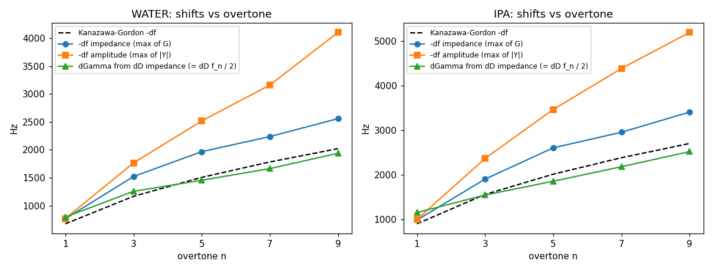
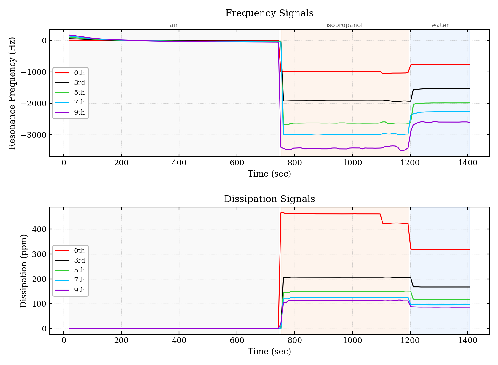
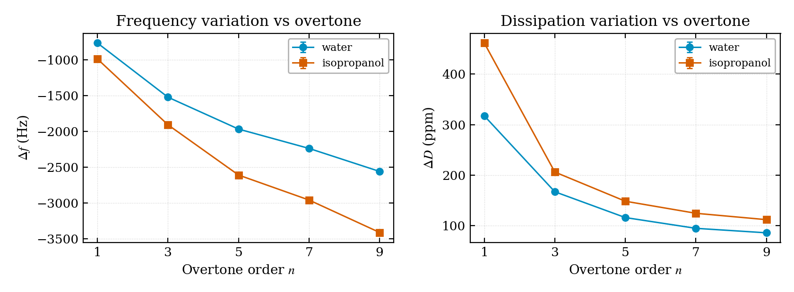
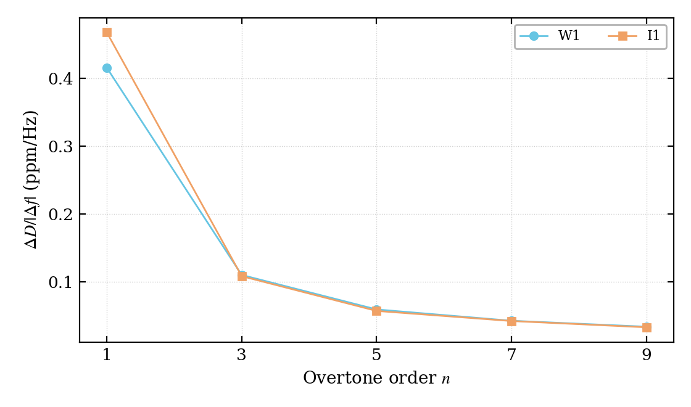
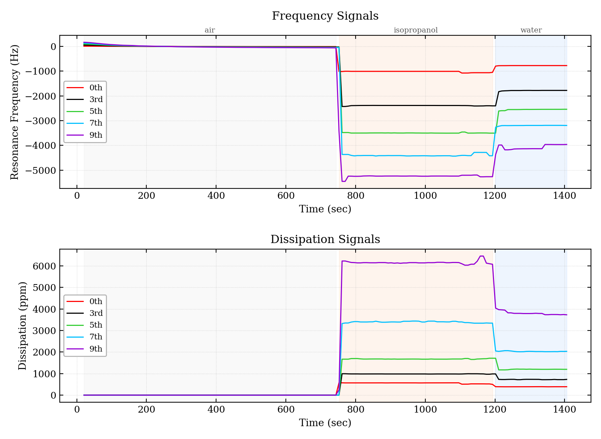
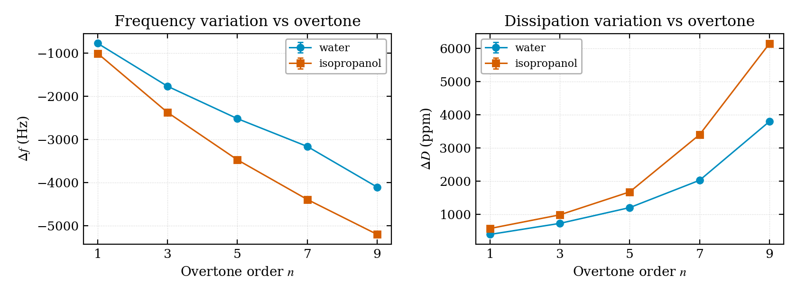

# Air → isopropanol → water on board 1920, 2026-09-10: the two datalogs against Kanazawa–Gordon

*Run `2026-09-10_17-10-06`, multiscan, 25 °C, impedance-analysis worktree with `DATALOG_AMPLITUDE_TOO`:
`_multi.csv` (this branch: f = max of the exact conductance G, D = 2Γ/f in ppm) and
`_multi_amplitude.csv` (main's quantities: f = max of the fitted amplitude, "Dissipation" = width at
−0.3 dB / 1e6), same rows, same instants. 175 rows, 23 minutes. Air 20–716 s, isopropanol 796–1070 s,
water 1237–1406 s (Marco's sequence; the report pipeline classifies phases by frequency level, so the
order does not matter).*

*Conditions as known when this was written: board 1920 (the in-specification board, 125 MHz clock),
5 MHz sensor, TEC at 25 °C, liquids at room temperature poured in sequence; the raw datalogs are in
`data/`, the analysis scripts in `scripts/` (`report_driver.py` drives the official pipeline's functions,
which it loads from a Python-3.9-compatible copy of `generate_test_report.py` — the skill asset plus
`from __future__ import annotations`; `kanazawa_gordon.py` builds the comparison from `summary.json`).
Sensor batch and holder were not recorded: Marco to add.*

## Method, and where it departs from the standard report

The analysis is the official test-report pipeline (`openqcm-test-report`, `generate_test_report.py`),
called function by function with parameters suited to a short run, because with its defaults it found
no plateau at all: plateau detection `std_thr = 2.0 Hz, roll_win = 7, min_len = 10` (defaults 0.6 /
21 / 30), quiet window 12 points (default 50), maximum plateau drift 40 mHz/s (default 4 — the air
baseline drifts at −21 mHz/s here, the crystal still settling after the TEC was restarted at 25 °C
from 33 °C). Everything else is the pipeline's own code.

Two conversions, so the columns mean what the tables say: the script multiplies Dissipation by 1e6
(main's convention), so the impedance file was fed with D / 1e6 and its "ΔD" is D in ppm; the
amplitude file was fed as is, so its "ΔD (ppm)" is numerically the **change of the −0.3 dB width in
Hz** — not a dissipation factor, and there is no theory to compare it with (see
`docs/impedance-analysis/datalog-quantities-2026-09-10.md`).

Kanazawa–Gordon: Δf_n = −√n · f₀^(3/2) · √(ρη / (π ρ_q μ_q)), with ρ_q = 2648 kg/m³, μ_q = 2.947·10¹⁰ Pa,
f₀ the measured fundamental in air; for a Newtonian liquid ΔΓ_n = |Δf_n|, hence ΔD_n = 2|Δf_n| / f_n.
Liquids at 25 °C: water ρ = 997.0 kg/m³, η = 0.890 mPa·s; isopropanol ρ = 781 kg/m³, η = 2.038 mPa·s.

Not produced: the PDF (no `pdflatex`, and the classic theme needs DejaVu fonts this machine lacks).
The uncertainties printed as ± 0 are not real: 34 of the 175 rows are exact duplicates written in
bursts of five within one millisecond, which flattens the standard deviation of a 12-point window.
That is a datalog artefact to look at separately, not a property of the measurement.

## Results

### WATER (rho = 997.0 kg/m3, eta = 0.890 mPa s at 25 degC)

| n | KG df [Hz] | df impedance [Hz] | ratio | df amplitude [Hz] | ratio | KG dD [ppm] | dD impedance [ppm] | ratio | 'dD' amplitude (= width change at -0.3 dB, Hz) |
|---|---|---|---|---|---|---|---|---|---|
| 1 | -674 | -764 ± 0 | 1.13 | -769 ± 0 | 1.14 | 269.2 | 317.5 ± 0.1 | 1.18 | 390.2 ± 1.2 |
| 3 | -1167 | -1521 ± 1 | 1.30 | -1765 ± 1 | 1.51 | 155.4 | 167.3 ± 0.0 | 1.08 | 723.8 ± 5.9 |
| 5 | -1506 | -1966 ± 1 | 1.31 | -2516 ± 1 | 1.67 | 120.4 | 116.2 ± 0.0 | 0.97 | 1199.5 ± 1.8 |
| 7 | -1782 | -2237 ± 1 | 1.26 | -3161 ± 2 | 1.77 | 101.7 | 94.9 ± 0.0 | 0.93 | 2022.8 ± 5.8 |
| 9 | -2021 | -2558 ± 2 | 1.27 | -4104 ± 15 | 2.03 | 89.7 | 86.1 ± 0.2 | 0.96 | 3796.8 ± 10.7 |

### IPA (rho = 781.0 kg/m3, eta = 2.038 mPa s at 25 degC)

| n | KG df [Hz] | df impedance [Hz] | ratio | df amplitude [Hz] | ratio | KG dD [ppm] | dD impedance [ppm] | ratio | 'dD' amplitude (= width change at -0.3 dB, Hz) |
|---|---|---|---|---|---|---|---|---|---|
| 1 | -902 | -987 ± 0 | 1.09 | -1002 ± 0 | 1.11 | 360.5 | 461.6 ± 0.0 | 1.28 | 569.1 ± 0.8 |
| 3 | -1563 | -1907 ± 1 | 1.22 | -2372 ± 1 | 1.52 | 208.1 | 206.3 ± 0.0 | 0.99 | 981.3 ± 0.7 |
| 5 | -2017 | -2609 ± 1 | 1.29 | -3471 ± 2 | 1.72 | 161.2 | 148.6 ± 0.0 | 0.92 | 1673.0 ± 1.7 |
| 7 | -2387 | -2958 ± 5 | 1.24 | -4391 ± 2 | 1.84 | 136.3 | 124.7 ± 0.0 | 0.92 | 3398.3 ± 11.6 |
| 9 | -2706 | -3411 ± 6 | 1.26 | -5201 ± 2 | 1.92 | 120.2 | 112.1 ± 0.1 | 0.93 | 6145.0 ± 6.2 |

*Frequency shifts per overtone against Kanazawa–Gordon (dashed). Blue: this branch's frequency (max of G).
Orange: main's frequency (max of the fitted amplitude). Green: the half-width shift ΔΓ recovered from
this branch's D (ΔΓ = ΔD·f_n/2).*

## What the numbers say

1. **The dissipation of the impedance chain agrees with the theory.** ΔΓ from D matches Kanazawa–Gordon
   within −8 percent … +8 percent on the 3rd to 9th overtone in both liquids (ratios 0.92–1.08). The
   fundamental is 18 percent (water) and 28 percent (isopropanol) high — the same overtone that already
   shows D = 19 ppm in air against 4.5–5.6 on the others, i.e. an extra damping of the fundamental
   (mounting, holder) that the liquid adds to. **Γ at half height of G is the quantity to trust.**
2. **The frequency of the impedance chain overshoots.** |Δf| from the maximum of G is 9–13 percent beyond
   the theory at n = 1 and 22–31 percent beyond it at n ≥ 3, and |Δf| / ΔΓ is 1.2–1.35 where a Newtonian
   liquid gives 1.0. The width is right and the position is not: this points at the estimator, `argmax`
   of a peak that in liquid is a kilohertz wide and skewed by the residual C₀ branch, not at the physics.
   The HANDOFF already notes the skew; the Impedance Fit window's BVD circle fit and the midpoint of
   the two half-height crossings are both candidates for a better f_s — to be tried offline on this
   very dataset before changing anything.
3. **main's frequency is not an f_s estimator in liquid.** The maximum of |Y| in dB moves 11–14 percent
   beyond the theory at the fundamental and up to **2.0×** at the 9th overtone (−4104 Hz against −2021
   predicted, −2558 measured on G). In air the two maxima were 2–18 Hz apart; in liquid, where the
   peak is broad, the amplitude maximum is pulled by B and by the phase offset. Its "Dissipation"
   column (width at −0.3 dB) grows to 3.8 kHz in water and 6.1 kHz in isopropanol at n = 9, with no
   theoretical counterpart.
4. **Order of magnitude against the reference device.** Water Δf₁ = −764 / −769 Hz here against −740 Hz
   in the validated report of device 1867; isopropanol −987 / −1002 against −1100. Different crystal,
   different day, same ballpark.

## The pipeline's own figures

### Impedance file (`_multi.csv`)

### Amplitude file (`_multi_amplitude.csv`, main's quantities)

## Open points this run raises

- Try, offline on these two files' source sweeps, an f_s estimator for G other than `argmax`: the
  midpoint of the half-height crossings, and the BVD circle fit already coded in `impedanceFitWindow`.
  The test is whether |Δf| / ΔΓ comes back to ~1.0 on the overtones in liquid.
- The fundamental's excess dissipation (19 ppm in air, +18–28 percent over theory in liquid): a property
  of this crystal and holder, to be checked on a second sensor.
- The datalog writes bursts of five identical rows at the same millisecond (34 of 175 rows here):
  find where, before the next repeatability analysis, since it biases every standard deviation.
- A longer run (10 minutes per plateau, as the standard protocol) would let the report pipeline run
  with its default parameters and give real uncertainties.

## Addendum, same day: three f_s estimators on the same exact G, in air

`scripts/fs_estimators.py`, on the 16:00 air dump of board 1920 (one sweep per overtone, the exact
chain reproduced as in `docs/impedance-analysis/datalog-quantities-2026-09-10.md`). Estimators:
`argmax` (what the datalog publishes), the midpoint of the two half-height crossings (free: Γ already
computes them), and the Lorentzian LM fit of `sweep_data/fit_admittance.py` on a ±3Γ window.

| n | argmax f_G [Hz] | midpoint − argmax [Hz] | Lorentzian − argmax [Hz] | Γ half height [Hz] | fit "gamma" [Hz] | fit gamma / Γ |
|---|---|---|---|---|---|---|
| 1 | 5004646 | −11.6 | −8.7 | 48.4 | 98.9 | 2.04 |
| 3 | 14988803 | −12.4 | −7.8 | 39.2 | 78.1 | 1.99 |
| 5 | 24973813 | −17.3 | −9.4 | 56.6 | 109.5 | 1.93 |
| 7 | 34957740 | −25.8 | −13.7 | 82.2 | 154.8 | 1.88 |
| 9 | 44943331 | −42.2 | −21.7 | 126.3 | 233.7 | 1.85 |

- Both alternatives sit **below** `argmax` by 0.25–0.33 Γ: the G peak is skewed with its tail to the
  right, and the sample maximum falls right of the centre. Scaled to the liquid Γ (0.8–2 kHz) that
  fraction is 200–600 Hz — the size of the overshoot against Kanazawa–Gordon above (90 Hz at n = 1,
  ~350 Hz at n = 3 in water). Consistent; to be confirmed on liquid sweeps (dumps requested).
- ⚠️ The Lorentzian fit's `gamma` is the **full** width at half height, twice Γ; its `D = gamma/fs` is
  therefore already 2Γ/f, consistent with the datalog. The name misleads, the number does not.
- The ratio falls from 2.04 to 1.85 with the overtone: the peak departs from a Lorentzian as n grows,
  and the fit absorbs only part of the skew, while the midpoint assumes no shape at all.
- The BVD circle fit was not evaluated here for lack of time; it stays a candidate for the liquid
  comparison (Marco, 2026-09-11: all doors open).
