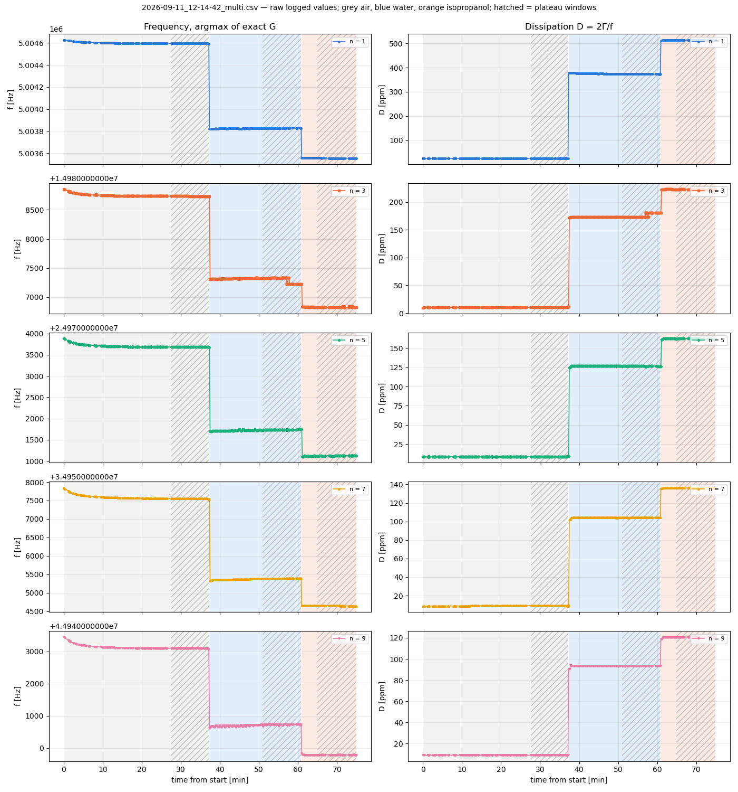
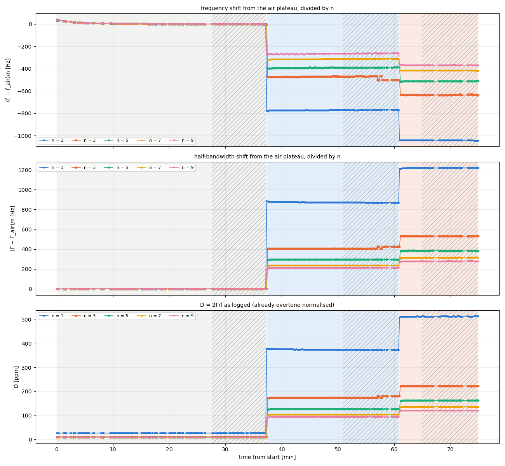
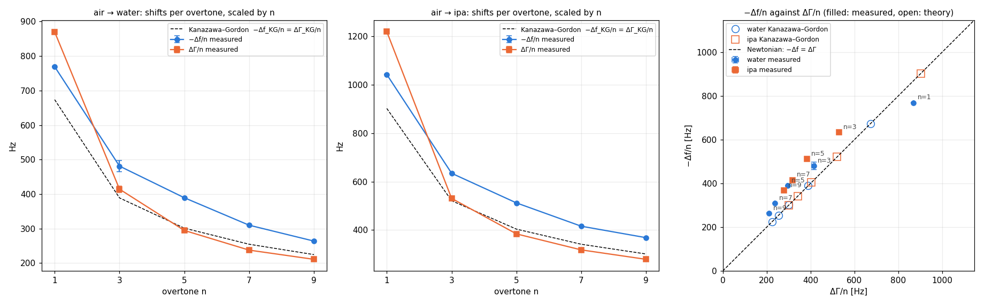
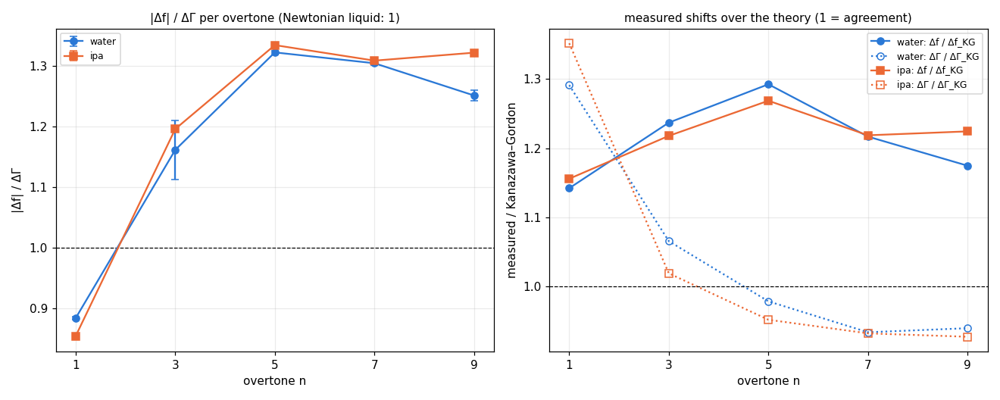
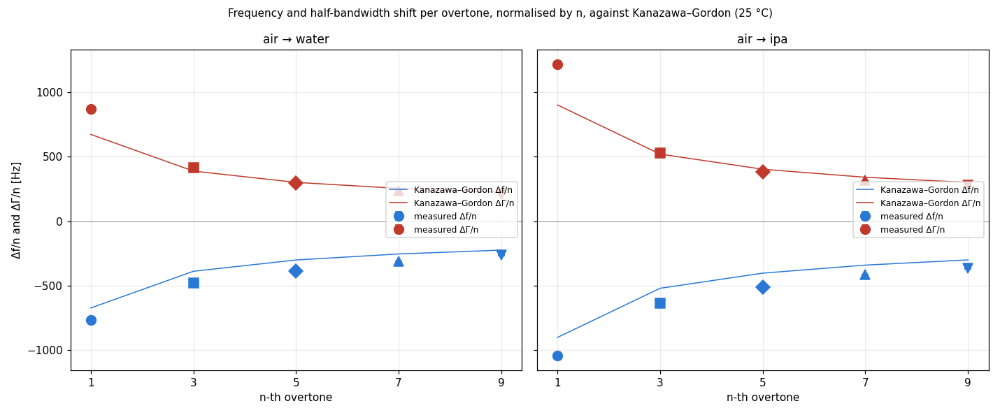
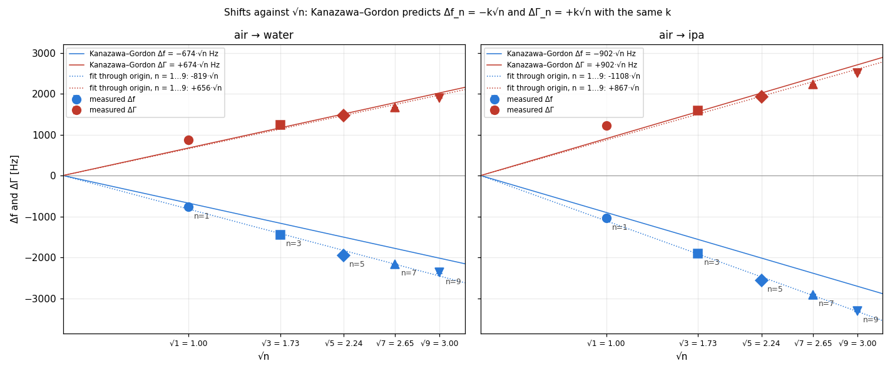

# Air → water → isopropanol on board 1920, 2026-09-11: the impedance datalog as acquired

*Run `2026-09-11_12-14-42`, multiscan, impedance-analysis worktree, `OPENQCM_SWEEP_DUMP=1` and
`DATALOG_AMPLITUDE_TOO`. This document reads the **impedance datalog** `_multi.csv` (f = sample where the
exact conductance G is maximum; D = 2Γ/f in ppm, Γ the half width at half height of G) and puts it against
Kanazawa–Gordon at 25 °C. It describes the data; it draws no conclusion. The amplitude datalog
(`_multi_amplitude.csv`, main's quantities) is in `data/` and is not analysed here. The nine sweep dumps
copied by hand during the run are the input of a separate document (f_s estimators).*

## Acquisition conditions (Marco, 2026-09-11)

| | |
|---|---|
| board | 1920 (the in-specification board, 125 MHz clock) |
| sensor | the same 5 MHz sensor as on 2026-09-10 |
| TEC | 25 °C set-point; logged temperature 24.93–25.00 °C, 25.00 on every plateau |
| sequence | air → water → isopropanol, liquids poured in sequence, one acquisition |
| calibration | the `Calibration_5MHz.txt` of this run (in the dataset folder, 100 001 points, 1–51 MHz) |
| dumps | three copies of `g<n>.txt` / `<n>.txt` per liquid, on the plateau: air 12:25:49, 12:46:28, 12:50:16; water 12:57:34, 13:08:52, 13:15:24; isopropanol 13:20:02, 13:24:16, 13:30:00 (write time of the 3rd-overtone file) |
| raw data | the two datalogs in `data/`; the nine dumps (45 `g<n>.txt`, 61 MB) as one compressed archive `data/sweep_dumps_2026-09-11.npz` (7.8 MB, byte-exact round trip, copy times inside) — `python scripts/load_dumps.py unpack data/sweep_dumps_2026-09-11.npz <dir>` recreates the folders the scripts read; the originals stay at `/Users/marco/Documents/openqcm-next-data_20260911` |

## Method

`scripts/datalog_analysis.py data figures`. Phases are split by the level of the fundamental
(air above 5 004 000 Hz, water 5 003 700–5 004 000, isopropanol below); the plateau of each phase is its
**last 10 minutes**, mean ± sd over the rows in it. Γ is recomputed from the logged pair as Γ = D·10⁻⁶·f/2.
Shifts are liquid plateau minus air plateau, per overtone; their sd is the quadrature sum of the two
plateau sds. Kanazawa–Gordon: Δf_n = −√n·f₀^{3/2}·√(ρη/(π ρ_q μ_q)), ρ_q = 2648 kg/m³, μ_q = 2.947·10¹⁰ Pa,
f₀ the air plateau of the fundamental; Newtonian liquid: ΔΓ_n = |Δf_n|. Water ρ = 997.05 kg/m³,
η = 0.890 mPa·s; isopropanol ρ = 781 kg/m³, η = 2.038 mPa·s (25 °C). Same constants as
`../air-ipa-water-1920-2026-09-10/scripts/kanazawa_gordon.py`. No other processing: no plateau detection
beyond the fixed rule, no outlier removal, no averaging of duplicate rows.

## Tables

### Run

| rows | duplicate F/D rows | median row spacing [s] | temperature min / max [°C] | air | water | isopropanol |
|---|---|---|---|---|---|---|
| 486 | 95 | 9.0 | 24.93 / 25.00 | 12:15:27 – 12:52:37 | 12:52:47 – 13:16:15 | 13:16:24 – 13:30:22 |

### Plateaus: last 10 minutes of each phase, mean ± sd

| phase | window | rows | T [°C] mean (min–max) | n | f [Hz] | D [ppm] | Γ = D·f/2 [Hz] |
|---|---|---|---|---|---|---|---|
| air | 12:43:04–12:52:37 | 53 | 25.00 (25.00–25.00) | 1 | 5004597 ± 1 | 26.1 ± 0.1 | 65.2 ± 0.1 |
|  |  |  |  | 3 | 14988734 ± 1 | 10.4 ± 0.1 | 78.1 ± 0.9 |
|  |  |  |  | 5 | 24973681 ± 2 | 8.6 ± 0.1 | 107.7 ± 1.0 |
|  |  |  |  | 7 | 34957555 ± 4 | 9.1 ± 0.1 | 159.9 ± 1.0 |
|  |  |  |  | 9 | 44943096 ± 6 | 9.0 ± 0.0 | 203.2 ± 0.3 |
| water | 13:06:23–13:16:15 | 74 | 25.00 (25.00–25.00) | 1 | 5003828 ± 1 | 373.7 ± 0.5 | 935.0 ± 1.2 |
|  |  |  |  | 3 | 14987291 ± 50 | 176.3 ± 3.8 | 1320.8 ± 28.2 |
|  |  |  |  | 5 | 24971734 ± 4 | 126.6 ± 0.1 | 1580.6 ± 0.7 |
|  |  |  |  | 7 | 34955387 ± 3 | 104.3 ± 0.1 | 1822.8 ± 2.0 |
|  |  |  |  | 9 | 44940723 ± 15 | 93.5 ± 0.1 | 2100.6 ± 2.3 |
| ipa | 13:20:23–13:30:22 | 67 | 25.00 (25.00–25.00) | 1 | 5003554 ± 1 | 513.5 ± 0.2 | 1284.8 ± 0.4 |
|  |  |  |  | 3 | 14986831 ± 8 | 222.8 ± 0.1 | 1669.5 ± 1.0 |
|  |  |  |  | 5 | 24971122 ± 4 | 162.3 ± 0.2 | 2026.5 ± 2.6 |
|  |  |  |  | 7 | 34954647 ± 4 | 136.4 ± 0.1 | 2383.2 ± 1.7 |
|  |  |  |  | 9 | 44939783 ± 5 | 120.6 ± 0.2 | 2710.8 ± 3.4 |

### air → water: shifts against Kanazawa–Gordon (ρ = 997.0 kg/m³, η = 0.890 mPa·s, 25 °C, f₀ = 5004597 Hz)

| n | Δf [Hz] | Δf/n [Hz] | Δf_KG [Hz] | Δf / Δf_KG | ΔΓ [Hz] | ΔΓ/n [Hz] | ΔΓ_KG = \|Δf_KG\| [Hz] | ΔΓ / ΔΓ_KG | \|Δf\| / ΔΓ |
|---|---|---|---|---|---|---|---|---|---|
| 1 | -769 ± 2 | -769 | -674 | 1.14 | 870 ± 1 | 870 | 674 | 1.29 | 0.88 |
| 3 | -1443 ± 50 | -481 | -1167 | 1.24 | 1243 ± 28 | 414 | 1167 | 1.07 | 1.16 |
| 5 | -1947 ± 5 | -389 | -1506 | 1.29 | 1473 ± 1 | 295 | 1506 | 0.98 | 1.32 |
| 7 | -2168 ± 5 | -310 | -1782 | 1.22 | 1663 ± 2 | 238 | 1782 | 0.93 | 1.30 |
| 9 | -2373 ± 17 | -264 | -2021 | 1.17 | 1897 ± 2 | 211 | 2021 | 0.94 | 1.25 |

### air → ipa: shifts against Kanazawa–Gordon (ρ = 781.0 kg/m³, η = 2.038 mPa·s, 25 °C, f₀ = 5004597 Hz)

| n | Δf [Hz] | Δf/n [Hz] | Δf_KG [Hz] | Δf / Δf_KG | ΔΓ [Hz] | ΔΓ/n [Hz] | ΔΓ_KG = \|Δf_KG\| [Hz] | ΔΓ / ΔΓ_KG | \|Δf\| / ΔΓ |
|---|---|---|---|---|---|---|---|---|---|
| 1 | -1042 ± 1 | -1042 | -902 | 1.16 | 1220 ± 0 | 1220 | 902 | 1.35 | 0.85 |
| 3 | -1903 ± 8 | -634 | -1562 | 1.22 | 1591 ± 1 | 530 | 1562 | 1.02 | 1.20 |
| 5 | -2559 ± 4 | -512 | -2017 | 1.27 | 1919 ± 3 | 384 | 2017 | 0.95 | 1.33 |
| 7 | -2908 ± 6 | -415 | -2387 | 1.22 | 2223 ± 2 | 318 | 2387 | 0.93 | 1.31 |
| 9 | -3313 ± 8 | -368 | -2706 | 1.22 | 2508 ± 3 | 279 | 2706 | 0.93 | 1.32 |

### Slopes in √n (least squares through the origin, Hz per √n)

| liquid | k_KG | k from Δf, n = 1…9 | k from Δf, n = 3…9 | k from ΔΓ, n = 1…9 | k from ΔΓ, n = 3…9 |
|---|---|---|---|---|---|
| water | 674 | 819 | 821 | 656 | 647 |
| ipa | 902 | 1108 | 1111 | 867 | 852 |

## Figures

### Raw logged values

*Left: logged frequency per overtone (absolute, note the offset on each axis). Right: logged D.
Background: grey air, blue water, orange isopropanol; hatched = the 10-minute plateau windows.*

### Scaled by the overtone order

*Top: (f − f_air)/n. Middle: (Γ − Γ_air)/n. Bottom: D as logged, which is 2Γ_n/(n·f₀) and therefore already
divided by n. f_air and Γ_air are the air plateau values of the same overtone.*

### Against Kanazawa–Gordon

*Left and centre: −Δf/n (blue) and ΔΓ/n (orange) against n, with the theory (dashed; for a Newtonian
liquid the two theoretical curves coincide). Right: −Δf/n against ΔΓ/n, one point per overtone and liquid;
filled markers measured, open markers the theory, which sits on the diagonal by construction.*

### Ratios

*Left: |Δf|/ΔΓ per overtone, both liquids, with the sd of the plateaus propagated. Right: measured Δf over
Δf_KG (solid) and measured ΔΓ over ΔΓ_KG (dotted).*

### The classic view: Δf/n and ΔΓ/n against n

*Blue: Δf/n, negative. Red: ΔΓ/n, positive. Lines: Kanazawa–Gordon. One marker shape per overtone.*

### Against √n

*Kanazawa–Gordon is linear in √n with the same slope k for −Δf and ΔΓ (solid lines). Dotted: least-squares
line through the origin on the five measured points; the slopes are in the table above.*

## What the data show (numbers only)

- **Plateaus.** On the last 10 minutes the sd of f is 1–6 Hz in air and 1–8 Hz in isopropanol on every
  overtone; in water it is 1–4 Hz on n = 1, 5, 7, 15 Hz on n = 9 and **50 Hz on n = 3** (next point). D is
  stable to 0.0–0.2 ppm everywhere except water n = 3 (3.8 ppm).
- **Water, 3rd overtone, from 13:12:31.** The logged pair alternates between two discrete values:
  f = 14 987 330 ± 5 Hz with D = 173.3 ppm (the value held since 12:53) and f = 14 987 226 ± 2 Hz with
  D = 181.0 ppm — 105 Hz and 7.7 ppm apart — on consecutive rows (13:12:05 → 13:12:31 → 13:13:01 →
  13:13:19). From 13:13:19 to the end of the water phase it holds the second value. The other four
  overtones do not move at those instants. Restricting the water plateau to 12:53:30–13:11:30 gives
  n = 3: f = 14 987 323 ± 7 Hz, D = 173.4 ± 0.1 ppm, hence Δf₃ = −1411 Hz, ΔΓ₃ = 1222 Hz, |Δf|/ΔΓ = 1.15
  (against −1443 / 1243 / 1.16 on the last-10-minute rule). The `wat_2` dump (13:15:24) falls inside the
  second state.
- **Air drift.** The log starts at 12:15:27 with the temperature at 24.93 °C and reads 25.00 °C from 12:16
  on; f falls by 15, 51, 86, 125, 148 Hz (n = 1…9) between the first 10 minutes and the last 10, and by 0, 2, 4, 9, 8 Hz
  between 12:33–12:43 and 12:43–12:52.
- **Air D on this sensor, today against 2026-09-10 16:00** (same board, same sensor, same chain):
  26.1 / 10.4 / 8.6 / 9.1 / 9.0 ppm today, 19.3 / 5.2 / 4.5 / 4.7 / 5.6 ppm yesterday, for n = 1…9. Air f today
  is 49, 69, 132, 185, 235 Hz below yesterday's.
- **Δf against the theory.** Δf/Δf_KG = 1.14–1.29 in water and 1.16–1.27 in isopropanol on all five
  overtones (1.14 and 1.16 at n = 1, 1.17–1.29 and 1.22–1.27 at n = 3…9).
- **ΔΓ against the theory.** ΔΓ/ΔΓ_KG = 1.29 (water) and 1.35 (isopropanol) at n = 1; 0.93–1.07 (water) and
  0.93–1.02 (isopropanol) at n = 3…9.
- **|Δf|/ΔΓ.** 0.88 (water) and 0.85 (isopropanol) at n = 1; 1.16–1.32 (water) and 1.20–1.33 (isopropanol)
  at n = 3…9. The two liquids agree with each other to within 0.04 at every overtone except n = 3
  (1.16 against 1.20, where the water value carries the 50 Hz sd above).
- **Scaled shifts.** Δf/n and ΔΓ/n both decrease with n in both liquids (fig. 2, fig. 3). ΔΓ/n crosses the
  theory between n = 3 and n = 5 in both liquids: above it at n = 1 and 3, below it at n = 5, 7, 9.
- **Slopes in √n.** Through the origin on all five overtones: k from −Δf = 819 (water) and 1108 Hz/√n
  (isopropanol) against k_KG = 674 and 902; k from ΔΓ = 656 and 867. Dropping n = 1 moves the Δf slopes by
  2–3 Hz/√n and the ΔΓ slopes by 9–15 Hz/√n. The ratio of the two measured slopes is 1.25 (water) and
  1.28 (isopropanol).
- **Datalog rows.** 486 rows in 75 minutes, median spacing 9.0 s; **95 rows are exact duplicates** of the
  previous F/D values (written in bursts within the same second), the same artefact noted on 2026-09-10
  (34 of 175). The plateau sds above include them and are therefore lower bounds.
- **Compared with 2026-09-10** (same board and sensor, plateaus by the report pipeline): water
  Δf₁ = −769 Hz today against −764; isopropanol Δf₁ = −1042 against −987. |Δf|/ΔΓ on n = 3…9 was 1.2–1.35
  yesterday and is 1.16–1.33 today.
