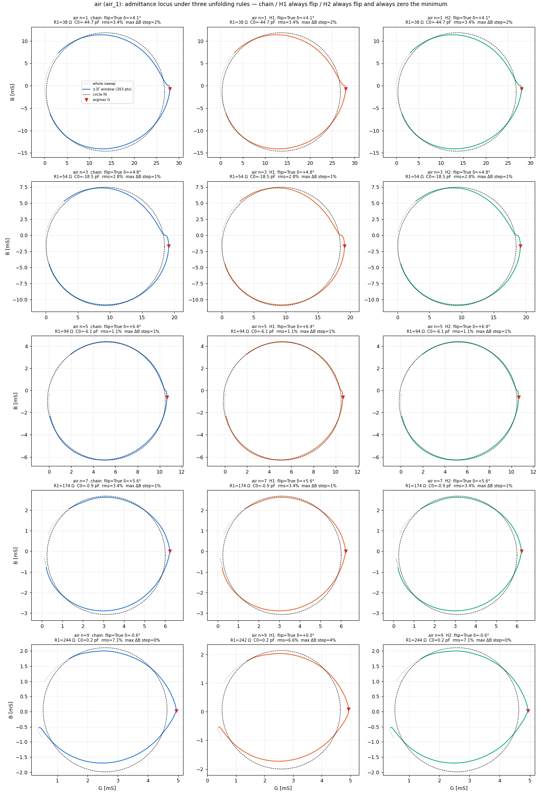
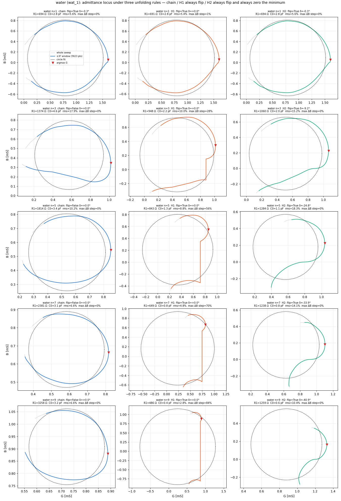
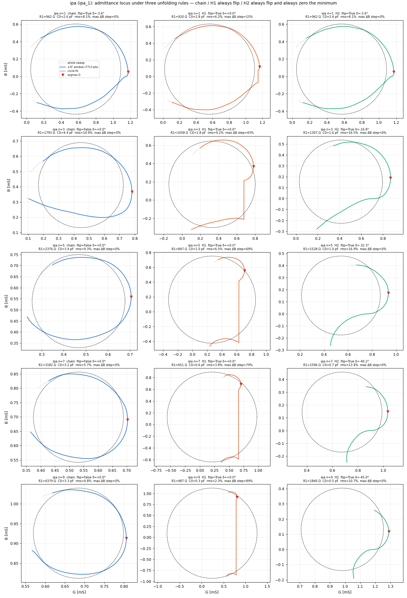
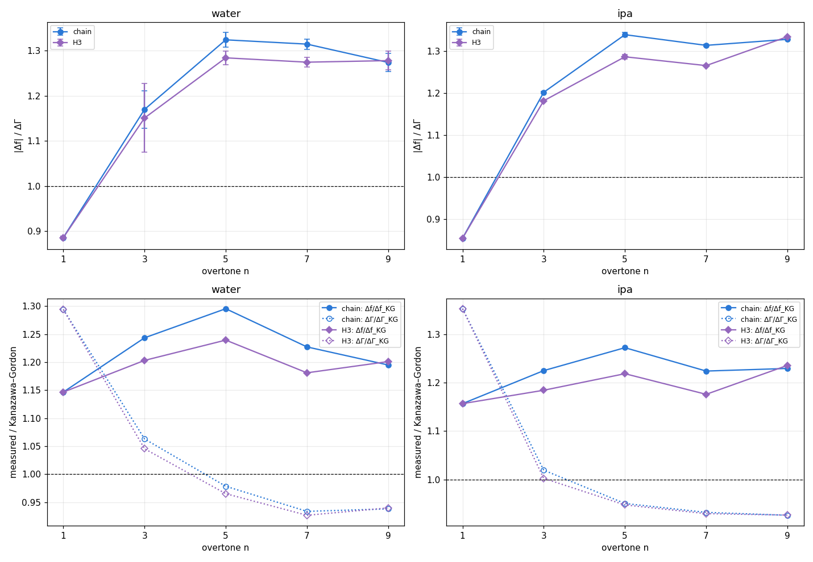
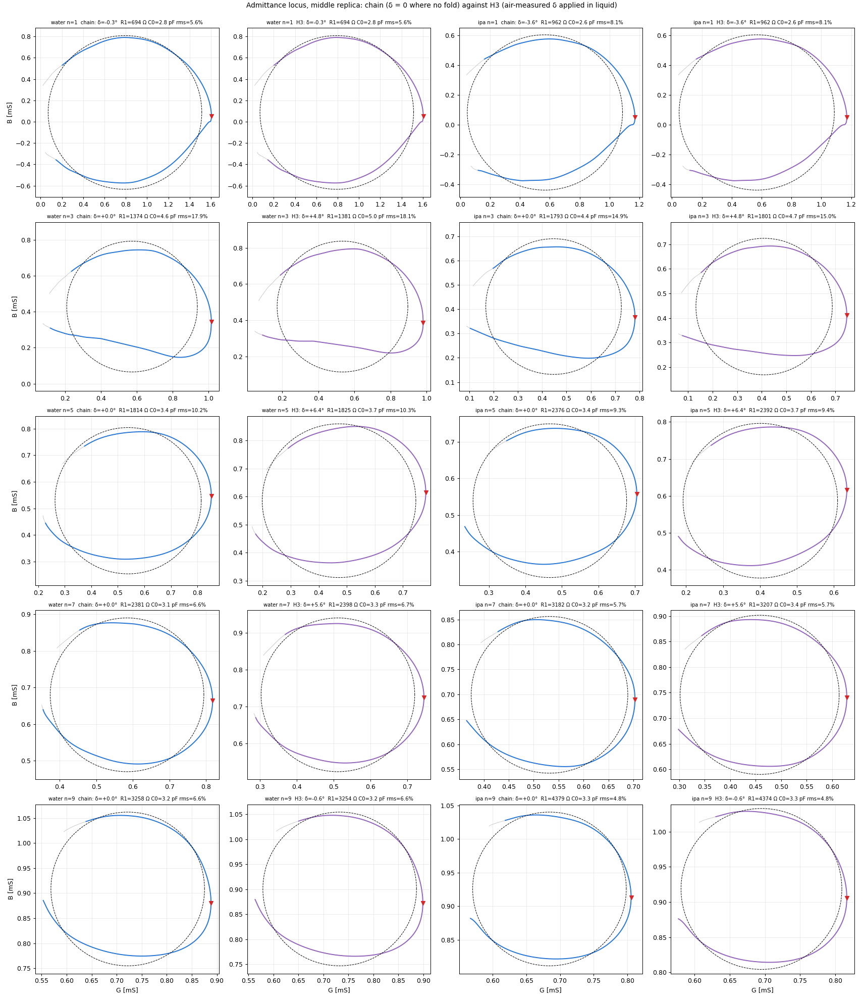

# Three unfolding rules for the AD8302 phase, on the admittance locus — board 1920, 2026-09-11

*Marco's hypothesis (2026-09-11): the fold must always be undone at the maximum of V_PHS, because the
true phase keeps going after its minimum instead of turning back. This page applies it to the middle
replica of each phase and puts the result beside the process's rule. `scripts/fold_hypothesis_circles.py`,
same smoothing as the process (Savitzky–Golay 51/3, spline s = 0.001), circle fit `fit1_circle` on the
±3Γ window of each variant's own G.*

| rule | sign flip at the minimum of the reading | offset δ |
|---|---|---|
| **chain** | only when the peak-depth test passes (depth ≥ 0.88, minimum within 5 Γ) | −min(r) when the test passes, else 0 |
| **H1** | always | −min(r) only where the reading goes below 0° (a negative modulus), else 0 |
| **H2** | always | always −min(r): the minimum is forced to 0° |

G is even in the sign of the phase, so H1 changes B only; H2 changes G as well, and with it f, Γ, D.

## Admittance loci, B against G

Grey: the whole sweep. Colour: the ±3Γ window the circle is fitted on. Dashed: the fitted circle.
Red triangle: the sample where G is maximum.

### Air

### Water

### Isopropanol

## Numbers

| phase | n | rule | flip | δ [°] | argmax G [Hz] | Γ half height [Hz] | D [ppm] | R1 [Ω] | C0 [pF] | circle rms [% r] | largest step in B [% of range] |
|---|---|---|---|---|---|---|---|---|---|---|---|
| air | 1 | chain | True | +4.1 | 5004598 | 65.3 | 26.1 | 38 | -44.7 | 3.4 | 2 |
| air | 1 | H1 | True | +4.1 | 5004598 | 65.3 | 26.1 | 38 | -44.7 | 3.4 | 2 |
| air | 1 | H2 | True | +4.1 | 5004598 | 65.3 | 26.1 | 38 | -44.7 | 3.4 | 2 |
| air | 3 | chain | True | +4.8 | 14988735 | 78.0 | 10.4 | 54 | -18.5 | 2.8 | 1 |
| air | 3 | H1 | True | +4.8 | 14988735 | 78.0 | 10.4 | 54 | -18.5 | 2.8 | 1 |
| air | 3 | H2 | True | +4.8 | 14988735 | 78.0 | 10.4 | 54 | -18.5 | 2.8 | 1 |
| air | 5 | chain | True | +6.4 | 24973682 | 107.5 | 8.6 | 94 | -6.1 | 1.1 | 1 |
| air | 5 | H1 | True | +6.4 | 24973682 | 107.5 | 8.6 | 94 | -6.1 | 1.1 | 1 |
| air | 5 | H2 | True | +6.4 | 24973682 | 107.5 | 8.6 | 94 | -6.1 | 1.1 | 1 |
| air | 7 | chain | True | +5.6 | 34957554 | 160.4 | 9.2 | 174 | -0.9 | 3.4 | 1 |
| air | 7 | H1 | True | +5.6 | 34957554 | 160.4 | 9.2 | 174 | -0.9 | 3.4 | 1 |
| air | 7 | H2 | True | +5.6 | 34957554 | 160.4 | 9.2 | 174 | -0.9 | 3.4 | 1 |
| air | 9 | chain | True | -0.6 | 44943100 | 203.1 | 9.0 | 244 | 0.2 | 7.1 | 0 |
| air | 9 | H1 | True | +0.0 | 44943100 | 201.3 | 9.0 | 242 | 0.2 | 6.6 | 4 |
| air | 9 | H2 | True | -0.6 | 44943100 | 203.1 | 9.0 | 244 | 0.2 | 7.1 | 0 |
| water | 1 | chain | True | -0.3 | 5003824 | 937.1 | 374.5 | 694 | 2.8 | 5.6 | 0 |
| water | 1 | H1 | True | +0.0 | 5003826 | 934.4 | 373.5 | 691 | 2.8 | 5.4 | 1 |
| water | 1 | H2 | True | -0.3 | 5003824 | 937.1 | 374.5 | 694 | 2.8 | 5.6 | 0 |
| water | 3 | chain | False | +0.0 | 14987320 | 1298.9 | 173.3 | 1374 | 4.6 | 17.9 | 0 |
| water | 3 | H1 | True | +0.0 | 14987320 | 1298.9 | 173.3 | 948 | 2.2 | 10.0 | 28 |
| water | 3 | H2 | True | -9.2 | 14987222 | 1358.4 | 181.3 | 1060 | 2.0 | 15.2 | 0 |
| water | 5 | chain | False | +0.0 | 24971759 | 1583.8 | 126.8 | 1814 | 3.4 | 10.2 | 0 |
| water | 5 | H1 | True | +0.0 | 24971759 | 1583.8 | 126.8 | 843 | 1.3 | 8.8 | 56 |
| water | 5 | H2 | True | -24.8 | 24971382 | 1662.7 | 133.2 | 1284 | 1.1 | 18.3 | 0 |
| water | 7 | chain | False | +0.0 | 34955387 | 1820.3 | 104.1 | 2381 | 3.1 | 6.6 | 0 |
| water | 7 | H1 | True | +0.0 | 34955387 | 1820.3 | 104.1 | 649 | 0.8 | 4.8 | 70 |
| water | 7 | H2 | True | -33.9 | 34954748 | 2019.0 | 115.5 | 1238 | 0.8 | 14.1 | 0 |
| water | 9 | chain | False | +0.0 | 44940687 | 2099.4 | 93.4 | 3258 | 3.2 | 6.6 | 0 |
| water | 9 | H1 | True | +0.0 | 44940687 | 2099.4 | 93.4 | 486 | 0.4 | 2.8 | 84 |
| water | 9 | H2 | True | -40.9 | 44939531 | 2292.9 | 102.0 | 1259 | 0.6 | 10.4 | 0 |
| ipa | 1 | chain | True | -3.6 | 5003555 | 1285.4 | 513.8 | 962 | 2.6 | 8.1 | 0 |
| ipa | 1 | H1 | True | +0.0 | 5003583 | 1243.1 | 496.9 | 920 | 2.8 | 6.2 | 15 |
| ipa | 1 | H2 | True | -3.6 | 5003555 | 1285.4 | 513.8 | 962 | 2.6 | 8.1 | 0 |
| ipa | 3 | chain | False | +0.0 | 14986826 | 1670.5 | 222.9 | 1793 | 4.4 | 14.9 | 0 |
| ipa | 3 | H1 | True | +0.0 | 14986826 | 1670.5 | 222.9 | 1058 | 1.8 | 9.2 | 43 |
| ipa | 3 | H2 | True | -16.8 | 14986606 | 1741.6 | 232.4 | 1307 | 1.6 | 16.5 | 0 |
| ipa | 5 | chain | False | +0.0 | 24971116 | 2028.5 | 162.5 | 2376 | 3.4 | 9.3 | 0 |
| ipa | 5 | H1 | True | +0.0 | 24971116 | 2028.5 | 162.5 | 847 | 1.0 | 6.5 | 69 |
| ipa | 5 | H2 | True | -32.3 | 24970490 | 2119.0 | 169.7 | 1528 | 1.0 | 16.9 | 0 |
| ipa | 7 | chain | False | +0.0 | 34954646 | 2381.2 | 136.2 | 3182 | 3.2 | 5.7 | 0 |
| ipa | 7 | H1 | True | +0.0 | 34954646 | 2381.2 | 136.2 | 651 | 0.6 | 3.8 | 79 |
| ipa | 7 | H2 | True | -40.2 | 34953598 | 2565.0 | 146.8 | 1596 | 0.7 | 13.4 | 0 |
| ipa | 9 | chain | False | +0.0 | 44939784 | 2710.4 | 120.6 | 4379 | 3.3 | 4.8 | 0 |
| ipa | 9 | H1 | True | +0.0 | 44939784 | 2710.4 | 120.6 | 487 | 0.3 | 2.3 | 89 |
| ipa | 9 | H2 | True | -45.0 | 44938190 | 2749.9 | 122.4 | 1840 | 0.5 | 10.7 | 0 |

### Shifts against the air of the same rule

| liquid | n | rule | Δf (argmax G) [Hz] | ΔΓ [Hz] | \|Δf\|/ΔΓ |
|---|---|---|---|---|---|
| water | 1 | chain | -774 | 872 | 0.89 |
| water | 1 | H1 | -772 | 869 | 0.89 |
| water | 1 | H2 | -774 | 872 | 0.89 |
| water | 3 | chain | -1415 | 1221 | 1.16 |
| water | 3 | H1 | -1415 | 1221 | 1.16 |
| water | 3 | H2 | -1513 | 1280 | 1.18 |
| water | 5 | chain | -1923 | 1476 | 1.30 |
| water | 5 | H1 | -1923 | 1476 | 1.30 |
| water | 5 | H2 | -2300 | 1555 | 1.48 |
| water | 7 | chain | -2167 | 1660 | 1.31 |
| water | 7 | H1 | -2167 | 1660 | 1.31 |
| water | 7 | H2 | -2806 | 1859 | 1.51 |
| water | 9 | chain | -2413 | 1896 | 1.27 |
| water | 9 | H1 | -2413 | 1898 | 1.27 |
| water | 9 | H2 | -3569 | 2090 | 1.71 |
| ipa | 1 | chain | -1043 | 1220 | 0.85 |
| ipa | 1 | H1 | -1015 | 1178 | 0.86 |
| ipa | 1 | H2 | -1043 | 1220 | 0.85 |
| ipa | 3 | chain | -1909 | 1593 | 1.20 |
| ipa | 3 | H1 | -1909 | 1593 | 1.20 |
| ipa | 3 | H2 | -2129 | 1664 | 1.28 |
| ipa | 5 | chain | -2566 | 1921 | 1.34 |
| ipa | 5 | H1 | -2566 | 1921 | 1.34 |
| ipa | 5 | H2 | -3192 | 2012 | 1.59 |
| ipa | 7 | chain | -2908 | 2221 | 1.31 |
| ipa | 7 | H1 | -2908 | 2221 | 1.31 |
| ipa | 7 | H2 | -3956 | 2405 | 1.65 |
| ipa | 9 | chain | -3316 | 2507 | 1.32 |
| ipa | 9 | H1 | -3316 | 2509 | 1.32 |
| ipa | 9 | H2 | -4910 | 2547 | 1.93 |

## What the figures show (numbers only)

- **Air**: the three rules coincide on n = 1…7 (the reading goes below zero there, so every rule flips
  and applies the same δ). On n = 9 the reading's minimum is +0.6°: H1 applies no offset and the largest
  step in B is 4 % of its range against 0 % for the other two.
- **Liquid, n = 1**: reading minimum 0.2° (water) and 3.5° (isopropanol); all three rules flip. H1 (δ = 0)
  leaves a step in B of 1 % and 15 %; chain and H2 coincide.
- **Liquid, n ≥ 3, H1**: the flip at a minimum of 9–45° produces a vertical segment in the locus — a step in B
  of 28–84 % (water) and 43–89 % (isopropanol) of its range — and two arcs. The circle fitted through the two
  arcs has a smaller residual (2.3–10 % against 4.8–18 %), R1 3–9 times smaller (486–1058 Ω against
  1374–4379) and C0 0.3–2.2 pF against 3.1–4.6. G, f, Γ, D are unchanged by construction.
- **Liquid, n ≥ 3, H2**: forcing the minimum to 0° subtracts 9–45° at every point. The locus becomes
  continuous again (step 0 %) but S-shaped, not circular: residual 10–18 %. argmax G moves down by 98 Hz
  (water n = 3) to 1594 Hz (isopropanol n = 9), Γ grows by 4–10 %, R1 lands between the other two rules.
  |Δf|/ΔΓ rises from 1.16–1.34 (chain and H1) to 1.18–1.93, growing with n.

## H3: the air-measured offset applied in liquid (Marco, 2026-09-11)

*`scripts/air_offset_in_liquid.py`. Where the chain's test says "no fold" (liquid, n ≥ 3) the reading is
corrected by the δ the same overtone measures in air from its fold, mean of the three air replicas:
+4.1, +4.8, +6.4, +5.6, −0.6° for n = 1…9. No sign flip. The fundamental keeps the chain's own fold. Air is
unchanged, so the shifts share the reference. All three liquid replicas, mean ± sd.*

| liquid | n | rule | δ used [°] | f (argmax G) [Hz] | Γ [Hz] | D [ppm] | Δf [Hz] | ΔΓ [Hz] | \|Δf\|/ΔΓ | Δf/Δf_KG | ΔΓ/ΔΓ_KG | R1 [Ω] | C0 [pF] | circle rms [%] | Lorentz f_s − argmax [Hz] |
|---|---|---|---|---|---|---|---|---|---|---|---|---|---|---|---|
| water | 1 | chain | -0.3 | 5003826 ± 3 | 937 ± 3 | 374.5 | -772 | 872 | **0.89** | 1.15 | 1.29 | 694 | 2.8 | 5.6 | +29 |
| water | 1 | H3 | -0.3 | 5003826 ± 3 | 937 ± 3 | 374.5 | -772 | 872 | **0.89** | 1.15 | 1.29 | 694 | 2.8 | 5.6 | +29 |
| water | 3 | chain | +0.0 | 14987288 ± 52 | 1318 ± 33 | 175.9 | -1451 | 1240 | **1.17** | 1.24 | 1.06 | 1269 | 3.7 | 17.0 | -37 |
| water | 3 | H3 | +4.8 | 14987335 ± 93 | 1298 ± 51 | 173.2 | -1404 | 1220 | **1.15** | 1.20 | 1.05 | 1274 | 4.0 | 17.1 | -49 |
| water | 5 | chain | +0.0 | 24971737 ± 24 | 1582 ± 2 | 126.7 | -1951 | 1474 | **1.32** | 1.30 | 0.98 | 1814 | 3.4 | 10.2 | -87 |
| water | 5 | H3 | +6.4 | 24971821 ± 22 | 1562 ± 2 | 125.1 | -1867 | 1454 | **1.28** | 1.24 | 0.97 | 1825 | 3.7 | 10.3 | -70 |
| water | 7 | chain | +0.0 | 34955379 ± 19 | 1823 ± 3 | 104.3 | -2187 | 1664 | **1.31** | 1.23 | 0.93 | 2382 | 3.1 | 6.6 | -125 |
| water | 7 | H3 | +5.6 | 34955461 ± 18 | 1810 ± 3 | 103.6 | -2105 | 1652 | **1.27** | 1.18 | 0.93 | 2399 | 3.3 | 6.7 | -103 |
| water | 9 | chain | +0.0 | 44940695 ± 37 | 2100 ± 1 | 93.4 | -2415 | 1896 | **1.27** | 1.19 | 0.94 | 3258 | 3.2 | 6.6 | -202 |
| water | 9 | H3 | -0.6 | 44940683 ± 39 | 2103 ± 1 | 93.6 | -2427 | 1900 | **1.28** | 1.20 | 0.94 | 3255 | 3.2 | 6.6 | -204 |
| ipa | 1 | chain | -3.5 | 5003555 ± 2 | 1286 ± 1 | 513.9 | -1043 | 1220 | **0.86** | 1.16 | 1.35 | 962 | 2.6 | 8.2 | +27 |
| ipa | 1 | H3 | -3.5 | 5003555 ± 2 | 1286 ± 1 | 513.9 | -1043 | 1220 | **0.86** | 1.16 | 1.35 | 962 | 2.6 | 8.2 | +27 |
| ipa | 3 | chain | +0.0 | 14986825 ± 3 | 1670 ± 1 | 222.9 | -1914 | 1593 | **1.20** | 1.22 | 1.02 | 1797 | 4.4 | 14.9 | -44 |
| ipa | 3 | H3 | +4.8 | 14986888 ± 3 | 1644 ± 1 | 219.4 | -1850 | 1566 | **1.18** | 1.18 | 1.00 | 1805 | 4.8 | 15.0 | -38 |
| ipa | 5 | chain | +0.0 | 24971122 ± 10 | 2025 ± 4 | 162.2 | -2566 | 1917 | **1.34** | 1.27 | 0.95 | 2378 | 3.4 | 9.3 | -78 |
| ipa | 5 | H3 | +6.4 | 24971230 ± 10 | 2019 ± 8 | 161.7 | -2458 | 1911 | **1.29** | 1.22 | 0.95 | 2394 | 3.7 | 9.4 | -57 |
| ipa | 7 | chain | +0.0 | 34954645 ± 5 | 2383 ± 2 | 136.4 | -2921 | 2224 | **1.31** | 1.22 | 0.93 | 3183 | 3.2 | 5.6 | -129 |
| ipa | 7 | H3 | +5.6 | 34954759 ± 5 | 2377 ± 1 | 136.0 | -2806 | 2218 | **1.27** | 1.18 | 0.93 | 3207 | 3.4 | 5.6 | -105 |
| ipa | 9 | chain | +0.0 | 44939783 ± 1 | 2710 ± 3 | 120.6 | -3327 | 2506 | **1.33** | 1.23 | 0.93 | 4390 | 3.3 | 4.9 | -115 |
| ipa | 9 | H3 | -0.6 | 44939766 ± 1 | 2711 ± 3 | 120.6 | -3344 | 2507 | **1.33** | 1.24 | 0.93 | 4385 | 3.3 | 4.9 | -116 |

- Adding +4.8…+6.4° moves argmax G **up** by 47–114 Hz and Γ down by 6–26 Hz on n = 3…7 in both liquids;
  |Δf|/ΔΓ moves by −0.02…−0.05 (water 1.32 → 1.28 at n = 5, isopropanol 1.34 → 1.29). At n = 9 δ_air is
  −0.6° and nothing changes. The circle residual, R1 and C0 are unchanged to the first decimal — a constant
  phase offset is a Möbius map of the locus and cannot change its roundness.
- The offset the fold measures on the fundamental **in liquid** is −0.3° (water) and −3.6° (isopropanol),
  against +4.1° in air on the same overtone: 4–8° apart on the same channel within one hour.
