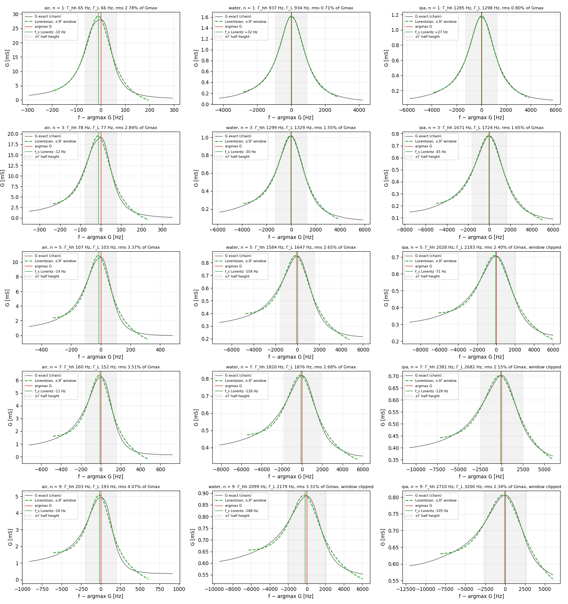
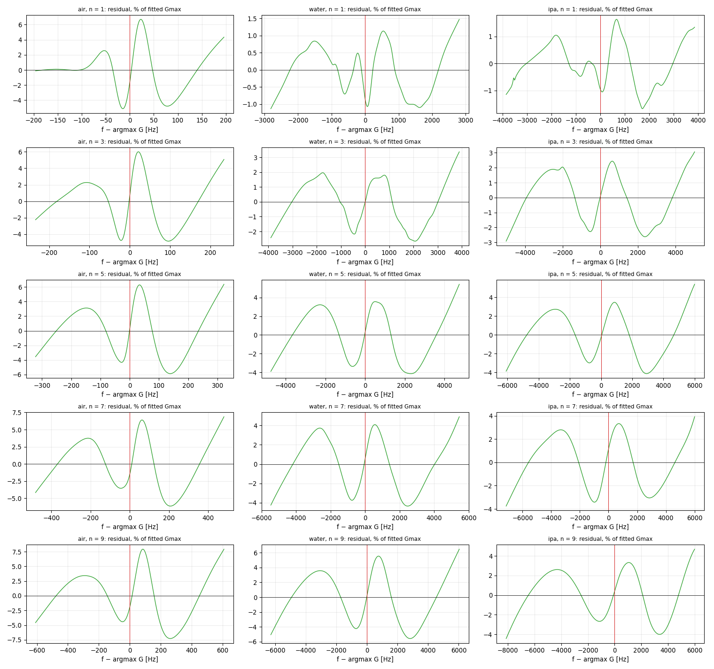
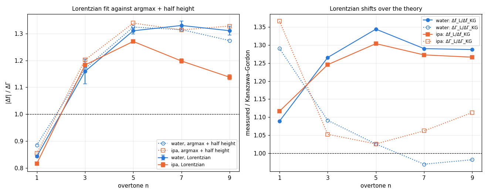
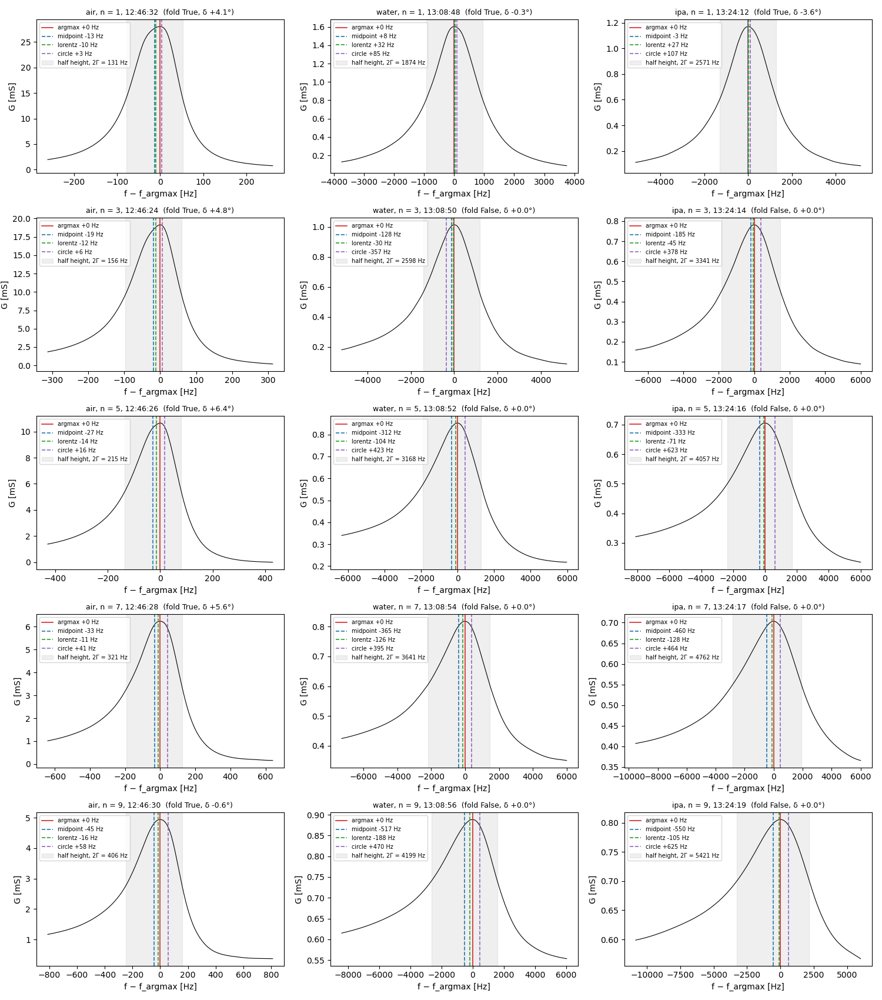
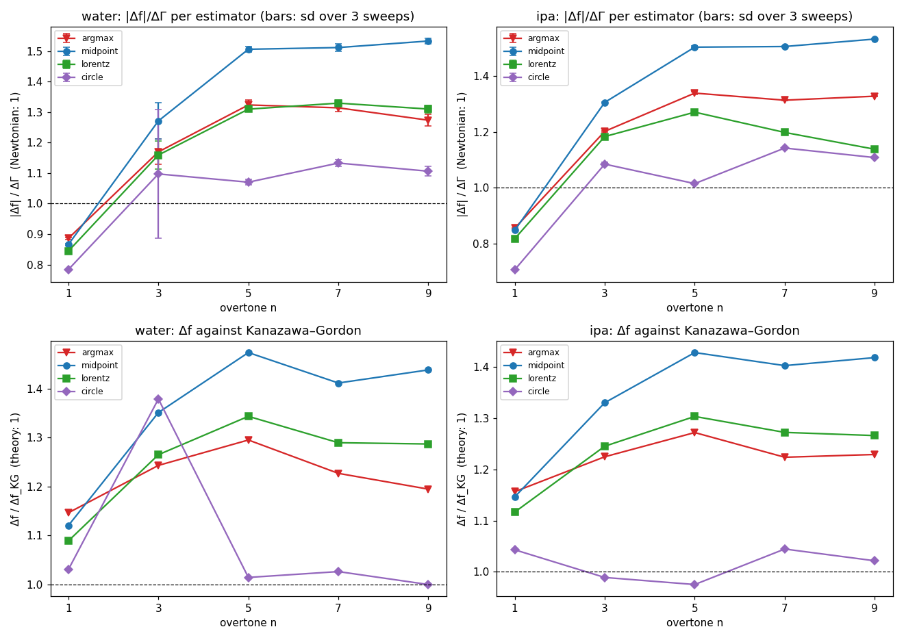
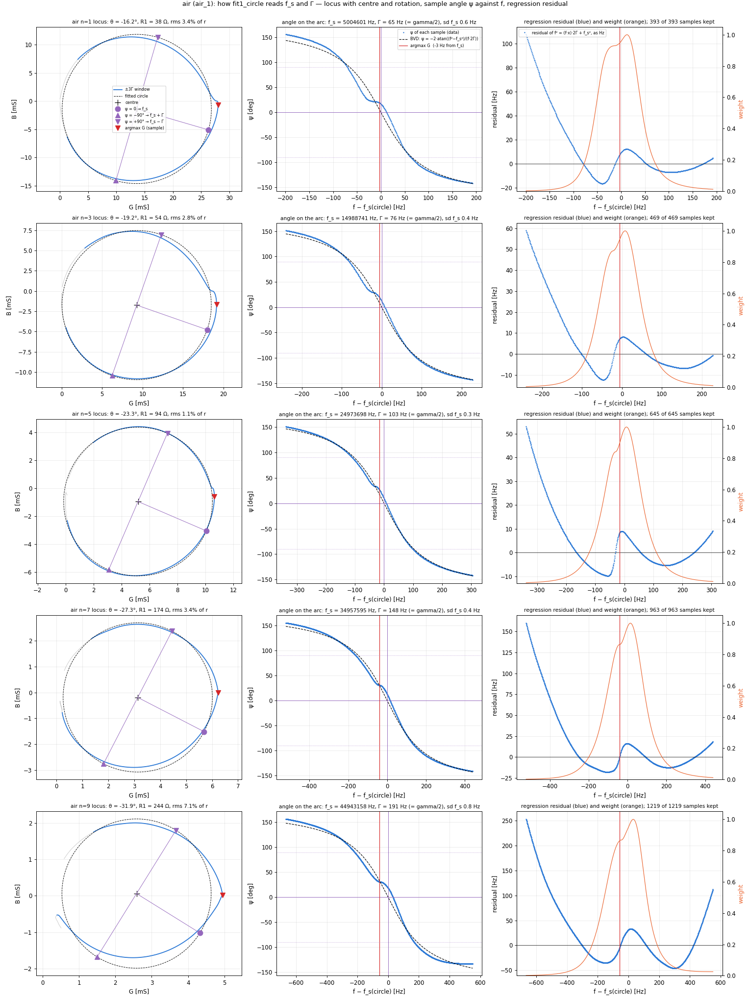
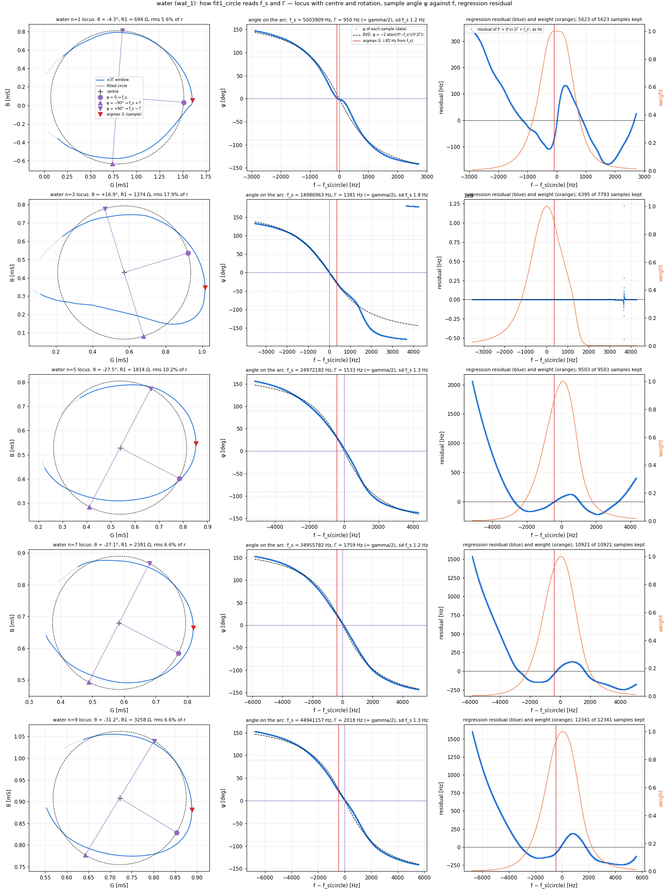
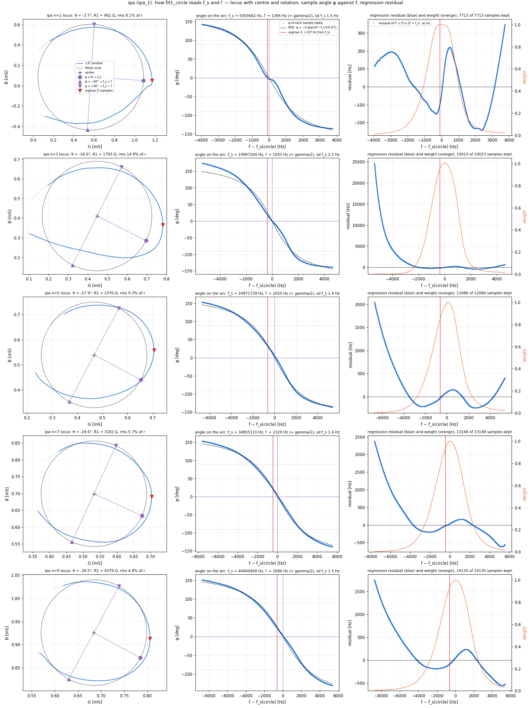

# f_s estimators on the exact conductance in liquid — board 1920, 2026-09-11

*Part 1: the Lorentzian fit on its own. Part 2: the four estimators side by side — argmax, half-height
midpoint, Lorentzian, BVD circle.*

## Part 1 — Lorentzian fit of the exact conductance, air / water / isopropanol

*`scripts/lorentzian_fit_G.py`. G is the process's own (Savitzky–Golay 51/3, spline s = 0.001, fold decision
per sweep, exact inversion). The fit is `sweep_data/fit_admittance.fit2_lorentzian` on the ±3Γ window around
argmax G, model G = Gmax / (1 + ((f² − f_s²)/(f·gamma))²) + a + b·f with a free linear background; `gamma`
is the **full** width at half height, so Γ_L = gamma/2 and D_L = gamma/f_s. Three replicas per phase,
mean ± sd. Shifts are liquid minus air with the same estimator on both sides; Kanazawa–Gordon at 25 °C with
the constants of `../air-ipa-water-1920-2026-09-10/scripts/kanazawa_gordon.py`.*

## Figures

### G and the fitted Lorentzian, middle replica

*Grey: G. Green dashed: the Lorentzian on its ±3Γ window. Red line: argmax G. Green line: f_s of the fit.
Shaded: ±Γ at half height.*

### Residual G − fit, percent of the fitted Gmax

### |Δf|/ΔΓ and the ratios to the theory

## Tables

### Lorentzian fit per phase, mean ± sd over the three replicas

| phase | n | f_s [Hz] | Γ_L = gamma/2 [Hz] | D_L = gamma/f_s [ppm] | f_s − argmax G [Hz] | Γ_L / Γ half height | fit rms / Gmax [%] | points in ±3Γ | window clipped |
|---|---|---|---|---|---|---|---|---|---|
| air | 1 | 5004589 ± 2 | 66.1 ± 0.2 | 26.4 | -9 | 1.011 | 2.74 | 393 | no |
| air | 3 | 14988727 ± 7 | 77.0 ± 0.1 | 10.3 | -12 | 0.987 | 2.82 | 469 | no |
| air | 5 | 24973674 ± 13 | 103.9 ± 0.7 | 8.3 | -14 | 0.962 | 3.36 | 645 | no |
| air | 7 | 34957553 ± 21 | 150.3 ± 2.4 | 8.6 | -13 | 0.947 | 3.53 | 963 | no |
| air | 9 | 44943095 ± 23 | 193.4 ± 1.0 | 8.6 | -15 | 0.949 | 4.05 | 1219 | no |
| water | 1 | 5003855 ± 3 | 935.1 ± 3.9 | 373.7 | +29 | 0.998 | 0.70 | 5623 | no |
| water | 3 | 14987251 ± 58 | 1350.3 ± 35.7 | 180.2 | -37 | 1.024 | 1.66 | 7793 | no |
| water | 5 | 24971650 ± 13 | 1649.0 ± 2.2 | 132.1 | -87 | 1.042 | 2.64 | 9503 | no |
| water | 7 | 34955254 ± 18 | 1879.2 ± 3.1 | 107.5 | -125 | 1.031 | 2.66 | 10921 | no |
| water | 9 | 44940494 ± 24 | 2178.7 ± 1.1 | 97.0 | -202 | 1.038 | 3.36 | 12341 | right |
| ipa | 1 | 5003582 ± 2 | 1298.3 ± 0.6 | 519.0 | +27 | 1.010 | 0.81 | 7713 | no |
| ipa | 3 | 14986781 ± 1 | 1722.0 ± 1.4 | 229.8 | -44 | 1.031 | 1.63 | 10023 | no |
| ipa | 5 | 24971044 ± 2 | 2174.0 ± 11.7 | 174.1 | -78 | 1.074 | 2.45 | 12086 | right |
| ipa | 7 | 34954516 ± 4 | 2685.8 ± 2.9 | 153.7 | -129 | 1.127 | 2.15 | 13148 | right |
| ipa | 9 | 44939668 ± 14 | 3205.5 ± 5.7 | 142.7 | -115 | 1.183 | 2.34 | 14135 | right |

### air → water: shifts from the Lorentzian fit, against Kanazawa–Gordon (25 °C), with argmax G beside

| n | Δf_L [Hz] | Δf_L/Δf_KG | ΔΓ_L [Hz] | ΔΓ_L/ΔΓ_KG | ΔD_L [ppm] | **\|Δf_L\|/ΔΓ_L** | Δf argmax [Hz] | ΔΓ half height [Hz] | \|Δf\|/ΔΓ argmax |
|---|---|---|---|---|---|---|---|---|---|
| 1 | -734 ± 4 | 1.09 | 869 | 1.29 | 347.3 | **0.84** | -772 | 872 | 0.89 |
| 3 | -1476 ± 59 | 1.27 | 1273 | 1.09 | 169.9 | **1.16** | -1451 | 1240 | 1.17 |
| 5 | -2024 ± 18 | 1.34 | 1545 | 1.03 | 123.7 | **1.31** | -1951 | 1474 | 1.32 |
| 7 | -2299 ± 28 | 1.29 | 1729 | 0.97 | 98.9 | **1.33** | -2187 | 1664 | 1.31 |
| 9 | -2601 ± 33 | 1.29 | 1985 | 0.98 | 88.4 | **1.31** | -2415 | 1896 | 1.27 |

### air → ipa: shifts from the Lorentzian fit, against Kanazawa–Gordon (25 °C), with argmax G beside

| n | Δf_L [Hz] | Δf_L/Δf_KG | ΔΓ_L [Hz] | ΔΓ_L/ΔΓ_KG | ΔD_L [ppm] | **\|Δf_L\|/ΔΓ_L** | Δf argmax [Hz] | ΔΓ half height [Hz] | \|Δf\|/ΔΓ argmax |
|---|---|---|---|---|---|---|---|---|---|
| 1 | -1007 ± 3 | 1.12 | 1232 | 1.37 | 492.5 | **0.82** | -1043 | 1220 | 0.86 |
| 3 | -1946 ± 7 | 1.25 | 1645 | 1.05 | 219.5 | **1.18** | -1914 | 1593 | 1.20 |
| 5 | -2630 ± 13 | 1.30 | 2070 | 1.03 | 165.8 | **1.27** | -2566 | 1917 | 1.34 |
| 7 | -3037 ± 22 | 1.27 | 2535 | 1.06 | 145.1 | **1.20** | -2921 | 2224 | 1.31 |
| 9 | -3427 ± 27 | 1.27 | 3012 | 1.11 | 134.1 | **1.14** | -3327 | 2506 | 1.33 |

## What the numbers say

- **Where the Lorentzian centre falls.** In air f_s is 9–15 Hz left of argmax (0.14–0.16 Γ). In liquid it is
  +29 Hz (n = 1) and −37…−202 Hz (water n = 3…9), +27 and −44…−129 Hz (isopropanol): **0.02–0.10 Γ**, not the
  0.25–0.33 Γ the air addendum of 2026-09-10 extrapolated to the liquid width. That extrapolation was wrong:
  scaled to Γ, the skew of the peak is 3–8 times smaller in liquid than in air.
- **|Δf|/ΔΓ does not move towards 1.** Water: 1.16 / 1.31 / 1.33 / 1.31 on n = 3…9 against 1.17 / 1.32 / 1.31 /
  1.27 with argmax and half height. Isopropanol: 1.18 / 1.27 / 1.20 / 1.14 against 1.20 / 1.34 / 1.31 / 1.33;
  the lower values at n = 7 and 9 come from ΔΓ_L, not from Δf: there Γ_L/Γ_hh = 1.13–1.18, the ±3Γ window is
  clipped on the right by the sweep, and ΔΓ_L/ΔΓ_KG rises to 1.06–1.11 while Δf_L/Δf_KG stays at 1.27.
- **The frequency excess over the theory is the same.** Δf_L/Δf_KG = 1.27–1.34 (water) and 1.25–1.30
  (isopropanol) on n = 3…9, against 1.19–1.30 and 1.22–1.27 with argmax.
- **G is not a Lorentzian on this instrument, in air or in liquid.** The residual has the same S shape in every
  panel — negative just left of the peak, positive just right, opposite sign one width further out — with an
  amplitude of 4–7 % of Gmax in air and 2–6 % in liquid. The fit rms is 2.7–4.1 % of Gmax in air and 0.7–3.4 %
  in liquid. The pattern is the same on the three replicas.
- **Repeatability.** The sd of f_s over three sweeps is 1–4 Hz in air on n = 1, 7–23 Hz on n = 3…9 (air is still
  drifting at 12:25), 2–24 Hz in liquid except water n = 3 (58 Hz, the state change of 13:12).

## Part 2 — the four estimators side by side

*`scripts/fs_estimators_liquid.py`, all on the same exact G and the same ±3Γ window (Γ at half height):
`argmax` (published), the midpoint of the two half-height crossings, the Lorentzian of Part 1, and the BVD
circle fit `fit_admittance.fit1_circle` on Y = G + jB built as the chain builds B (Taubin → geometric
refinement → rotation → f_s and Γ from the angle of each sample on the arc). Each estimator carries its
own Γ: half height for argmax and midpoint, gamma/2 for the Lorentzian and the circle. Three replicas per
phase, mean ± sd; shifts against the air of the same estimator.*

### G with the four markers, middle replica

### |Δf|/ΔΓ and Δf/Δf_KG per estimator

### Tables

### WATER (rho = 997.0 kg/m3, eta = 0.890 mPa s at 25 degC), mean +- sd over three sweeps on the plateau

| n | estimator | f air [Hz] | f liquid [Hz] | df [Hz] | df / df_KG | Gamma air [Hz] | Gamma liquid [Hz] | dGamma [Hz] | dGamma / dGamma_KG | **abs(df) / dGamma** |
|---|---|---|---|---|---|---|---|---|---|---|
| 1 | argmax | 5004598 ± 2 | 5003826 ± 3 | -772 | 1.15 | 65.4 | 937 ± 3 | 872 | 1.29 | **0.89** |
| 1 | midpoint | 5004586 ± 2 | 5003831 ± 3 | -755 | 1.12 | 65.4 | 937 ± 3 | 872 | 1.29 | **0.87** |
| 1 | lorentz | 5004589 ± 2 | 5003855 ± 3 | -734 | 1.09 | 66.1 | 935 ± 4 | 869 | 1.29 | **0.84** |
| 1 | circle | 5004602 ± 2 | 5003908 ± 2 | -694 | 1.03 | 64.9 | 951 ± 4 | 886 | 1.31 | **0.78** |
| 3 | argmax | 14988738 ± 8 | 14987288 ± 52 | -1451 | 1.24 | 78.0 | 1318 ± 33 | 1240 | 1.06 | **1.17** |
| 3 | midpoint | 14988720 ± 7 | 14987143 ± 74 | -1577 | 1.35 | 78.0 | 1318 ± 33 | 1240 | 1.06 | **1.27** |
| 3 | lorentz | 14988727 ± 7 | 14987251 ± 58 | -1476 | 1.27 | 77.0 | 1350 ± 36 | 1273 | 1.09 | **1.16** |
| 3 | circle | 14988744 ± 7 | 14987135 ± 309 | -1609 | 1.38 | 76.1 | 1542 ± 280 | 1466 | 1.26 | **1.10** |
| 5 | argmax | 24973688 ± 13 | 24971737 ± 24 | -1951 | 1.30 | 108.0 | 1582 ± 2 | 1474 | 0.98 | **1.32** |
| 5 | midpoint | 24973661 ± 13 | 24971440 ± 14 | -2220 | 1.47 | 108.0 | 1582 ± 2 | 1474 | 0.98 | **1.51** |
| 5 | lorentz | 24973674 ± 13 | 24971650 ± 13 | -2024 | 1.34 | 103.9 | 1649 ± 2 | 1545 | 1.03 | **1.31** |
| 5 | circle | 24973705 ± 13 | 24972177 ± 14 | -1528 | 1.01 | 103.6 | 1531 ± 2 | 1428 | 0.95 | **1.07** |
| 7 | argmax | 34957566 ± 22 | 34955379 ± 19 | -2187 | 1.23 | 158.7 | 1823 ± 3 | 1664 | 0.93 | **1.31** |
| 7 | midpoint | 34957531 ± 22 | 34955015 ± 19 | -2516 | 1.41 | 158.7 | 1823 ± 3 | 1664 | 0.93 | **1.51** |
| 7 | lorentz | 34957553 ± 21 | 34955254 ± 18 | -2299 | 1.29 | 150.3 | 1879 ± 3 | 1729 | 0.97 | **1.33** |
| 7 | circle | 34957604 ± 20 | 34955775 ± 17 | -1829 | 1.03 | 146.8 | 1761 ± 2 | 1615 | 0.91 | **1.13** |
| 9 | argmax | 44943110 ± 23 | 44940695 ± 37 | -2415 | 1.19 | 203.7 | 2100 ± 1 | 1896 | 0.94 | **1.27** |
| 9 | midpoint | 44943065 ± 23 | 44940158 ± 18 | -2907 | 1.44 | 203.7 | 2100 ± 1 | 1896 | 0.94 | **1.53** |
| 9 | lorentz | 44943095 ± 23 | 44940494 ± 24 | -2601 | 1.29 | 193.4 | 2179 ± 1 | 1985 | 0.98 | **1.31** |
| 9 | circle | 44943169 ± 23 | 44941148 ± 28 | -2021 | 1.00 | 191.3 | 2018 ± 1 | 1827 | 0.90 | **1.11** |

### IPA (rho = 781.0 kg/m3, eta = 2.038 mPa s at 25 degC), mean +- sd over three sweeps on the plateau

| n | estimator | f air [Hz] | f liquid [Hz] | df [Hz] | df / df_KG | Gamma air [Hz] | Gamma liquid [Hz] | dGamma [Hz] | dGamma / dGamma_KG | **abs(df) / dGamma** |
|---|---|---|---|---|---|---|---|---|---|---|
| 1 | argmax | 5004598 ± 2 | 5003555 ± 2 | -1043 | 1.16 | 65.4 | 1286 ± 1 | 1220 | 1.35 | **0.86** |
| 1 | midpoint | 5004586 ± 2 | 5003552 ± 2 | -1034 | 1.15 | 65.4 | 1286 ± 1 | 1220 | 1.35 | **0.85** |
| 1 | lorentz | 5004589 ± 2 | 5003582 ± 2 | -1007 | 1.12 | 66.1 | 1298 ± 1 | 1232 | 1.37 | **0.82** |
| 1 | circle | 5004602 ± 2 | 5003662 ± 2 | -941 | 1.04 | 64.9 | 1397 ± 5 | 1332 | 1.48 | **0.71** |
| 3 | argmax | 14988738 ± 8 | 14986825 ± 3 | -1914 | 1.22 | 78.0 | 1670 ± 1 | 1593 | 1.02 | **1.20** |
| 3 | midpoint | 14988720 ± 7 | 14986641 ± 1 | -2079 | 1.33 | 78.0 | 1670 ± 1 | 1593 | 1.02 | **1.31** |
| 3 | lorentz | 14988727 ± 7 | 14986781 ± 1 | -1946 | 1.25 | 77.0 | 1722 ± 1 | 1645 | 1.05 | **1.18** |
| 3 | circle | 14988744 ± 7 | 14987199 ± 9 | -1545 | 0.99 | 76.1 | 1501 ± 2 | 1425 | 0.91 | **1.08** |
| 5 | argmax | 24973688 ± 13 | 24971122 ± 10 | -2566 | 1.27 | 108.0 | 2025 ± 4 | 1917 | 0.95 | **1.34** |
| 5 | midpoint | 24973661 ± 13 | 24970779 ± 7 | -2881 | 1.43 | 108.0 | 2025 ± 4 | 1917 | 0.95 | **1.50** |
| 5 | lorentz | 24973674 ± 13 | 24971044 ± 2 | -2630 | 1.30 | 103.9 | 2174 ± 12 | 2070 | 1.03 | **1.27** |
| 5 | circle | 24973705 ± 13 | 24971738 ± 3 | -1967 | 0.98 | 103.6 | 2042 ± 11 | 1939 | 0.96 | **1.01** |
| 7 | argmax | 34957566 ± 22 | 34954645 ± 5 | -2921 | 1.22 | 158.7 | 2383 ± 2 | 2224 | 0.93 | **1.31** |
| 7 | midpoint | 34957531 ± 22 | 34954182 ± 4 | -3348 | 1.40 | 158.7 | 2383 ± 2 | 2224 | 0.93 | **1.51** |
| 7 | lorentz | 34957553 ± 21 | 34954516 ± 4 | -3037 | 1.27 | 150.3 | 2686 ± 3 | 2535 | 1.06 | **1.20** |
| 7 | circle | 34957604 ± 20 | 34955111 ± 1 | -2493 | 1.04 | 146.8 | 2330 ± 1 | 2183 | 0.91 | **1.14** |
| 9 | argmax | 44943110 ± 23 | 44939783 ± 1 | -3327 | 1.23 | 203.7 | 2710 ± 3 | 2506 | 0.93 | **1.33** |
| 9 | midpoint | 44943065 ± 23 | 44939226 ± 8 | -3839 | 1.42 | 203.7 | 2710 ± 3 | 2506 | 0.93 | **1.53** |
| 9 | lorentz | 44943095 ± 23 | 44939668 ± 14 | -3427 | 1.27 | 193.4 | 3206 ± 6 | 3012 | 1.11 | **1.14** |
| 9 | circle | 44943169 ± 23 | 44940404 ± 7 | -2765 | 1.02 | 191.3 | 2687 ± 2 | 2496 | 0.92 | **1.11** |

### What the four estimators do

- **Where they fall, relative to argmax, in liquid n ≥ 3.** Midpoint 128–550 Hz to the left (the tail of G is
  on the left in liquid); Lorentzian 30–200 Hz to the left; circle **357 Hz left (water n = 3, unstable) to
  378–625 Hz right**. In air all four sit within −45…+58 Hz of each other.
- **|Δf|/ΔΓ on n = 3…9.** argmax 1.17–1.34; midpoint 1.27–1.53; Lorentzian 1.14–1.33; **circle 1.07–1.14
  (water), 1.01–1.14 (isopropanol)**. The circle is the only one below 1.15, and it gets there by moving
  f_s to the right, not by changing Γ: its Δf/Δf_KG is 1.00–1.03 (water n = 5…9) and 0.98–1.04
  (isopropanol), against 1.19–1.34 for the other three; its ΔΓ/ΔΓ_KG is 0.90–0.96 like the others.
- **Fundamental.** Every estimator gives |Δf|/ΔΓ < 1 (0.78–0.89); the circle is the farthest (0.78, 0.71)
  because its Γ is 1.5–8 % larger than the half-height one while Δf is smaller.
- **Water n = 3.** The circle's f_s has sd 309 Hz over the three replicas: on the 13:15:28 sweep the fold
  decision flipped, the sign of B was inverted where the phase does not cross zero, and the circle fit
  returned Γ = 1865 Hz against 1381 on the other two. The other three estimators do not use B and carry
  only the 50-Hz change of state of that sweep.
- **Repeatability of the shifts** (sd of f over the three liquid sweeps, n ≥ 3, excluding water n = 3):
  argmax 1–37 Hz, midpoint 1–19, Lorentzian 1–24, circle 1–28. All small against the 1.4–3.4 kHz shifts.
- In a Butterworth–Van Dyke circuit the maximum of G and the circle's f_s are the same frequency. Here
  they are 0.2–0.3 Γ apart in liquid, which is another statement of the S-shaped residual of Part 1 and of
  the out-of-round locus of `fold-hypothesis.md`.

## Part 3 — how the circle reads f_s and Γ, and where its f_s comes from

*`scripts/circle_fit_anatomy.py`, middle replica. Three plots per overtone: the locus with the fitted circle,
its centre, the rotation θ and the three points ψ = 0 (f_s), ψ = ∓90° (f_s ± Γ); the angle ψ of every sample
on the arc against frequency with the BVD law ψ = −2·atan((f² − f_s²)/(f·2Γ)); the residual of the linear
regression f² = (f·x)·2Γ + f_s² in Hz, with the weight 1/(1 + x²)².*

**The recipe.** (1) Fit a circle to the ±3Γ points (Taubin, then orthogonal-distance refinement): centre and
radius, R1 = 1/(2r). (2) For every sample take the angle ψ from the centre, after rotating the whole locus by
θ. (3) In a Butterworth–Van Dyke circuit ψ = −2·atan(x) with x = (f² − f_s²)/(f·2Γ), so x = −tan(ψ/2) and
f² = (f·x)·2Γ + f_s² is linear in the two unknowns: one weighted least squares gives 2Γ and f_s². (4) θ is
**free**: it is scanned (181 values, then golden-section refined) for the value that makes step 3 fit best.
f_s is therefore the frequency of the sample that sits on the rotated horizontal through the centre, and
f_s ± Γ are the samples on the rotated vertical.

### Air

### Water

### Isopropanol

### The same reading with θ = 0 and with the fitted θ

| phase | n | θ fitted [°] | f_s − argmax, θ = 0 [Hz] | f_s − argmax, θ fitted [Hz] | Γ, θ = 0 [Hz] | Γ, θ fitted [Hz] | Γ half height [Hz] | regression cost θ=0 / fitted |
|---|---|---|---|---|---|---|---|---|
| air | 1 / 3 / 5 / 7 / 9 | −16 / −19 / −23 / −27 / −32 | −10 / −13 / −16 / −13 / −20 | +3 / +6 / +16 / +41 / +58 | 66 / 81 / 116 / 175 / 239 | 65 / 76 / 103 / 148 / 191 | 65 / 78 / 107 / 160 / 203 | 1.1 / 1.7 / 3.2 / 2.5 / 1.8 |
| water | 1 / 3 / 5 / 7 / 9 | −4 / +17 / −28 / −27 / −31 | +31 / −102 / −136 / −244 / −377 | +85 / −357 / +423 / +395 / +470 | 955 / 1186 / 1788 / 2053 / 2477 | 950 / 1381 / 1533 / 1759 / 2018 | 937 / 1299 / 1584 / 1820 / 2099 | 1.1 / 1.2 / 2.7 / 2.8 / 3.1 |
| isopropanol | 1 / 3 / 5 / 7 / 9 | −4 / −27 / −28 / −25 / −29 | +39 / −123 / −136 / −297 / −390 | +107 / +378 / +623 / +464 / +625 | 1400 / 1580 / 2397 / 2659 / 3239 | 1394 / 1503 / 2050 / 2329 / 2686 | 1285 / 1671 / 2028 / 2381 / 2710 | 1.0 / 1.1 / 3.0 / 2.5 / 2.9 |

- **The rotation is what moves f_s to the right.** With θ = 0 the circle's f_s sits 100–390 Hz **left** of
  argmax on n ≥ 3 in liquid — on the same side as the midpoint and the Lorentzian. The fitted θ of −25…−31°
  carries it 400–620 Hz to the right. The |Δf|/ΔΓ of 1.0–1.1 in Part 2 rests entirely on that free angle.
- **θ is the same in air and in liquid on n ≥ 5**: −23…−32° in air, −25…−31° in the liquids. It is a property
  of the instrument, not of the load. On n = 1 it is −16° in air and −4° in liquid; water n = 3 gives +17°
  on this replica, the one whose fold decision flipped.
- **Γ from the arc** is 3–5 % below the half-height Γ with the fitted θ and 10–20 % above it with θ = 0.
- **The regression is systematically off** far from f_s (the residual grows to hundreds of Hz at ±2Γ); the
  weight 1/(1 + x²)² confines the fit to about ±Γ around f_s. Inside that band the fitted law follows the
  data; in air the ψ(f) data show a bump at ψ ≈ 0, 20–40 Hz wide, that the model does not have — the
  rounded fold of the detector near 0°.

## Where this leaves the estimator question (Marco, 2026-09-11)

None of the four candidates brings |Δf|/ΔΓ to 1 on the overtones in liquid for a reason that survives
inspection: argmax, midpoint and Lorentzian give 1.14–1.53; the circle gives 1.0–1.14 only through a free
rotation of 25–31°, and its fitted circle overlaps the measured locus poorly — the locus deviates from
circularity by 5–18 % of the radius. Marco's reading: the circle is weak on this data. The published
estimator stays `argmax` for now; the frequency excess over Kanazawa–Gordon (Δf/Δf_KG = 1.2–1.3 on n = 3…9,
ΔΓ within ±8 %) is not an estimator artefact and is open.
