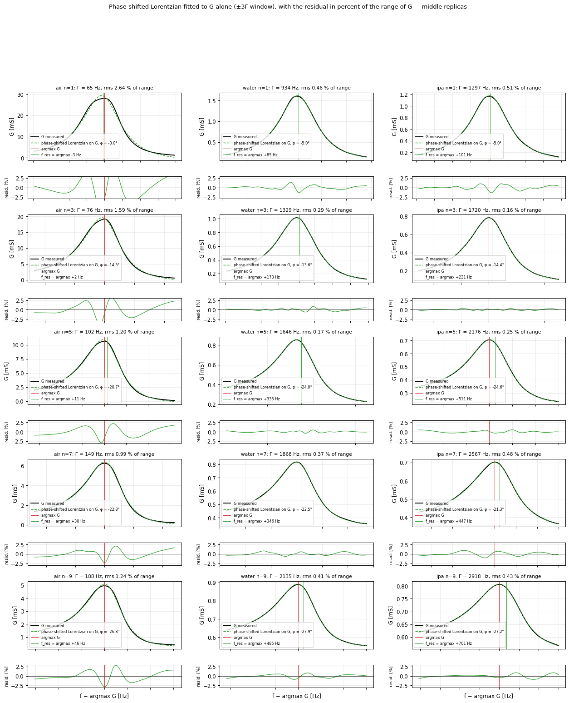
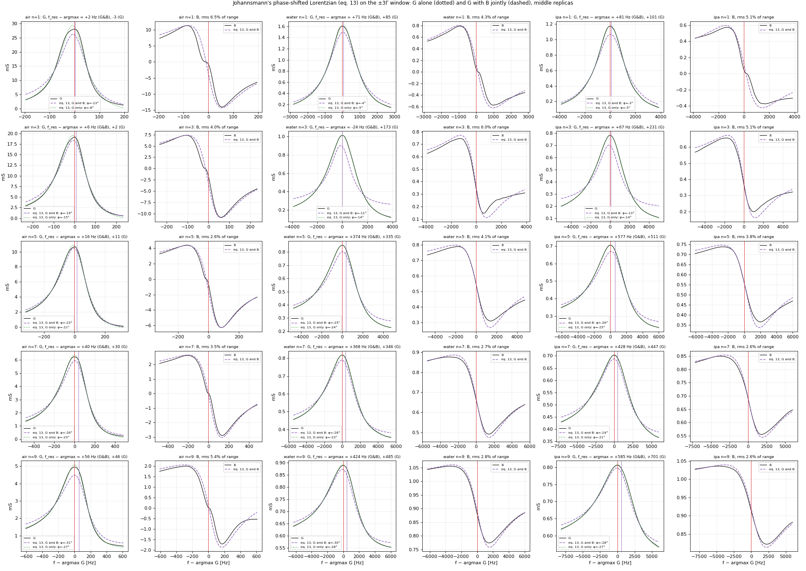
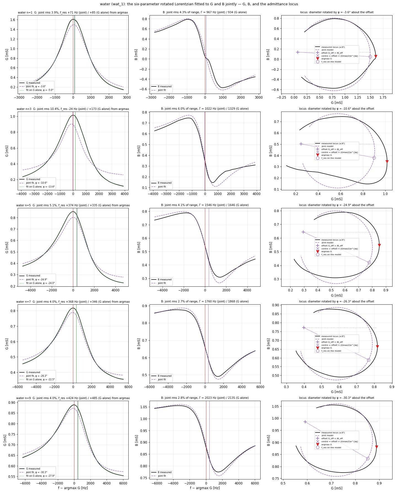
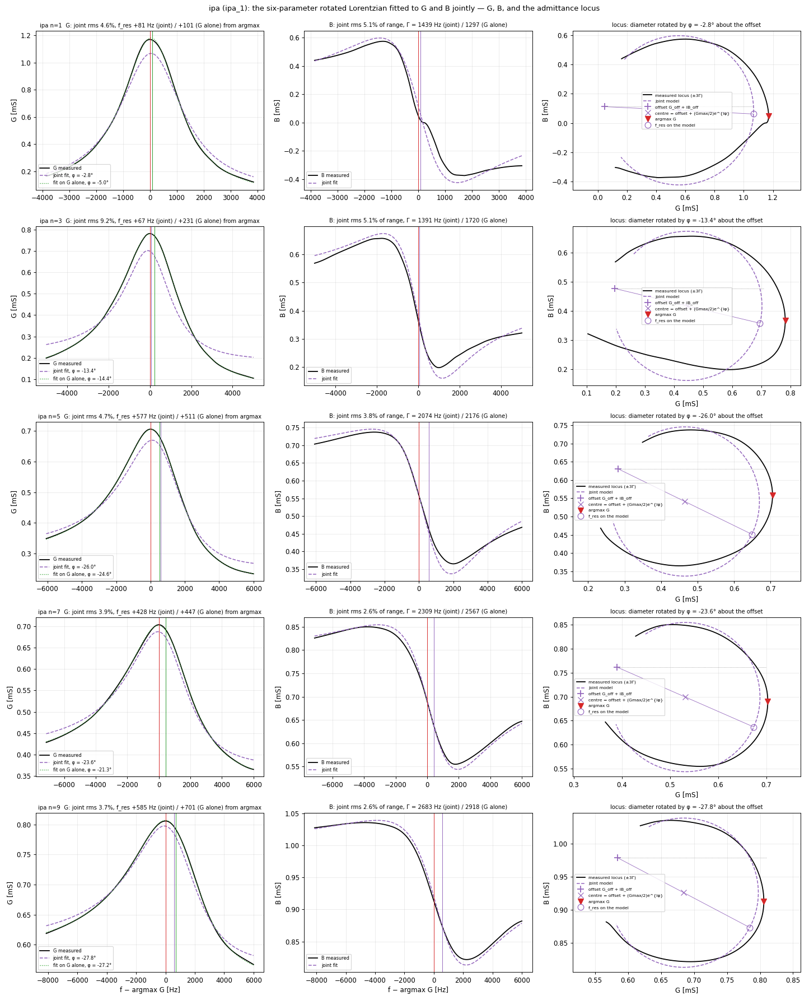
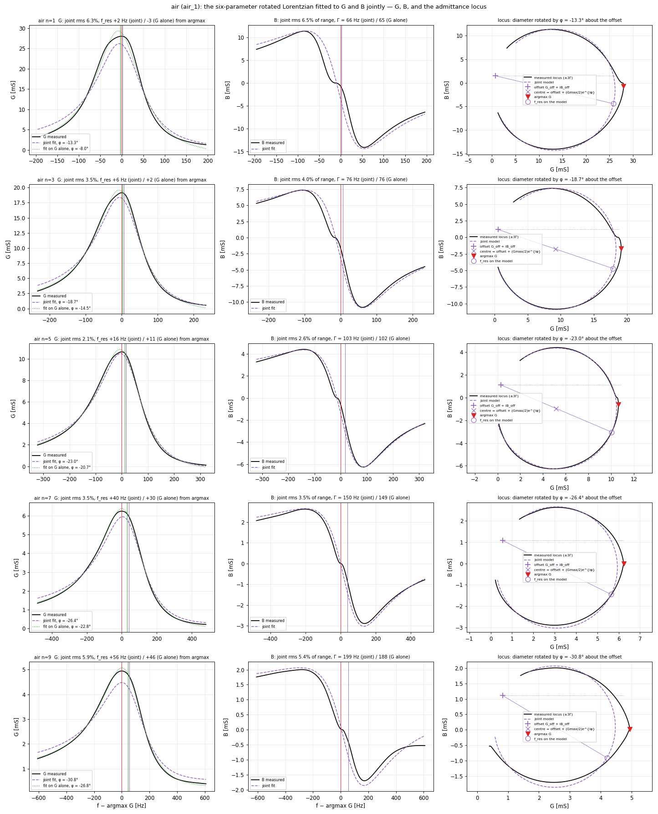
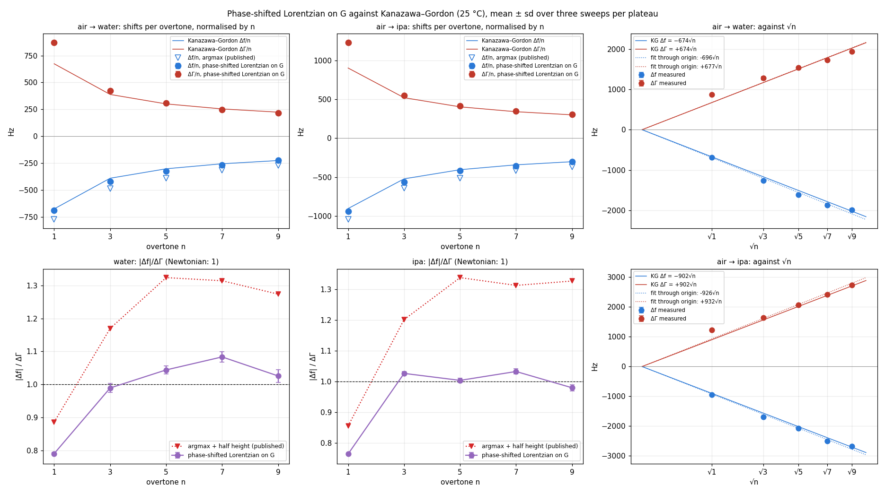

# The phase-shifted Lorentzian on G — board 1920, 2026-09-11, air / water / isopropanol

*Johannsmann, Sensors 2021, 21, 3490, eq. 13, tried on Marco's question of 2026-09-14 ("questo tipo di fit lo
abbiamo provato?"). It had not been. `scripts/phase_shifted_lorentzian.py`; the nine dumps of 2026-09-11
(`data/sweep_dumps_2026-09-11.npz`), G and B from the process's own chain, the fit on the ±3Γ window around
argmax G with Γ at half height. Three replicas per phase, mean ± sd; shifts liquid minus air with the same
fit on both sides; Kanazawa–Gordon at 25 °C with the constants of `../air-ipa-water-1920-2026-09-10/scripts/kanazawa_gordon.py`.*

## The model

```
G = Gmax·Γ · ( Γ·cos φ + (f_res − f)·sin φ ) / ((f_res − f)² + Γ²) + G_off
B = Gmax·Γ · ( Γ·sin φ + (f_res − f)·cos φ ) / ((f_res − f)² + Γ²) + B_off
```

Γ is the **half** width at half maximum (Johannsmann's convention, the datalog's Γ). φ absorbs the asymmetry of
the resonance curve; Johannsmann attributes it to imperfect calibration and notes that it rarely vanishes.

⚠️ **As printed, eq. 13 is not one rotation.** The real and imaginary parts of the rotated complex Lorentzian
A·e^{jφ}/(Γ − j(f_res − f)) are G = A(Γ cos φ − Δ sin φ)/(Δ² + Γ²) and B = A(Γ sin φ + Δ cos φ)/(Δ² + Γ²) with
Δ = f_res − f: eq. 13's B matches, eq. 13's G has the opposite sign on the dispersive term. Fitted separately
with eq. 13 literally, G and B return φ of **opposite sign and equal size** (+21…+28° and −26…−30° on n ≥ 5),
which is the same rotation seen through the two sign conventions; fitted jointly with eq. 13 literally the
model can only satisfy both channels with φ ≈ 0, and that first joint fit was bad for that reason (rms 6–10 %),
not for the reason first written here. Every fit below uses the rotation form, and φ is reported with the
rotation's sign (negative here; eq. 13's φ for G is its opposite). Three fits per sweep, Levenberg–Marquardt
on the ±3Γ window: **(a) G alone**, five parameters (A = Gmax·Γ, f_res, Γ, φ, G_off); **(b) B alone**, five;
**(c) G and B jointly**, six, each channel weighted by its own range.

The symmetric Lorentzian of `fs-estimators-liquid.md` Part 1 is case (a) with φ ≡ 0 and a linear background.
The BVD circle fit of Part 3 is the geometric relative of (b): its rotation θ is this φ with the opposite sign
convention, read off the arc angles instead of fitted by least squares.

## Figures

### G and the fit on G alone, with the residual, middle replicas



*Black: measured G on the ±3Γ window. Green dashed: the phase-shifted Lorentzian fitted to G alone. Beneath
each panel the residual in percent of the range of G, on a fixed ±3 % scale. Red line: argmax G; green line:
f_res of the fit. In liquid the two curves are within ±0.5 % everywhere; in air the residual reaches ±2.5 % in
a narrow S at the peak, 20–50 Hz wide — the plateau of the fold described in `raw-sweeps.md`, which G shows
too.*

### G and B with both fits, middle replicas



*Black: measured. Green dotted: fit on G alone (the curve above). Purple dashed: the joint fit on G and B,
drawn on both channels — this is the one that visibly departs from the data: rms 4–10 % of range.*

### The joint six-parameter fit: G, B and the admittance locus







*Per overtone: G with the joint fit (purple dashed) and the fit on G alone (green dotted); B with the joint fit;
the locus B–G with the joint model, its offset G_off + iB_off (+), the centre offset + (Gmax/2)·e^{iφ} (×), the
rotated diameter (purple line against the unrotated one, dotted grey), f_res on the model (○) and argmax G (▼).
The joint model is a circle rotated by φ about the offset; the measured locus is not a circle — it runs inside
the model on one side and outside on the other, the same 5–18 % out-of-round of `fold-hypothesis.md` — so the
joint fit compromises: rms 3.7–5.1 % on G and 2.5–4.1 % on B on n ≥ 5, worse on n = 1 and 3.*

### Against Kanazawa–Gordon



*Top left and centre: Δf/n and ΔΓ/n from the fit on G (filled) against the theory (lines), with the published
argmax Δf/n beside (open triangles). Bottom left and centre: |Δf|/ΔΓ, fit on G against argmax + half height.
Right: the shifts against √n with the least-squares lines through the origin.*

## Tables

### Phase-shifted Lorentzian per phase, mean ± sd over three replicas

| phase | n | fit | f_res [Hz] | f_res − argmax [Hz] | Γ (HWHM) [Hz] | Γ / Γ half height | φ [°] | circle θ [°] | rms G [% range] | rms B [% range] |
|---|---|---|---|---|---|---|---|---|---|---|
| air | 1 | G only | 5004596 ± 2 | -3 | 66 | 1.003 | -8.0 ± 0.0 | -16 | 2.61 | 14.68 |
| air | 1 | B only | 5004611 ± 2 | +12 | 77 | 1.180 | -22.5 ± 0.5 | -16 | 11.44 | 4.44 |
| air | 1 | G and B | 5004601 ± 2 | +3 | 66 | 1.014 | -13.2 ± 0.2 | -16 | 6.33 | 6.57 |
| air | 3 | G only | 14988740 ± 7 | +2 | 76 | 0.975 | -14.5 ± 0.0 | -19 | 1.57 | 15.62 |
| air | 3 | B only | 14988752 ± 7 | +14 | 84 | 1.076 | -25.7 ± 0.1 | -19 | 6.30 | 2.79 |
| air | 3 | G and B | 14988745 ± 7 | +6 | 76 | 0.980 | -18.7 ± 0.0 | -19 | 3.49 | 3.97 |
| air | 5 | G only | 24973699 ± 13 | +11 | 102 | 0.948 | -20.6 ± 0.1 | -23 | 1.20 | 15.93 |
| air | 5 | B only | 24973711 ± 13 | +23 | 109 | 1.012 | -26.0 ± 0.1 | -23 | 10.56 | 2.06 |
| air | 5 | G and B | 24973704 ± 13 | +16 | 104 | 0.963 | -23.0 ± 0.1 | -23 | 2.10 | 2.62 |
| air | 7 | G only | 34957593 ± 21 | +28 | 148 | 0.930 | -22.9 ± 0.0 | -27 | 0.99 | 20.70 |
| air | 7 | B only | 34957608 ± 21 | +42 | 160 | 1.008 | -27.3 ± 0.1 | -27 | 8.59 | 2.13 |
| air | 7 | G and B | 34957603 ± 21 | +37 | 149 | 0.936 | -26.4 ± 0.1 | -27 | 3.49 | 3.44 |
| air | 9 | G only | 44943157 ± 23 | +47 | 189 | 0.926 | -26.8 ± 0.0 | -32 | 1.23 | 32.65 |
| air | 9 | B only | 44943152 ± 23 | +42 | 229 | 1.124 | -26.1 ± 0.2 | -32 | 12.35 | 3.15 |
| air | 9 | G and B | 44943166 ± 23 | +56 | 200 | 0.982 | -30.8 ± 0.0 | -32 | 5.88 | 5.45 |
| water | 1 | G only | 5003909 ± 2 | +83 | 934 | 0.997 | -5.0 ± 0.0 | -4 | 0.46 | 11.28 |
| water | 1 | B only | 5003793 ± 3 | -33 | 1080 | 1.153 | +4.7 ± 0.0 | -4 | 9.05 | 2.32 |
| water | 1 | G and B | 5003895 ± 2 | +69 | 968 | 1.033 | -3.6 ± 0.0 | -4 | 3.87 | 4.24 |
| water | 3 | G only | 14987478 ± 16 | +191 | 1351 | 1.025 | -15.0 ± 2.5 | +7 | 0.32 | 34.15 |
| water | 3 | B only | 14987051 ± 93 | -236 | 1446 | 1.097 | +4.9 ± 13.1 | +7 | 72.21 | 2.81 |
| water | 3 | G and B | 14987354 ± 112 | +66 | 1307 | 0.992 | -11.4 ± 1.4 | +7 | 8.73 | 6.61 |
| water | 5 | G only | 24972088 ± 13 | +351 | 1646 | 1.040 | -24.0 ± 0.0 | -27 | 0.18 | 26.08 |
| water | 5 | B only | 24971919 ± 13 | +182 | 1586 | 1.003 | -13.1 ± 0.1 | -27 | 44.67 | 0.41 |
| water | 5 | G and B | 24972127 ± 14 | +390 | 1543 | 0.976 | -24.8 ± 0.1 | -27 | 5.09 | 4.10 |
| water | 7 | G only | 34955726 ± 18 | +347 | 1872 | 1.027 | -22.5 ± 0.0 | -27 | 0.36 | 29.91 |
| water | 7 | B only | 34955706 ± 19 | +328 | 1861 | 1.021 | -26.7 ± 0.1 | -27 | 154.54 | 0.47 |
| water | 7 | G and B | 34955748 ± 18 | +369 | 1762 | 0.967 | -26.3 ± 0.0 | -27 | 3.98 | 2.66 |
| water | 9 | G only | 44941165 ± 29 | +470 | 2130 | 1.015 | -27.9 ± 0.2 | -31 | 0.50 | 34.13 |
| water | 9 | B only | 44940945 ± 26 | +250 | 2104 | 1.002 | -28.0 ± 0.2 | -31 | 103.70 | 0.32 |
| water | 9 | G and B | 44941102 ± 28 | +407 | 2024 | 0.964 | -30.2 ± 0.2 | -31 | 4.02 | 2.81 |
| ipa | 1 | G only | 5003656 ± 2 | +101 | 1297 | 1.009 | -5.0 ± 0.0 | -4 | 0.52 | 12.92 |
| ipa | 1 | B only | 5003449 ± 2 | -106 | 1697 | 1.320 | +8.7 ± 0.1 | -4 | 91.28 | 2.45 |
| ipa | 1 | G and B | 5003636 ± 2 | +81 | 1442 | 1.122 | -2.8 ± 0.0 | -4 | 4.62 | 5.12 |
| ipa | 3 | G only | 14987054 ± 5 | +230 | 1719 | 1.029 | -14.2 ± 0.2 | -26 | 0.16 | 38.41 |
| ipa | 3 | B only | 14986664 ± 5 | -161 | 1410 | 0.844 | -5.6 ± 0.0 | -26 | 54.13 | 1.42 |
| ipa | 3 | G and B | 14986890 ± 7 | +65 | 1390 | 0.832 | -13.4 ± 0.1 | -26 | 9.20 | 5.15 |
| ipa | 5 | G only | 24971627 ± 1 | +505 | 2167 | 1.070 | -24.7 ± 0.2 | -28 | 0.22 | 24.02 |
| ipa | 5 | B only | 24971450 ± 6 | +328 | 2152 | 1.063 | -15.8 ± 0.1 | -28 | 13.41 | 0.37 |
| ipa | 5 | G and B | 24971692 ± 3 | +570 | 2067 | 1.021 | -26.1 ± 0.1 | -28 | 4.67 | 3.76 |
| ipa | 7 | G only | 34955093 ± 0 | +448 | 2570 | 1.078 | -21.4 ± 0.1 | -25 | 0.47 | 10.83 |
| ipa | 7 | B only | 34955072 ± 3 | +427 | 2417 | 1.014 | -25.6 ± 0.1 | -25 | 389.68 | 0.64 |
| ipa | 7 | G and B | 34955074 ± 0 | +430 | 2310 | 0.969 | -23.7 ± 0.1 | -25 | 3.91 | 2.54 |
| ipa | 9 | G only | 44940476 ± 12 | +693 | 2925 | 1.080 | -27.2 ± 0.0 | -29 | 0.43 | 9.31 |
| ipa | 9 | B only | 44940347 ± 8 | +563 | 2832 | 1.045 | -30.1 ± 0.0 | -29 | 844.60 | 0.39 |
| ipa | 9 | G and B | 44940364 ± 7 | +580 | 2683 | 0.990 | -27.9 ± 0.1 | -29 | 3.68 | 2.53 |

### air → water: shifts, against Kanazawa–Gordon (25 °C)

| n | fit | Δf [Hz] | Δf/Δf_KG | ΔΓ [Hz] | ΔΓ/ΔΓ_KG | **\|Δf\|/ΔΓ** | for reference: argmax + half height | circle |
|---|---|---|---|---|---|---|---|---|
| 1 | G only | -687 | 1.02 | 869 | 1.29 | **0.79** | 0.89 | Δf -694 |
| 1 | B only | -817 | 1.21 | 1003 | 1.49 | **0.81** | 0.89 | Δf -694 |
| 1 | G and B | -706 | 1.05 | 902 | 1.34 | **0.78** | 0.89 | Δf -694 |
| 3 | G only | -1262 | 1.08 | 1275 | 1.09 | **0.99** | 1.17 | Δf -1609 |
| 3 | B only | -1701 | 1.46 | 1362 | 1.17 | **1.25** | 1.17 | Δf -1609 |
| 3 | G and B | -1391 | 1.19 | 1231 | 1.06 | **1.13** | 1.17 | Δf -1609 |
| 5 | G only | -1611 | 1.07 | 1543 | 1.02 | **1.04** | 1.32 | Δf -1528 |
| 5 | B only | -1792 | 1.19 | 1477 | 0.98 | **1.21** | 1.32 | Δf -1528 |
| 5 | G and B | -1577 | 1.05 | 1439 | 0.96 | **1.10** | 1.32 | Δf -1528 |
| 7 | G only | -1868 | 1.05 | 1724 | 0.97 | **1.08** | 1.31 | Δf -1829 |
| 7 | B only | -1901 | 1.07 | 1701 | 0.95 | **1.12** | 1.31 | Δf -1829 |
| 7 | G and B | -1855 | 1.04 | 1613 | 0.91 | **1.15** | 1.31 | Δf -1829 |
| 9 | G only | -1991 | 0.99 | 1941 | 0.96 | **1.03** | 1.27 | Δf -2021 |
| 9 | B only | -2207 | 1.09 | 1875 | 0.93 | **1.18** | 1.27 | Δf -2021 |
| 9 | G and B | -2064 | 1.02 | 1824 | 0.90 | **1.13** | 1.27 | Δf -2021 |

### air → ipa: shifts, against Kanazawa–Gordon (25 °C)

| n | fit | Δf [Hz] | Δf/Δf_KG | ΔΓ [Hz] | ΔΓ/ΔΓ_KG | **\|Δf\|/ΔΓ** | for reference: argmax + half height | circle |
|---|---|---|---|---|---|---|---|---|
| 1 | G only | -940 | 1.04 | 1231 | 1.36 | **0.76** | 0.86 | Δf -941 |
| 1 | B only | -1161 | 1.29 | 1619 | 1.80 | **0.72** | 0.86 | Δf -941 |
| 1 | G and B | -965 | 1.07 | 1376 | 1.52 | **0.70** | 0.86 | Δf -941 |
| 3 | G only | -1686 | 1.08 | 1643 | 1.05 | **1.03** | 1.20 | Δf -1545 |
| 3 | B only | -2088 | 1.34 | 1326 | 0.85 | **1.58** | 1.20 | Δf -1545 |
| 3 | G and B | -1855 | 1.19 | 1313 | 0.84 | **1.41** | 1.20 | Δf -1545 |
| 5 | G only | -2072 | 1.03 | 2064 | 1.02 | **1.00** | 1.34 | Δf -1967 |
| 5 | B only | -2261 | 1.12 | 2043 | 1.01 | **1.11** | 1.34 | Δf -1967 |
| 5 | G and B | -2012 | 1.00 | 1963 | 0.97 | **1.03** | 1.34 | Δf -1967 |
| 7 | G only | -2501 | 1.05 | 2422 | 1.01 | **1.03** | 1.31 | Δf -2493 |
| 7 | B only | -2536 | 1.06 | 2257 | 0.95 | **1.12** | 1.31 | Δf -2493 |
| 7 | G and B | -2529 | 1.06 | 2162 | 0.91 | **1.17** | 1.31 | Δf -2493 |
| 9 | G only | -2681 | 0.99 | 2737 | 1.01 | **0.98** | 1.33 | Δf -2765 |
| 9 | B only | -2805 | 1.04 | 2603 | 0.96 | **1.08** | 1.33 | Δf -2765 |
| 9 | G and B | -2803 | 1.04 | 2483 | 0.92 | **1.13** | 1.33 | Δf -2765 |

### G-only fit: sensitivity to the window (middle replicas), f_res − argmax [Hz] / Γ [Hz] / φ [°]

| set | n | ±2 Γ | ±3 Γ | ±4 Γ | ±6 Γ |
|---|---|---|---|---|---|
| air_1 | 1 | -2 / 71 / -9.3 | -3 / 65 / -8.0 | -4 / 63 / -7.4 | -5 / 61 / -6.8 |
| air_1 | 3 | +4 / 79 / -16.4 | +2 / 76 / -14.5 | +1 / 75 / -13.7 | -0 / 74 / -12.8 |
| air_1 | 5 | +14 / 105 / -22.2 | +11 / 102 / -20.7 | +10 / 101 / -19.9 | +9 / 100 / -19.1 |
| air_1 | 7 | +34 / 153 / -24.2 | +30 / 149 / -22.8 | +28 / 148 / -22.1 | +26 / 147 / -21.3 |
| air_1 | 9 | +49 / 195 / -27.7 | +46 / 188 / -26.8 | +44 / 186 / -26.3 | +43 / 185 / -25.8 |
| wat_1 | 1 | +86 / 945 / -5.1 | +85 / 934 / -5.0 | +81 / 932 / -4.7 | +74 / 931 / -4.3 |
| wat_1 | 3 | +174 / 1349 / -13.6 | +173 / 1329 / -13.6 | +171 / 1328 / -13.5 | +167 / 1333 / -13.3 |
| wat_1 | 5 | +337 / 1646 / -24.1 | +335 / 1646 / -24.0 | +342 / 1642 / -24.3 | +349 / 1633 / -24.6 |
| wat_1 | 7 | +365 / 1834 / -23.4 | +346 / 1868 / -22.5 | +336 / 1881 / -22.2 | +325 / 1901 / -21.8 |
| wat_1 | 9 | +508 / 2132 / -28.7 | +485 / 2135 / -27.9 | +466 / 2159 / -27.3 | +446 / 2199 / -26.6 |
| ipa_1 | 1 | +108 / 1316 / -5.3 | +101 / 1297 / -5.0 | +94 / 1291 / -4.6 | +86 / 1292 / -4.3 |
| ipa_1 | 3 | +235 / 1725 / -14.5 | +231 / 1720 / -14.4 | +224 / 1729 / -14.1 | +222 / 1732 / -14.0 |
| ipa_1 | 5 | +493 / 2195 / -23.9 | +511 / 2176 / -24.6 | +518 / 2167 / -24.9 | +524 / 2155 / -25.0 |
| ipa_1 | 7 | +470 / 2514 / -22.2 | +447 / 2567 / -21.3 | +438 / 2584 / -21.1 | +438 / 2587 / -21.1 |
| ipa_1 | 9 | +726 / 2903 / -27.8 | +701 / 2918 / -27.2 | +680 / 2976 / -26.6 | +676 / 2996 / -26.4 |

### G-only fit: slopes in √n through the origin [Hz/√n]

| liquid | k_KG | k from −Δf | k from ΔΓ | ratio |
|---|---|---|---|---|
| water | 674 | 696 | 677 | 1.03 |
| ipa | 902 | 926 | 932 | 0.99 |

## What the numbers say

- **On the overtones 3–9, in both liquids, the fit on G alone brings Δf and ΔΓ onto Kanazawa–Gordon
  together**: Δf/Δf_KG = 0.99–1.08, ΔΓ/ΔΓ_KG = 0.96–1.09, |Δf|/ΔΓ = 0.98–1.08 in all eight cases. The slopes
  in √n through the origin are 696 (−Δf) and 677 (ΔΓ) Hz/√n in water against 674 predicted, 926 and 932 in
  isopropanol against 902. With argmax and half height the same numbers were Δf/Δf_KG = 1.17–1.34 and
  |Δf|/ΔΓ = 1.17–1.34.
- **The fit describes G.** rms 0.16–0.50 % of the range of G in liquid and 1.0–2.6 % in air, against
  1.6–3.4 % and 2.7–4.1 % for the symmetric Lorentzian on the same windows: the S-shaped residual of Part 1
  was the missing dispersive term (f_res − f)·sin φ.
- **φ is a property of the instrument.** +14…+28° in liquid, growing with n; +8…+27° in air on the same
  overtones; identical on the three replicas to 0.0–0.2° (water n = 3: 2.5°, the sweep whose fold decision
  flipped); moving the window from ±2Γ to ±6Γ moves φ by 1–1.5° and f_res by 20–60 Hz. Its magnitude matches
  the circle's rotation θ (−16…−32°), sign convention apart.
- **Where f_res falls.** 170–700 Hz to the **right** of argmax G in liquid (0.13–0.26 Γ), 2–47 Hz in air.
  Adopting this estimator would move the published frequency by that much; Γ moves by −7…+8 % of the
  half-height value.
- **G and B agree on φ and disagree on f_res.** With the rotation form, G alone, B alone, the joint fit and the
  BVD circle all return the same angle on n ≥ 5: φ = −21…−28° (G), −26…−30° (B), −24…−30° (joint), θ = −25…−32°
  (circle). B alone fits as well as G alone there (rms 0.3–0.6 % of its range) but places f_res 20–220 Hz
  **lower** than G does (water n = 9: +250 against +470 Hz from argmax; isopropanol n = 5: +328 against +505),
  and its shifts give |Δf|/ΔΓ = 1.08–1.25 against 0.98–1.08 from G. The joint fit is therefore a compromise
  that fits neither channel well (rms 3.7–5.1 % on G, 2.5–4.1 % on B, ratios 1.03–1.17): the two channels are
  not the real and imaginary part of one rotated Lorentzian with one f_res. On n = 1 and 3 B alone fits poorly
  (1.4–2.8 %): the plateau at the fold (n = 1) and the borderline fold (water n = 3) documented in
  `raw-sweeps.md` and `fold-hypothesis.md`. The G-only fit is the estimator; the G–B disagreement on f_res is
  the out-of-round locus of `fold-hypothesis.md` in another form.
- **The fundamental stays where it was**: |Δf|/ΔΓ = 0.76–0.79, ΔΓ/ΔΓ_KG = 1.29–1.36 with this fit, 0.85–0.89
  and 1.29–1.35 with argmax. Its excess is in the dissipation, and no estimator moves it.
- **Repeatability**: sd of f_res over three sweeps 1–29 Hz in liquid (62 Hz on water n = 3, the two-state
  sweep), 2–23 Hz in air, against shifts of 1.3–2.7 kHz.

## What this corrects

`fs-estimators-liquid.md` (2026-09-11), HANDOFF §4, the CHANGELOG entry of 2026-09-11 and
`docs/impedance-analysis/SESSION_PROMPT_liquid_frequency_excess.md` state that the 20–30 % frequency excess
over Kanazawa–Gordon on the overtones "is not an estimator artefact". Measured here, it is: the asymmetry φ
that neither argmax nor the symmetric Lorentzian model accounts for. Those statements are corrected in place
with a pointer to this page. Still true from those pages: the fold rule, the offset δ and the sign flip are not
where the excess came from; the fundamental's dissipation excess is open; the locus is out of round by 5–18 %.

## What is not settled

- One board, one sensor, one day, two liquids. A second sensor and a second board are the test.
- The agreement is at the 8 % level of what we control: ρη tabulated at 25 °C with the liquid temperature not
  measured, f₀ in air drifting a few hertz per minute, three sweeps per plateau.
- φ is stable today; whether it is a constant of the board, a function of frequency (it grows with n) or of the
  load (air and liquid differ by 1–7° on the same overtone) is not known. If published, it must be logged.
- The fit runs offline on the smoothed G of the chain (SG 51/3 + spline); the live process has not run it.
  Any change to the published estimator is Marco's decision, after that.
