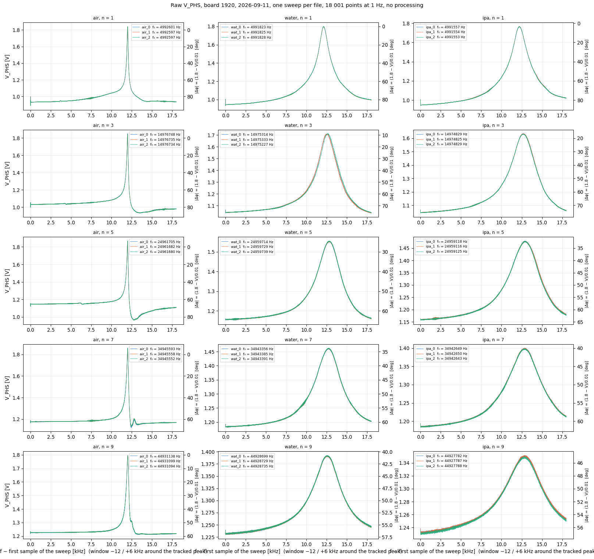
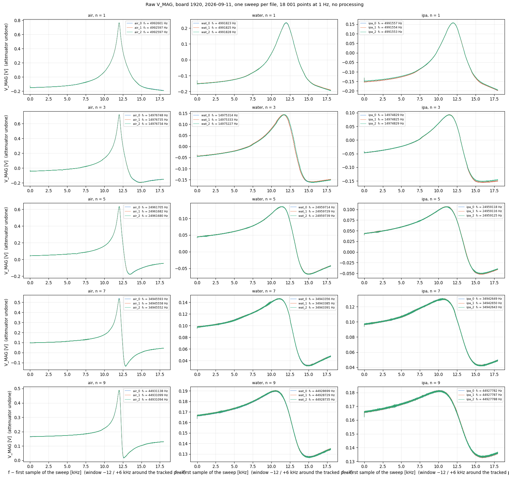
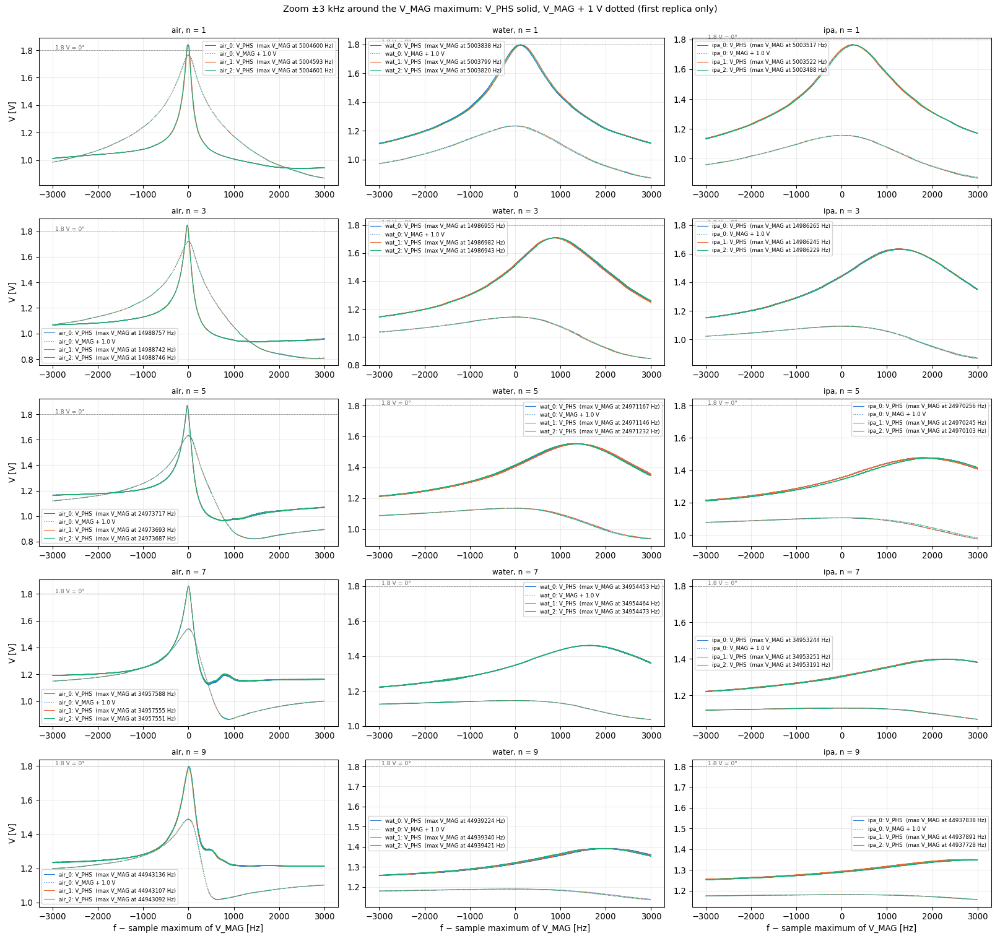

# Raw AD8302 sweeps, board 1920, 2026-09-11: V_MAG and V_PHS as dumped

*Nine dumps (`g<n>.txt`, 18 001 points at 1 Hz, `OPENQCM_SWEEP_DUMP=1`), copied by hand on the plateaus of
run `2026-09-11_12-14-42`: three per phase (air 12:25 / 12:46 / 12:50, water 12:57 / 13:08 / 13:15,
isopropanol 13:20 / 13:24 / 13:30). Column 2 is V_MAG in volts with the INPB attenuator already undone
(`V_MAG_DECADE_OFFSET`), column 3 is V_PHS in volts as the ADC saw it. Nothing else: no Savitzky–Golay, no
spline, no phase conversion. `scripts/raw_sweeps_plot.py`. This page shows the data; the processing comes
after, on Marco's instructions.*

*Detector reference (AD8302 data sheet, Rev. B, p. 1, 3, 10): phase output 10 mV/° over 0–180°, 1.8 V at
0° and 0.9 V at 90° (so |Δφ| = (1.8 − V_PHS)/0.01), sign of the phase difference not available; dynamic
range with less than ±1° deviation from the best-fit line 143° at 900 MHz, i.e. the response bends within
roughly ±18° of 0° and 180° (TPC 25–29); phase measurement balance 0.8°; phase centre point 0.9 V
nominal with a spread of 0.75–1.05 V over 17 000 units (TPC 36).*

## Extrema per file, mean over the three replicas

| phase | n | max V_PHS [V] | = min \|Δφ\| [deg] | f(max V_PHS) − f(max V_MAG) [Hz] | V_PHS at max V_MAG [V] | = \|Δφ\| there [deg] | samples with V_PHS > 1.8 V | V_PHS at sweep start [V] (\|Δφ\|) | V_MAG span [V] |
|---|---|---|---|---|---|---|---|---|---|
| air | 1 | 1.840 ± 0.000 | -4.0 | -17 ± 5 | 1.835 | -3.5 | 55 | 0.999 (80°) | 0.957 |
| air | 3 | 1.848 ± 0.000 | -4.8 | -25 ± 2 | 1.790 | 1.0 | 49 | 1.055 (74°) | 0.918 |
| air | 5 | 1.868 ± 0.000 | -6.8 | -27 ± 2 | 1.808 | -0.8 | 59 | 1.152 (65°) | 0.812 |
| air | 7 | 1.858 ± 0.000 | -5.8 | -1 ± 2 | 1.858 | -5.8 | 75 | 1.186 (61°) | 0.674 |
| air | 9 | 1.796 ± 0.000 | 0.4 | +6 ± 6 | 1.794 | 0.6 | 0 | 1.234 (57°) | 0.472 |
| water | 1 | 1.799 ± 0.001 | 0.1 | +119 ± 16 | 1.779 | 2.1 | 0 | 1.004 (80°) | 0.427 |
| water | 3 | 1.710 ± 0.001 | 9.0 | +896 ± 17 | 1.516 | 28.4 | 0 | 1.064 (74°) | 0.305 |
| water | 5 | 1.554 ± 0.001 | 24.6 | +1327 ± 54 | 1.410 | 39.0 | 0 | 1.160 (64°) | 0.204 |
| water | 7 | 1.462 ± 0.001 | 33.8 | +1634 ± 15 | 1.348 | 45.2 | 0 | 1.192 (61°) | 0.116 |
| water | 9 | 1.392 ± 0.000 | 40.8 | +1968 ± 87 | 1.319 | 48.1 | 0 | 1.239 (56°) | 0.064 |
| ipa | 1 | 1.765 ± 0.001 | 3.5 | +256 ± 24 | 1.730 | 7.0 | 0 | 1.006 (79°) | 0.356 |
| ipa | 3 | 1.632 ± 0.002 | 16.8 | +1265 ± 35 | 1.443 | 35.7 | 0 | 1.067 (73°) | 0.248 |
| ipa | 5 | 1.479 ± 0.000 | 32.1 | +1855 ± 38 | 1.350 | 45.0 | 0 | 1.163 (64°) | 0.159 |
| ipa | 7 | 1.400 ± 0.001 | 40.0 | +2260 ± 71 | 1.303 | 49.7 | 0 | 1.194 (61°) | 0.089 |
| ipa | 9 | 1.351 ± 0.001 | 44.9 | +2834 ± 100 | 1.293 | 50.7 | 0 | 1.238 (56°) | 0.049 |

*The sd is shown only where the replicas differ beyond rounding. In water at n = 3 the third replica
(13:15:28) is shifted by about −100 Hz on both channels relative to the first two, the same instant at which
the datalog's 3rd overtone changed state (see README.md).*

## Figures

### V_PHS, full window

*Left axis volts, right axis the detector's |Δφ|. Air: a spike reaching 1.84–1.87 V on n = 1…7 — above the
1.8 V reference, i.e. a reading of "−4…−7°" — and 1.797 V on n = 9; after the spike n = 5, 7, 9 show an
undershoot and, on n = 7 and 9, a secondary bump 500–800 Hz to the right. Water and isopropanol: one broad
smooth peak, maximum 1.80 V (water n = 1) down to 1.35 V (isopropanol n = 9), i.e. |Δφ| never below 10°
on n ≥ 3.*

### V_MAG, full window

*Air: peak 0.49–0.77 V high on a 0.9–1.0 V span. Liquids: 0.06–0.43 V span, the peak followed by a dip
2–4 kHz to the right whose depth grows with n.*

### Zoom ±3 kHz around the V_MAG maximum, both channels

*V_PHS solid, V_MAG + 1 V dotted (first replica). In air the two maxima coincide within 30 Hz; in the
liquids the V_PHS maximum sits 100 Hz (n = 1) to 2.9 kHz (isopropanol n = 9) to the right of the V_MAG
maximum, and the V_PHS peak is wider than the V_MAG one.*
