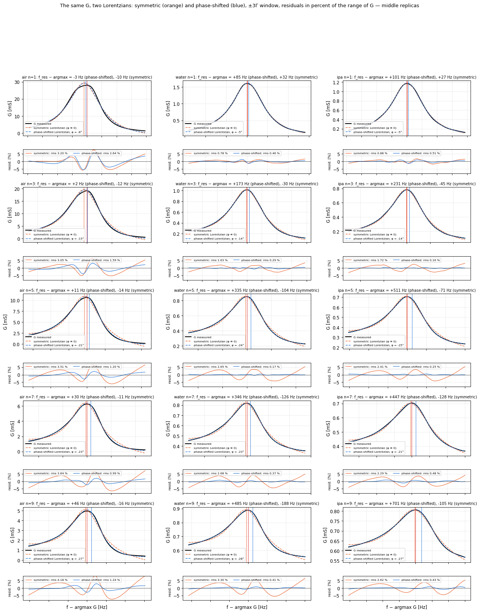
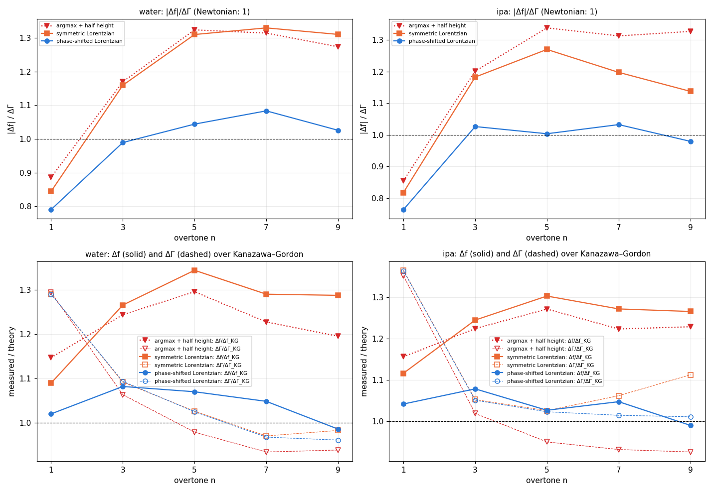
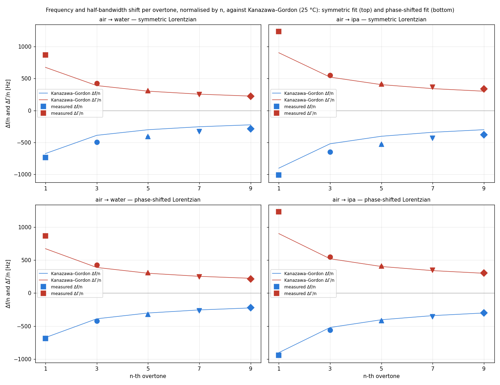
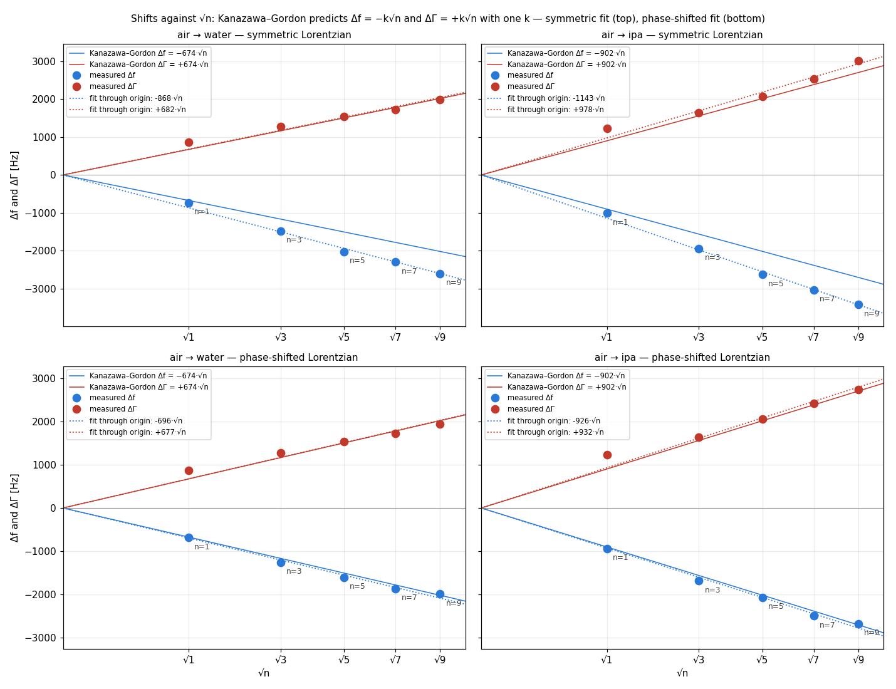

# Two Lorentzians on the conductance of a QCM: the symmetric one and the phase-shifted one

*Synthesis, 2026-09-15. Board 1920, one 5 MHz sensor, air → water → isopropanol at 25 °C, three sweeps per
plateau (dumps of 2026-09-11, `data/sweep_dumps_2026-09-11.npz`). The chain that turns the AD8302 voltages into
the conductance G is the one the instrument runs; nothing upstream of G is changed here. Detail and every
intermediate step: `phase-shifted-lorentzian.md`, `psl-validation.md`, `fs-estimators-liquid.md`. Scripts:
`scripts/synthesis_figures.py`, `scripts/psl_lib.py`.*

## The point

The resonance frequency and the half-bandwidth of the sensor are read off the conductance peak G(f). Two
estimators were compared on the same G:

- **symmetric Lorentzian** — G = G_max·Γ²/((f_res − f)² + Γ²) + background, four parameters, the textbook shape
  of a resonance;
- **phase-shifted Lorentzian** — Y(f) = e^{iφ}·iΓG_max/(f_res − f + iΓ) + G_off + iB_off (Johannsmann, *Sensors*
  2021, 21, 3490, eq. 3), fitted to its real part G alone: five parameters, the same shape rotated by an angle
  φ in the complex plane. φ is a property of the instrument, not of the sample.

On this instrument G is not symmetric. The symmetric Lorentzian leaves the same S-shaped residual in every
sweep, 2–4 % of the range of G; the phase-shifted one follows G to 0.2–0.5 % in liquid and 1–2.6 % in air, with
φ = −8 → −27° from the fundamental to the 9th overtone, identical on the three replicas to 0.0–0.2°. The two
fits put f_res in **different places**: the symmetric one 10–200 Hz left of the maximum of G, the phase-shifted
one 2–47 Hz right of it in air and 80–700 Hz right of it in liquid. That difference, 0.2–0.3 Γ in liquid, is
the whole question: it is the size of the disagreement between the instrument's frequency shifts and the
Kanazawa–Gordon prediction that had been open since 2026-09-10.

## 1. The two fits on the same G

*Middle replica of each phase, ±3Γ window around the maximum of G. Orange: symmetric Lorentzian; blue:
phase-shifted Lorentzian; vertical lines: the maximum of G (red) and the two f_res. Beneath each panel the
residuals in percent of the range of G, on a fixed ±8 % scale.*

- The symmetric fit's residual is the same S in all fifteen panels: negative just left of the peak, positive
  just right, opposite one width out. That is the dispersive term (f_res − f)·sin φ the model lacks. The
  phase-shifted fit removes it; what remains in air is a 20–50 Hz feature at the very top of the peak, the
  rounded fold of the detector's phase channel near 0°, which does not move f_res or Γ.
- f_res: the symmetric fit is pulled **towards the tail** of the skewed peak; the phase-shifted fit lands where a
  rotated Lorentzian has its centre. For a rotated Lorentzian the maximum of G sits at f_res + Γ·tan(φ/2); on
  the 45 sweeps the measured offset of the maximum from the fitted f_res agrees with this formula to
  +1 ± 28 Hz (`psl-validation.md`, A1).
- Γ: the two fits agree within 1–4 % on n = 1–5; on the 7th and 9th in isopropanol, where the sweep window
  clips the right flank, the symmetric fit widens by 4–10 % and the phase-shifted one does not.

### Where the two fits put f_res and Γ, mean over three replicas

| phase | n | argmax G [Hz] | f_res symmetric − argmax [Hz] | f_res phase-shifted − argmax [Hz] | Γ half height [Hz] | Γ symmetric [Hz] | Γ phase-shifted [Hz] | φ [°] | rms symmetric [% range] | rms phase-shifted [% range] |
|---|---|---|---|---|---|---|---|---|---|---|
| air | 1 | 5004598 | -9 | -3 | 65 | 66 | 66 | -8.0 | 3.16 | 2.61 |
| air | 3 | 14988738 | -12 | +2 | 78 | 77 | 76 | -14.5 | 3.03 | 1.57 |
| air | 5 | 24973688 | -14 | +11 | 108 | 104 | 102 | -20.6 | 3.49 | 1.20 |
| air | 7 | 34957566 | -13 | +28 | 159 | 150 | 148 | -22.9 | 3.65 | 0.99 |
| air | 9 | 44943110 | -15 | +47 | 204 | 193 | 189 | -26.8 | 4.16 | 1.23 |
| water | 1 | 5003826 | +29 | +83 | 937 | 935 | 934 | -5.0 | 0.77 | 0.46 |
| water | 3 | 14987288 | -37 | +191 | 1318 | 1350 | 1351 | -15.0 | 1.73 | 0.32 |
| water | 5 | 24971737 | -87 | +351 | 1582 | 1649 | 1646 | -24.0 | 2.64 | 0.18 |
| water | 7 | 34955379 | -125 | +347 | 1823 | 1879 | 1872 | -22.5 | 2.66 | 0.36 |
| water | 9 | 44940695 | -202 | +470 | 2100 | 2179 | 2130 | -27.9 | 3.36 | 0.50 |
| ipa | 1 | 5003555 | +27 | +101 | 1286 | 1298 | 1297 | -5.0 | 0.90 | 0.52 |
| ipa | 3 | 14986825 | -44 | +230 | 1670 | 1722 | 1719 | -14.2 | 1.70 | 0.16 |
| ipa | 5 | 24971122 | -78 | +505 | 2025 | 2174 | 2167 | -24.7 | 2.46 | 0.22 |
| ipa | 7 | 34954645 | -129 | +448 | 2383 | 2686 | 2570 | -21.4 | 2.29 | 0.47 |
| ipa | 9 | 44939783 | -115 | +693 | 2710 | 3206 | 2925 | -27.2 | 2.61 | 0.43 |

## 2. Against Kanazawa–Gordon

For a Newtonian liquid on a smooth surface, Δf_n = −√n·k and ΔΓ_n = +√n·k with the same k = f₀^{3/2}·√(ρη/(πρ_qμ_q)):
|Δf|/ΔΓ = 1 on every overtone, and the absolute values follow from ρη at 25 °C (water 674 Hz/√n, isopropanol
902 Hz/√n with f₀ = 5.0046 MHz).

*Top: |Δf|/ΔΓ per overtone; bottom: Δf (solid) and ΔΓ (dashed) over the theory. Red dotted: the maximum of G
with the half-height width, what the instrument logs today; orange: symmetric Lorentzian; blue: phase-shifted
Lorentzian. Shifts are liquid plateau minus air plateau with the same estimator on both sides, mean of three
sweeps.*

### air → water against Kanazawa–Gordon (25 °C)

| n | estimator | Δf [Hz] | Δf/Δf_KG | ΔΓ [Hz] | ΔΓ/ΔΓ_KG | \|Δf\|/ΔΓ |
|---|---|---|---|---|---|---|
| 1 | argmax + half height | -772 | 1.15 | 872 | 1.29 | **0.89** |
| 3 | argmax + half height | -1451 | 1.24 | 1240 | 1.06 | **1.17** |
| 5 | argmax + half height | -1951 | 1.30 | 1474 | 0.98 | **1.32** |
| 7 | argmax + half height | -2187 | 1.23 | 1664 | 0.93 | **1.31** |
| 9 | argmax + half height | -2415 | 1.19 | 1896 | 0.94 | **1.27** |
| 1 | symmetric Lorentzian | -734 | 1.09 | 869 | 1.29 | **0.84** |
| 3 | symmetric Lorentzian | -1476 | 1.27 | 1273 | 1.09 | **1.16** |
| 5 | symmetric Lorentzian | -2024 | 1.34 | 1545 | 1.03 | **1.31** |
| 7 | symmetric Lorentzian | -2299 | 1.29 | 1729 | 0.97 | **1.33** |
| 9 | symmetric Lorentzian | -2601 | 1.29 | 1985 | 0.98 | **1.31** |
| 1 | phase-shifted Lorentzian | -687 | 1.02 | 869 | 1.29 | **0.79** |
| 3 | phase-shifted Lorentzian | -1262 | 1.08 | 1275 | 1.09 | **0.99** |
| 5 | phase-shifted Lorentzian | -1611 | 1.07 | 1543 | 1.02 | **1.04** |
| 7 | phase-shifted Lorentzian | -1868 | 1.05 | 1724 | 0.97 | **1.08** |
| 9 | phase-shifted Lorentzian | -1991 | 0.99 | 1941 | 0.96 | **1.03** |

### air → ipa against Kanazawa–Gordon (25 °C)

| n | estimator | Δf [Hz] | Δf/Δf_KG | ΔΓ [Hz] | ΔΓ/ΔΓ_KG | \|Δf\|/ΔΓ |
|---|---|---|---|---|---|---|
| 1 | argmax + half height | -1043 | 1.16 | 1220 | 1.35 | **0.86** |
| 3 | argmax + half height | -1914 | 1.22 | 1593 | 1.02 | **1.20** |
| 5 | argmax + half height | -2566 | 1.27 | 1917 | 0.95 | **1.34** |
| 7 | argmax + half height | -2921 | 1.22 | 2224 | 0.93 | **1.31** |
| 9 | argmax + half height | -3327 | 1.23 | 2506 | 0.93 | **1.33** |
| 1 | symmetric Lorentzian | -1007 | 1.12 | 1232 | 1.37 | **0.82** |
| 3 | symmetric Lorentzian | -1946 | 1.25 | 1645 | 1.05 | **1.18** |
| 5 | symmetric Lorentzian | -2630 | 1.30 | 2070 | 1.03 | **1.27** |
| 7 | symmetric Lorentzian | -3037 | 1.27 | 2535 | 1.06 | **1.20** |
| 9 | symmetric Lorentzian | -3427 | 1.27 | 3012 | 1.11 | **1.14** |
| 1 | phase-shifted Lorentzian | -940 | 1.04 | 1231 | 1.36 | **0.76** |
| 3 | phase-shifted Lorentzian | -1686 | 1.08 | 1643 | 1.05 | **1.03** |
| 5 | phase-shifted Lorentzian | -2072 | 1.03 | 2064 | 1.02 | **1.00** |
| 7 | phase-shifted Lorentzian | -2501 | 1.05 | 2422 | 1.01 | **1.03** |
| 9 | phase-shifted Lorentzian | -2681 | 0.99 | 2737 | 1.01 | **0.98** |

- **The symmetric Lorentzian does not improve on the maximum of G.** Δf/Δf_KG = 1.25–1.34 and |Δf|/ΔΓ = 1.14–1.33
  on n = 3–9, the same 20–30 % excess as argmax + half height (1.19–1.30, 1.17–1.34). Fitting a symmetric
  shape to a skewed peak finds the skew, not the resonance.
- **The phase-shifted Lorentzian brings frequency and width onto the theory together.** On n = 3–9 in both
  liquids: Δf/Δf_KG = 0.99–1.08, ΔΓ/ΔΓ_KG = 0.96–1.09, |Δf|/ΔΓ = 0.98–1.08. The slopes in √n through the
  origin are 696 (−Δf) and 677 (ΔΓ) Hz/√n in water against 674, 926 and 932 in isopropanol against 902.
- **The fundamental is not moved by any estimator**: ΔΓ/ΔΓ_KG = 1.29–1.37 and |Δf|/ΔΓ = 0.76–0.89 whichever fit
  is used. Its excess is in the dissipation, on the same overtone that shows D = 26 ppm in air against
  9–10 on the others; it belongs to the sensor or its mounting, not to the estimator.

### The classic view: Δf/n and ΔΓ/n against n

*Blue: Δf/n, negative; red: ΔΓ/n, positive; lines: Kanazawa–Gordon; one marker per overtone, error bars the
scatter of the three sweeps. Top row the symmetric fit, bottom row the phase-shifted fit. With the symmetric
fit ΔΓ/n sits on its curve and Δf/n sits below its curve on every overtone; with the phase-shifted fit both sit
on the curves from n = 3 up. The fundamental is off in both rows, on ΔΓ.*

### How the shifts scale with √n

*Kanazawa–Gordon is linear in √n with the same slope k for −Δf and ΔΓ (solid lines). Dotted: least-squares
lines through the origin on the five measured points.*

### Slopes in √n through the origin [Hz/√n]

| liquid | fit | k_KG | k from −Δf | k from ΔΓ | ratio |
|---|---|---|---|---|---|
| water | symmetric Lorentzian | 674 | 868 | 682 | 1.27 |
| water | phase-shifted Lorentzian | 674 | 696 | 677 | 1.03 |
| ipa | symmetric Lorentzian | 902 | 1143 | 978 | 1.17 |
| ipa | phase-shifted Lorentzian | 902 | 926 | 932 | 0.99 |
The symmetric fit gives the right slope for ΔΓ and a slope 27 % (water) and 17 % (isopropanol) too steep for
−Δf; the phase-shifted fit gives the two slopes equal to each other within 3 % and equal to the theory within
3.5 %. Both fits keep the points on a line through the origin: the √n law holds for either; what changes is
the slope of the frequency line, i.e. the same bias Γ·tan(φ/2) growing as √n does.

## Why the internal comparison carries the argument

The agreement with Kanazawa–Gordon is at the 8 % level and cannot be better here: ρη is tabulated at 25 °C
without the liquid temperature being measured, the surface is assumed smooth, f₀ in air drifts by a few hertz
per minute. The comparison between the two Lorentzians is internal to the same sweeps and the same chain,
and the difference it shows — 200–700 Hz on Δf, 0.2–0.3 Γ — is a hundred times the repeatability (1–29 Hz
over three sweeps) and is predicted in closed form by the rotation. Kanazawa–Gordon then plays one role,
indispensable: it says **which** of the two is right. On synthetic sweeps with a known f_s, sent through the
divider and the detector, the phase-shifted fit returns f_s within 4 Hz and Γ within 5 Hz while the maximum
of G is off by Γ·tan(φ/2) (`psl-validation.md`, A4).

## What this does and does not say

- It says: on this board, the conductance peak is a rotated Lorentzian; its maximum is not the resonance; a
  five-parameter fit on G recovers the resonance and the half-bandwidth and, on the overtones, both agree
  with the theory for two Newtonian liquids. The result is robust to the smoothing of the chain (f_res within
  5 Hz on raw samples), to a ±5° error of the phase offset (f_res within 21 Hz), to the fit window (±2…±6 Γ:
  f_res within 60 Hz) and to a clipped sweep.
- It does not say: what φ is physically (it grows with the overtone, −8 → −27°, faster than a delay would);
  whether it is the same on another board or sensor; how the estimator behaves over a plateau of a hundred
  sweeps; why the fundamental dissipates 30 % more than the theory. Those are the bench tests of block B of
  the validation plan.
- The instrument still logs the maximum of G and the half-height width. Changing that is a decision, to be
  taken after the estimator has run live beside the published one.
