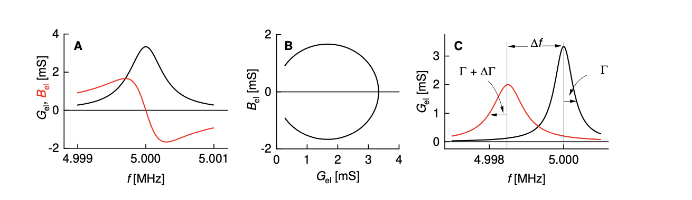
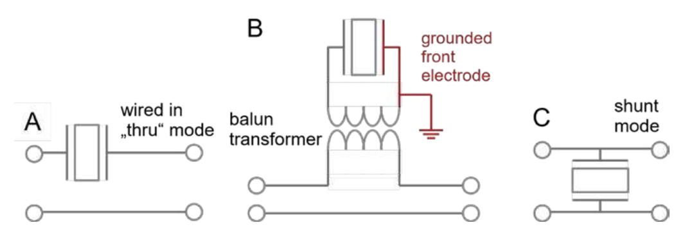

# 2. Forced Vibrations, Complex Resonance Frequencies

The following section motivates the complex frequency shift, $\Delta \tilde{f} = \Delta f + \mathrm{i}\Delta\Gamma$ [33]. The variable $\Gamma$ denotes the half bandwidth at half height ("bandwidth" for short). The tilde denotes a complex parameter.

Start from the equation of motion of the forced resonator:

$$
m_\mathrm{R}\,\ddot{x}(t) \;=\; -\xi_\mathrm{R}\,\dot{x}(t) - \kappa_\mathrm{R}\,x(t) + F_\mathrm{ext}(t)
\tag{3}
$$

$m_\mathrm{R}$ is the mass. $\xi_\mathrm{R}$ is the friction coefficient, also called "drag coefficient". In interfacial sliding, the "friction coefficient" is a ratio of two forces (tangential to normal). In liquid friction, it is a ratio of force to velocity. Renaming the force-velocity ratio as "drag coefficient" avoids this ambiguity. $\kappa_\mathrm{R}$ in Equation (3) is the spring constant.

We bring all terms containing $x(t)$ to the left-hand side. The source term (the external force, $F_\mathrm{ext}$) shall be of the form $\hat{F}_\mathrm{ext}\exp(\mathrm{i}\omega t)$. The hat (^) denotes a complex amplitude. Instead of $\exp(\mathrm{i}\omega t)$, one might have also written $\exp(-\mathrm{i}\omega t)$. That is a matter of convention, addressed in Box 1. For stationary oscillations of the form $x(t) = \hat{x}\exp(\mathrm{i}\omega t)$, the time derivative turns into a multiplication with $\mathrm{i}\omega$:

$$
-\omega^{2} m_\mathrm{R}\hat{x}\exp(\mathrm{i}\omega t) + \mathrm{i}\omega\xi_\mathrm{R}\hat{x}\exp(\mathrm{i}\omega t) + \kappa_\mathrm{R}\hat{x}\exp(\mathrm{i}\omega t) \;=\; \hat{F}_\mathrm{ext}\exp(\mathrm{i}\omega t)
\tag{4}
$$

We divide by $\exp(\mathrm{i}\omega t)$, divide by $m_\mathrm{R}$, rename $\xi_\mathrm{R}/m_\mathrm{R}$ as $2\gamma$, and rename $\kappa_\mathrm{R}/m_\mathrm{R}$ as $\omega_0^2$:

$$
-\omega^{2}\hat{x} + 2\mathrm{i}\omega\gamma\hat{x} + \omega_0^{2}\hat{x} \;=\; \frac{\hat{F}_\mathrm{ext}}{m_\mathrm{R}}
\tag{5}
$$

$\gamma$ is the damping coefficient and $\omega_0$ is the natural frequency. Both have units of inverse seconds. The amplitude of displacement depends on $\omega$ as:

$$
\hat{x} = \frac{1}{\omega_0^{2} - \omega^{2} + 2\mathrm{i}\gamma\omega} \cdot \frac{\hat{F}_\mathrm{ext}}{m_\mathrm{R}}
\tag{6}
$$

Because the resonances of the QCM are extraordinarily sharp, the frequency of excitation, $\omega$, is close to the natural frequency, $\omega_0$.

A side remark: For sharp resonances, the frequency of maximum displacement is the natural frequency. The natural frequency is called the "resonance frequency", here. For broad resonances, there is a slight difference between the natural frequency and the resonance frequency. The latter then is also called the "ringing frequency", equal to $\omega_0(1 - 2\gamma^{2}/\omega_0^{2})^{1/2}$. One can always compute the ringing frequency from the natural frequency and the bandwidth. The difference is not of practical importance for the QCM.

---

> **Box 1. Sign conventions.**
>
> When describing oscillations with complex numbers, one exploits Euler's relations, which imply that $\cos(\omega t) = 1/2(\exp(\mathrm{i}\omega t) + \exp(-\mathrm{i}\omega t))$. In principle, all calculations containing the cosine should be carried out on the sum of $\exp(\mathrm{i}\omega t)$ and $\exp(-\mathrm{i}\omega t)$. However, the two calculations with $+\mathrm{i}\omega t$ and with $-\mathrm{i}\omega t$ run in similar ways. One therefore carries out the calculation just once and eventually computes the (real) outcome of the calculation as $\mathrm{Re}(\tilde{y}) = 1/2\,(\tilde{y} + \tilde{y}^{*})$ where $\tilde{y}$ is the outcome of the calculation for $\exp(\mathrm{i}\omega t)$ and the asterisk denotes complex conjugation.
>
> If entropy is supposed to always increase, the imaginary parts of certain complex response functions must have certain signs. The sign depends on whether the calculation is carried out with $\exp(\mathrm{i}\omega t)$ or with $\exp(-\mathrm{i}\omega t)$. If $\exp(\mathrm{i}\omega t)$ is chosen, the signs are:
>
> | Definition | Relation | Quantity |
> |---|---|---|
> | $\tilde{G} = G' + \mathrm{i}G''$ | $\hat{\sigma}_\mathrm{shear} = \tilde{G}\hat{\gamma}_\mathrm{shear}$ | shear modulus; $\sigma_\mathrm{shear}$: stress; $\gamma_\mathrm{shear}$: strain |
> | $\tilde{\eta} = \eta' - \mathrm{i}\eta''$ | $\tilde{G} = \mathrm{i}\omega\tilde{\eta}$ | viscosity |
> | $\tilde{J} = J' - \mathrm{i}J''$ | $\tilde{J} = 1/\tilde{G}$ | shear compliance |
> | $\tilde{c} = c' + \mathrm{i}c''$ | $\tilde{c} = (\tilde{G}/\rho)^{1/2} = (\mathrm{i}\omega\tilde{\eta}/\rho)^{1/2}$ | speed of shear sound |
> | $\tilde{k} = k' - \mathrm{i}k''$ | $\tilde{k} = \omega/\tilde{c}$ | wave number, wave travels towards $+z$ |
> | $\tilde{Z} = Z + \mathrm{i}Z''$ | $\tilde{Z} = \rho\tilde{c} = (\rho\tilde{G})^{1/2} = (\mathrm{i}\omega\rho\tilde{\eta})^{1/2}$ | wave impedance |
> | $\tilde{\omega}_\mathrm{res} = \omega_0 + \mathrm{i}\gamma$ | $= 2\pi(f_\mathrm{res} + \mathrm{i}\Gamma) = 2\pi(f_\mathrm{res} + \mathrm{i}f_\mathrm{res}D/2)$ | resonance frequency |
>
> $\omega$ is real
>
> A wave propagating towards $+z$ is written as $\exp(\mathrm{i}(\omega t - \tilde{k}z)) = \exp(\mathrm{i}\omega t)\exp(-\mathrm{i}k'z)\exp(-k''z)$.

---

If $\omega \approx \omega_0$, the denominator can be simplified following $(\omega_0^{2} - \omega^{2}) \approx (\omega_0 + \omega)(\omega_0 - \omega) \approx 2\omega_0(\omega_0 - \omega)$. Equation (6) simplifies to:

$$
\hat{x}(\omega) \;=\; \frac{1}{\omega_0^{2} - \omega^{2} + \mathrm{i}2\gamma\omega} \cdot \frac{\hat{F}_\mathrm{ext}}{m_\mathrm{R}} \;\approx\; \frac{1}{(\omega_0 - \omega) + \mathrm{i}\gamma} \cdot \frac{\hat{F}_\mathrm{ext}}{2\omega_0 m_\mathrm{R}}
\tag{7}
$$

A complex resonance frequency can be defined as:

$$
\tilde{f}_\mathrm{res} \;=\; \frac{\omega_0 + \mathrm{i}\gamma}{2\pi} \;=\; f_\mathrm{res} + \mathrm{i}\Gamma
\tag{8}
$$

where $\Gamma = \gamma/(2\pi)$ is the half bandwidth at half height. (The complex resonance frequency makes the algebra easier *if* the resonances are sharp and if $\omega + \omega_0 \approx 2\omega_0$. Otherwise, it can cause confusion.)

Expressed in terms of the complex resonance frequency, Equation (7) turns into:

$$
\hat{x}(f) \;\approx\; \frac{\hat{F}_\mathrm{ext}}{8\pi^{2} f_\mathrm{res}\, m_\mathrm{R}} \, \frac{1}{\tilde{f}_\mathrm{res} - f}
\tag{9}
$$

The prefactor is often multiplied with an i and then hidden behind some normalization constant. Proceeding this way and separating the real and the imaginary part leads to:

$$
\hat{x}(f) \;\propto\; \frac{\Gamma}{\left(f - f_\mathrm{res}\right)^{2} + \Gamma^{2}} + \mathrm{i}\,\frac{f - f_\mathrm{res}}{\left(f - f_\mathrm{res}\right)^{2} + \Gamma^{2}}
\tag{10}
$$

The first and the second term are shown as a black and a red line in Figure 3.

---

**Figure 3.** A typical output from impedance analysis. Panel (**A**) shows the conductance $G_\mathrm{el}$ (black) and the susceptance, $B_\mathrm{el}$ (red). Together, they form the complex electrical admittance, $\tilde{Y}_\mathrm{el} = G_\mathrm{el} + \mathrm{i}B_\mathrm{el}$, which is equal to $\tilde{Z}_\mathrm{el}^{-1}$ with $\tilde{Z}_\mathrm{el}$ the impedance. The real part of the admittance forms the well-known, symmetric resonance curve (assuming perfect calibration). This is different for the real part of $\tilde{Z}_\mathrm{el}$ because of the parallel electrical capacitance, $C_0$. $G_\mathrm{el}(f)$ peaks at the series resonance frequency, $f_\mathrm{res}$. Panel (**B**) shows the polar diagram. Of interest in sensing are the *shifts* in frequency and bandwidth, $\Delta f$ and $\Delta\Gamma$ (**C**).

<!-- FIGURE DESCRIPTION (machine-readable)
Three-panel figure.
Panel A: x-axis f [MHz] from 4.999 to 5.001; y-axis "G_el, B_el [mS]" from -2 to 4.
  Black curve = conductance G_el: symmetric Lorentzian peak centred at 5.000 MHz, peak value ~3.3 mS, baseline ~0.3 mS.
  Red curve = susceptance B_el: dispersive (antisymmetric) shape, maximum ~+1.7 mS just below resonance, zero crossing at 5.000 MHz, minimum ~-1.7 mS just above resonance.
Panel B: polar diagram, x-axis G_el [mS] from 0 to 4, y-axis B_el [mS] from -2 to 2.
  Black curve = closed circle (resonance circle) passing through the origin region, rightmost point at G_el ~3.3 mS, vertical extent about +1.7 to -1.7 mS.
Panel C: x-axis f [MHz] around 4.998 to 5.000; y-axis G_el [mS] from 0 to ~3.5.
  Black curve = unloaded resonance: narrow peak at 5.000 MHz, amplitude ~3.3 mS, half bandwidth at half height labelled Gamma.
  Red curve = loaded resonance: shifted to lower frequency (~4.9985 MHz), lower and broader, amplitude ~2.0 mS, half bandwidth labelled Gamma + Delta-Gamma.
  A horizontal double arrow between the two peak positions is labelled Delta-f; vertical dashed lines mark the two peak frequencies.
-->

---

The complex resonance frequency plays out its strength when it comes to shifts thereof, called $\Delta\tilde{f}$ in the following ($\Delta\tilde{f} = \Delta f + \mathrm{i}\Delta\Gamma$). The complex shift was proposed by Eggers and Funk [33]. Just about all equations predicting frequency and bandwidth can be formulated in terms of $\Delta\tilde{f}$. These equations cover $\Delta f$ and $\Delta\Gamma$ at the same time.

The half bandwidth, $\Gamma$, is related to the energy dissipated per unit time, $\dot{E}$, as:

$$
\Gamma \;=\; \frac{\dot{E}}{4\pi E}
\tag{11}
$$

$E$ is the energy contained in the oscillation.

In the authors' opinion, $\Gamma$ is the best parameter for quantification of dissipative processes at the QCM surface. $\Gamma$ puts frequency and bandwidth on equal grounds. For instance, the noise on $\Delta f$ and $\Delta\Gamma$ is similar. Other parameters are in use. Some researchers use the full bandwidth, $w = 2\Gamma$, others use the Q-factor $Q = f_\mathrm{res}/(2\Gamma)$, and still others use the inverse Q-factor $Q^{-1} = 2\Gamma/f_\mathrm{res}$ and give it a new name and a new letter, namely "dissipation factor", $D$. Sometimes the "dissipation factor" is called "dissipation", for short. $\Delta\tilde{f}$ may also be expressed in terms of the dissipation factor. The conversion is simplest for the overtone-normalized frequency shift:

$$
\frac{\Delta\tilde{f}}{n} \;=\; \frac{\Delta f}{n} + \mathrm{i}\frac{\Delta\Gamma}{n} \;=\; \frac{\Delta f}{n} + \mathrm{i}\frac{f_0}{2}\Delta D
\tag{12}
$$

If $\Delta D$ is expressed in units of $10^{-6}$ and if $f_0$ is 5 MHz, the conversion from $\Delta D$ [$10^{-6}$] to $\Delta\Gamma/n$ [Hz] amounts to a multiplication with 2.5.

---

# 3.2. Impedance Analysis

Impedance analysis [27] avoids the complications inherent to oscillator circuits. An impedance analyzer (synonymous to "vector network analyzer", "VNA") sweeps the frequency of excitation across the resonance. The resonance parameters are obtained from a fit of a resonance curve to the admittance trace. A suitable fit function is the phase-shifted Lorentzian, which is:

$$
\begin{aligned}
G_\mathrm{fit} &= G_\mathrm{max}\Gamma \left( \frac{\Gamma}{\left(f_\mathrm{res} - f\right)^{2} + \Gamma^{2}} \cos\varphi + \frac{f_\mathrm{res} - f}{\left(f_\mathrm{res} - f\right)^{2} + \Gamma^{2}} \sin\varphi \right) + G_\mathrm{off} \\[6pt]
B_\mathrm{fit} &= G_\mathrm{max}\Gamma \left( \frac{\Gamma}{\left(f_\mathrm{res} - f\right)^{2} + \Gamma^{2}} \sin\varphi + \frac{f_\mathrm{res} - f}{\left(f_\mathrm{res} - f\right)^{2} + \Gamma^{2}} \cos\varphi \right) + B_\mathrm{off}
\end{aligned}
\tag{13}
$$

The phase shift in Equation (13), $\varphi$, accounts for an asymmetry of the resonance curve. Imperfect calibration causes such an asymmetry. The asymmetry can be small, but it rarely vanishes. $G_\mathrm{max}$ is an amplitude. The parameter $G_\mathrm{max}$ does not contribute much to sensing. The product $G_\mathrm{max}\Gamma$ is proportional to the effective area of the plate (Equation (113)). $G_\mathrm{max}\Gamma$ sometimes varies slightly during experiment. How these variations depend on the sample's properties, is poorly understood

Impedance analysis is among the passive techniques. "Passive", however, does not imply that the impedance analyzer would not affect the resonance frequency, at all. The analyzer's output resistance, its input resistance, and the length of the cables all take an influence on frequency and bandwidth because of piezoelectric stiffening. A second caveat: The resonance frequency as determined from the admittance trace depends on the sweep rate. Impedance analysis is not quite as reliable as one would wish. Still: impedance analysis is rather transparent. The problems are noticed and their consequences can be quantified with moderate effort.

For measurements in liquids, the through ("thru") configuration is advantageous because it leads to a small current into the impedance analyzer. The small current is measured against zero background and may by amplified. The background is nonzero in the "shunt" configuration, which is also common and works well for experiments in air. In the shunt configuration (depicted in Figure 4C), a large impedance of the device under test lets the voltage from the output go straight to the input of the VNA. If the resonator's impedance is much larger than 50 $\Omega$, it causes small changes to this input against a large background. Because the background is amplified as well, amplification lets the detector run into overload. A resonator immersed in a liquid has a large impedance on resonance and should be wired in thru configuration. If grounding the front electrode is an issue, a transformer as shown in Figure 4B can be employed. Grounding the front electrode is advisable because the electrical properties of the sample may otherwise affect the resonance via piezoelectric stiffening.

---

**Figure 4.** When working in liquids, wiring the resonator in the thru configuration (**A**) lowers the noise. A balun transformer ((**B**), such as the unit ADT1-1 from Minicircuits) can be used to ground the front electrode. The shunt configuration (**C**) is not recommended for use in liquids.

<!-- FIGURE DESCRIPTION (machine-readable)
Three circuit-schematic panels showing how the quartz resonator is wired to the network analyzer.
Panel A: "wired in 'thru' mode". The resonator (quartz plate symbol with two electrodes) sits in series
  in the signal line between the input port (left terminal) and the output port (right terminal);
  a second, separate line below connects the two ground terminals.
Panel B: same thru mode, but with a "balun transformer" inserted. The transformer has two coupled
  windings drawn between the lower signal line and the resonator branch; the resonator is drawn above
  the transformer. A red connection from one side of the resonator goes to a ground symbol, labelled
  "grounded front electrode".
Panel C: "shunt mode". The resonator is connected in parallel (shunt) between the signal line
  (top, joining input and output terminals) and the ground line (bottom).
-->

---

## Reference

Johannsmann, D.; Langhoff, A.; Leppin, C. Studying Soft Interfaces with Shear Waves: Principles and Applications of the Quartz Crystal Microbalance (QCM). *Sensors* **2021**, *21*, 3490. https://doi.org/10.3390/s21103490

Received: 16 March 2021 · Accepted: 8 May 2021 · Published: 17 May 2021
Academic Editor: Antonietta Taurino

Copyright: © 2021 by the authors. Licensee MDPI, Basel, Switzerland. This article is an open access article distributed under the terms and conditions of the Creative Commons Attribution (CC BY) license (https://creativecommons.org/licenses/by/4.0/).
