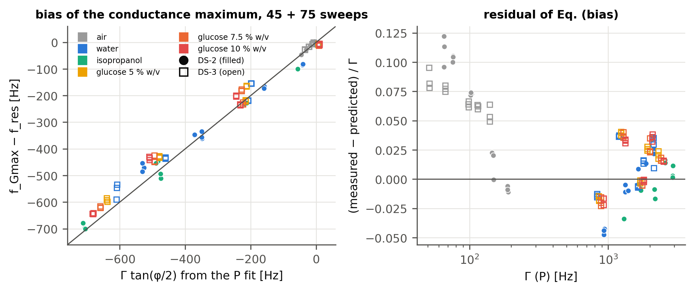

# 1. Introduction

A quartz crystal microbalance (QCM) reports what touches its surface through two numbers per overtone: the shift of the resonance frequency, $\Delta f$, and the shift of the half-bandwidth, $\Delta\Gamma$, or equivalently of the dissipation factor $D = 2\Gamma/f_\mathrm{res}$ [@Sauerbrey1959; @KanazawaGordon1985AC; @Johannsmann2021]. The second number separates a rigid film from a viscoelastic one and a Newtonian liquid from a structured one, and it is what oscillator circuits do not provide: an oscillator reports one frequency whose definition moves with the load [@Arnau2008; @RodriguezPardo2004]. Ring-down instruments obtain $D$ from the decay of the free oscillation [@Rodahl1995]; impedance analysers obtain $f_\mathrm{res}$ and $\Gamma$ from a fit of the admittance trace [@Martin1991; @Johannsmann2021; @JohannsmannReviakine2024]. Both are bench instruments.

Compact sweep-based instruments excite the crystal with a direct digital synthesiser (DDS) and record the response with a scalar detector. The open-source openQCM Q-1 and NEXT [@openQCMQ1; @openQCMNEXT] use an AD9851 DDS, a voltage divider formed by the sensor and a series resistor, and an AD8302 gain/phase detector [@AD8302Datasheet], whose outputs are proportional to the logarithmic magnitude ratio and to the *modulus* of the phase difference between its inputs. The production software of such an instrument reads the resonance as the maximum of the magnitude curve and a "dissipation" as its width a fixed number of decibels below the maximum. The magnitude of a divider transfer function is not the conductance of the crystal: its peak sits between the series and the parallel resonance and its width has no counterpart in the theory [@Johannsmann2021]. In liquid, we show, this estimator overshoots the Kanazawa–Gordon frequency shift by 50–116 % on the overtones. Published derivatives of the instrument replaced the detector by a logarithmic amplifier [@Horst2022] or by a vector network analyser [@Munoz2023; @Hardware2026NanoVNA].

The phase channel of the AD8302 makes a vector measurement possible and has been left unused, because the detector cannot tell the sign of the phase, its output folds at zero, and it carries an offset. This article asks whether the two detector outputs, inverted exactly through the known divider, yield a conductance good enough for the standard impedance-analysis estimators, which estimator should then be used, and how well the result follows the theory of a Newtonian liquid. The phase-shifted Lorentzian we recommend is not new: it is the fit function of Johannsmann and co-workers [@Johannsmann2015; @Leppin2020; @Johannsmann2021; @JohannsmannReviakine2024], used independently by others [@rheoQCM; @AWSensorsPatent2025], and the same mathematics as the background phase of microwave-resonator circle fits [@Gao2008; @PetersanAnlage1998; @Khalil2012; @Probst2015]; neither are the hardware blocks, which are the published openQCM NEXT [@openQCMNEXT]. Reading a complex impedance in polar form from an AD8302 through a known resistor is standard in bioimpedance spectroscopy [@Yang2006Bioimpedance; @Mohamadou2018; @Zompanti2026], the detector's sign ambiguity has been resolved in hardware with a quadrature reference [@McDermott2004; @Grossmann2016; @Mlynek2017], the same chip has been used on a QCM to display $\lvert Z\rvert$ and phase in air [@Sakti2019], and a sampled two-channel divider has been inverted to fit the Butterworth–Van Dyke model on the fundamental [@Burda2022a; @Burda2022b]. What has not been reported, to our knowledge, is the inversion of the scalar detector to $G + jB$ on a resonator, the resolution of the phase fold from the resonance itself, and a numeric multi-overtone comparison with the Kanazawa–Gordon relation on this class of instrument. Table 1 places the method among the interrogation schemes of the literature (full table and verification grades in the Supporting Information, SI, Section S1).

The contributions are: (i) a self-contained derivation of the Kanazawa–Gordon response from the small-load approximation, cast as three tests (KG-1, KG-2, KG-3) applied identically to every experiment; (ii) the exact inversion of the divider from the AD8302 outputs and a treatment of the unsigned, folded phase that uses the resonance itself; (iii) closed-form biases of the conductance-maximum and half-height estimators for a rotated resonance, $f_{G\max} = f_\mathrm{res} + \Gamma\tan(\varphi/2)$ and $\Gamma_\mathrm{hh} = \Gamma\sqrt{1 + 2\tan^2(\varphi/2)}$, verified on 120 sweeps; (iv) the comparison of the two estimators against the three KG tests on two instruments, two crystals and five liquids, with the improvement separated into what the reconstruction buys and what the rotation buys; (v) a direct test of the hypothesis that the rotation angle is an instrument property, with the cases where it fails.

**Table 1.** Interrogation schemes for QCM in liquid and the method under study, compact; the full table with the verification grade of every entry is in SI Section S1 (`literature/comparison_table.md`).

| system | architecture | phase measured | complex $Y$ reconstructed | estimator | liquid validation against KG | overtones |
|---|---|---|---|---|---|---|
| ring-down QCM-D [@Rodahl1995; @Dixon2008] | drive switched off, decay captured | no (time domain) | no | damped-sinusoid fit, $D$ from the decay | water and many liquids (vendor) | yes |
| impedance analyser or multi-tone lock-in, Johannsmann group [@Johannsmann2021; @Leppin2020] | bench analyser or 32-tone comb | yes (vector) | yes | phase-shifted Lorentzian on $G$ and $B$ | water and solvent mixtures, $n$ = 3–9, exponent ≈ 1/2, $\Delta\Gamma = -\Delta f$ | yes |
| PC virtual impedance analyser [@Burda2022a; @Burda2022b] | USB DAC/ADC + reference-resistor divider, both channels sampled | yes (vector) | yes, from the divider | BVD fits, no Lorentzian | water, glycerol–water; KG cited, no numeric comparison | no (10 MHz fundamental) |
| DDS + AD8302 on a QCM [@Sakti2019] | AD9910 DDS, 50 Ω series resistor, AD8302 | yes (unsigned) | partly: $\lvert Z\rvert$ and phase, no $G + jB$ | none ($\lvert Z\rvert$ minimum, zero-phase crossing) | none (air only) | no |
| openQCM-derived, open hardware [@Horst2022] | AD9851 DDS + AD8310 log amplifier (amplitude only) | no | no | spline, peak and width | water, qualitative; electrochemical | 1–11 in air, to 5 in water |
| VNA-based low-cost QCM-D [@Munoz2023; @Hardware2026NanoVNA] | DG8SAQ VNWA / NanoVNA-H | yes ($S_{11}$) | yes (VNA software) | maximum of $G$, FWHM | water, PEG solutions; KG cited only | one harmonic at a time |
| openQCM Q-1 / NEXT, published software [@openQCMQ1; @openQCMNEXT; @openQCMDissipationPost2025] | AD9851 DDS, quartz in series with 52.3 Ω, AD8302, Teensy 4.0 | acquired, not used | no | magnitude maximum, width at a fixed cut-off | vendor data; viscometer comparison [@MirandaMartinez2021] | 1–9 (NEXT) |
| **this work** | the row above, no hardware added | yes, unsigned; sign from the resonance | yes, exact divider inversion | maximum of $G$ + half height; phase-shifted Lorentzian on $G$ | water, isopropanol, glucose; KG-1/2/3; two instruments | 1–9 |

# 2. Theory: from the small-load approximation to Kanazawa–Gordon

Johannsmann's small-load approximation (SLA) relates the complex frequency shift $\Delta\tilde f = \Delta f + i\Delta\Gamma$ of a thickness-shear resonator to the load impedance $\tilde Z_L$ seen by its surface, normalised to the acoustic impedance of quartz $Z_q = \sqrt{\rho_q\mu_q}$ [@Johannsmann2008; @Johannsmann2015; @Johannsmann2021]:

$$\frac{\Delta\tilde f}{f_F} = \frac{i}{\pi Z_q}\,\tilde Z_L(\omega), \tag{1}$$

with $f_F$ the frequency of the *fundamental* ($f_0$ in [@Johannsmann2021], Eq. 23), $\mu_q$ the shear modulus ($G_q$ there) and $\rho_q$ the density of quartz, and the time dependence $\exp(i\omega t)$, in which the imaginary part of the shift is the bandwidth shift ($\tilde f_\mathrm{res} = f_\mathrm{res} + i\Gamma$, $\Gamma$ the half-bandwidth at half height). Equation (1) holds for $|\tilde Z_L| \ll Z_q$ and is applied overtone by overtone with $\omega = 2\pi f_n$, $f_n = nf_F$ ($n$ odd), while the normalisation stays $f_F$ [@Johannsmann2021]. The sign conventions, the frequency appearing in each term and a numerical check against the sources are collected in SI Section S2.

A Newtonian semi-infinite liquid of density $\rho_L$ and viscosity $\eta_L$ presents the shear-wave impedance $\tilde Z_L = \sqrt{i\omega\rho_L\eta_L}$. With $\sqrt i = (1+i)/\sqrt 2$,

$$\tilde Z_L = (1+i)\sqrt{\frac{\omega\rho_L\eta_L}{2}} = (1+i)\sqrt{\pi n f_F\rho_L\eta_L}, \tag{2}$$

and inserting (2) into (1), $i(1+i) = i - 1$:

$$\Delta f_n + i\Delta\Gamma_n = \frac{f_F}{\pi Z_q}(i - 1)\sqrt{\pi n f_F\rho_L\eta_L}. \tag{3}$$

Separating the real and the imaginary part gives the Kanazawa–Gordon (KG) forms [@KanazawaGordon1985AC; @KanazawaGordon1985ACA], generalised to the overtones,

$$\Delta f_n = -\sqrt n\,f_F^{3/2}\sqrt{\frac{\eta_L\rho_L}{\pi\mu_q\rho_q}},\qquad \Delta\Gamma_n = -\Delta f_n = +\sqrt n\,f_F^{3/2}\sqrt{\frac{\eta_L\rho_L}{\pi\mu_q\rho_q}}, \tag{4}$$

which reduce for $n = 1$ to the original relation of Kanazawa and Gordon. Equivalently $\Delta f_n = -(f_n^{3/2}/n)\sqrt{\eta_L\rho_L/(\pi\mu_q\rho_q)}$, since $f_n^{3/2}/n = \sqrt n f_F^{3/2}$. The dissipation factor follows as $\Delta D_n = 2\Delta\Gamma_n/f_n = (2/\sqrt n)\,f_F^{1/2}\sqrt{\eta_L\rho_L/(\pi\mu_q\rho_q)}$.

Three properties of (4) are used as tests in every experiment below, and are independent of each other:

- **KG-1.** $\Delta\Gamma_n/(-\Delta f_n) = 1$, for every overtone and every Newtonian liquid, independent of $\rho_L\eta_L$ and of temperature. It is the cleanest test, because it needs no liquid constants.
- **KG-2.** The shifts scale as $\sqrt n$: $\Delta f_n/n$ and $\Delta\Gamma_n/n$ scale as $n^{-1/2}$, i.e. a log–log slope of $-1/2$ against $n$, and $-\Delta f_n/\sqrt n$ and $\Delta\Gamma_n/\sqrt n$ are the same number for all overtones.
- **KG-3.** The shifts are proportional to $\sqrt{\eta_L\rho_L}$, with the coefficient $f_F^{3/2}/\sqrt{\pi\mu_q\rho_q}$ fixed by the quartz constants and the fundamental.

With $\rho_q = 2648$ kg m⁻³ and $\mu_q = 2.947\times10^{10}$ Pa ($Z_q = 8.83\times10^6$ kg m⁻² s⁻¹ [@Johannsmann2021]) and $f_F = 5.0046$ MHz the coefficient is 715 Hz per unit of $\sqrt{\rho_L\eta_L}$ (in kg m⁻² s⁻¹ᐟ²) per $\sqrt n$; for water at 25 °C ($\rho_L = 997.05$ kg m⁻³, $\eta_L = 0.890$ mPa s [@NISTWebBookWater]) $\Delta f_n = -673.6\sqrt n$ Hz and for isopropanol ($\rho_L = 781.0$ kg m⁻³, $\eta_L = 2.038$ mPa s, handbook values; the measurements of Kerscher et al. [@Kerscher2024] give 780.9 kg m⁻³ and 2.07 mPa s, +0.9 % on the coefficient) $-902.1\sqrt n$ Hz. The predictions fall by 1.2 %/K (water) and 1.6 %/K (isopropanol) with the liquid temperature [@NISTWebBookWater; @Kerscher2024], so a ±2 K uncertainty is ±2–3 % (SI S2). An earlier internal document of this project used $\eta_q$ for the quartz shear modulus and water constants that are not those of water at 25 °C; neither is used here.

# 3. Measurement principle and hardware

The sensor is a 5 MHz AT-cut quartz crystal (openQCM NEXT holder, gold electrodes, 14 mm blank) operated on the fundamental and the 3rd, 5th, 7th and 9th overtones (5–45 MHz). The instrument (openQCM NEXT [@openQCMNEXT]) comprises an AD9851 DDS clocked at 125 MHz, an LC reconstruction filter and a driver, the crystal as the series element of a voltage divider loaded by $R_{17} = 52.3\ \Omega$ to ground, an AD8302 gain/phase detector whose input A reads the node across $R_{17}$ and whose input B reads the drive through a resistive attenuator ($K = (R_{11}+R_{19})/R_{19} = 10.419$, 20.356 dB), two output buffers (gains 2 and 1.5) and the 12-bit ADC of a Teensy 4.0, which averages 500 readings per frequency point and streams the pair of counts to the host (Fig. 1). A Peltier element holds the sensor at a set temperature. The firmware sweeps 18 001 points at 1 Hz step over −12 kHz/+6 kHz around the previous resonance of each overtone, about 1.8 s per overtone.

The host software converts the counts to the detector voltages $V_\mathrm{MAG}$ and $V_\mathrm{PHS}$, removes the attenuator from $V_\mathrm{MAG}$, smooths both channels (Savitzky–Golay, 51 points, order 3, then a smoothing spline, $s = 10^{-3}$, on the 1 Hz grid), reconstructs $G(f)$ and $B(f)$ (Section 4) and estimates $f_\mathrm{res}$ and $\Gamma$ (Section 5). The datalog records, per sweep and overtone, $f_\mathrm{res}$ and $D = 2\Gamma/f_\mathrm{res}$; on request the software also writes the raw per-point triplets (frequency, $V_\mathrm{MAG}$, $V_\mathrm{PHS}$), which are the input of every result below.

# 4. Complex-admittance reconstruction

The divider transfer function is $H(f) = V_A/V_\mathrm{in} = R_{17}/(Z_\mathrm{el}(f) + R_{17})$, with $Z_\mathrm{el} = R_\mathrm{el} + jX_\mathrm{el}$ the electrical impedance of the crystal, and the detector sees $V_\mathrm{INPA}/V_\mathrm{INPB} = KH$. The AD8302 obeys, with $V_\mathrm{CP} = 0.900$ V [@AD8302Datasheet],

$$V_\mathrm{MAG} = V_\mathrm{CP} + 0.600\ \mathrm{V}\cdot\log_{10}\frac{|V_\mathrm{INPA}|}{|V_\mathrm{INPB}|},\qquad V_\mathrm{PHS} = V_\mathrm{CP} - 0.010\ \mathrm{V}/^\circ\cdot\left(|\angle V_\mathrm{INPA} - \angle V_\mathrm{INPB}| - 90^\circ\right). \tag{5}$$

After the attenuator is removed ($V_\mathrm{MAG} \leftarrow V_\mathrm{MAG} - 0.030\cdot20\log_{10}K = V_\mathrm{MAG} - 0.6107$ V; the 0.36 dB by which $K$ differs from one decade is 4 % on $M$ below and up to 22 % on the motional resistance in air, so the constant is computed, not rounded), the magnitude of $Z_\mathrm{el} + R_{17}$ and, writing $\phi = \angle H$ so that $Z_\mathrm{el} + R_{17} = Me^{-j\phi}$, the impedance and admittance of the crystal follow exactly:

$$M \equiv |Z_\mathrm{el} + R_{17}| = R_{17}\,10^{(V_\mathrm{CP} - V_\mathrm{MAG})/0.6},\qquad R_\mathrm{el} = M\cos\phi - R_{17},\qquad X_\mathrm{el} = -M\sin\phi, \tag{6}$$

$$G = \frac{M\cos\phi - R_{17}}{(M\cos\phi - R_{17})^2 + (M\sin\phi)^2},\qquad B = \frac{M\sin\phi}{(M\cos\phi - R_{17})^2 + (M\sin\phi)^2}. \tag{7}$$

Equations (6)–(7) were derived independently of the instrument code and agree with it to machine precision; a short gives $M = R_{17}$, $\phi = 0$. The inversion is ill-conditioned near the series resonance of a lightly damped crystal, where $R_\mathrm{el}$ is a difference of close numbers: a relative error $k - 1$ on $M$ reaches $R_m$ amplified by $(1 + R_{17}/R_m)$, 2.5× in air and 1.04× in liquid. The frequency and bandwidth estimates, which depend on the *shape* of $G(f)$, are much less sensitive (SI S6).

**The phase reading.** The detector returns the modulus of the phase. The reading in degrees, $r = (1.8\ \mathrm{V} - V_\mathrm{PHS})/0.010$ V, follows $r(f) = |\phi(f) + \phi_b| - \delta$, where $\phi_b$ is a phase of the board and cabling that enters *inside* the modulus and $\delta$ a voltage offset of the channel that enters *outside* it. For a lightly damped crystal (air) the argument crosses zero near the series resonance: the reading has a V-shaped minimum (a fold) whose vertex is $-\delta$ exactly, so the offset is measured by the fold and the sign of the phase is restored by negating the branch past the vertex. For a damped crystal (liquid, $n \ge 3$ here) the static capacitance keeps the phase away from zero, the reading has a smooth minimum tens of degrees above zero, there is no fold, $\delta$ is not identifiable from the sweep, and the reading is taken as the signed phase with $\phi_b - \delta$ left in it. The instrument decides between the two regimes from the depth of the reading's minimum relative to its off-resonance level and from its position relative to the conductance maximum (SI S3). The conductance (7) depends on $\phi$ only through $\cos\phi$ and $\sin^2\phi$: it is even in the sign of the phase, so $G(f)$, and with it $f_\mathrm{res}$ and $\Gamma$, is obtained from the unsigned reading on every load, while $B(f)$ needs the sign. Evenness does not extend to the offset: $G(\phi + \delta) \ne G(\phi)$, and an uncorrected $\delta$ distorts the peak shape; it is one of the quantities absorbed by the rotation angle of Section 5 on damped loads. We regard the fold detection and the offset correction as implementation details of this detector, documented in SI S3, not as contributions.

# 5. Resonance parameter estimation

**A: conductance maximum and half-height width.** The instrument's standard estimator takes $f_{G\max}$, the sample where $G$ is maximum on the 1 Hz grid, and the half-height half width $\Gamma_\mathrm{hh} = (f_+ - f_-)/2$, with $f_\pm$ the interpolated crossings of $G - G_0$ with half its maximum, $G_0$ the mean of the first 100 samples of the sweep. Then $D = 2\Gamma_\mathrm{hh}/f_{G\max}$.

**P: phase-shifted Lorentzian.** Near a resonance the motional admittance is $Y_m \propto 1/(\Gamma - j\Delta)$ with $\Delta = f_\mathrm{res} - f$ [@Johannsmann2021]. A calibration error that multiplies the admittance by a complex constant $e^{j\varphi}$ rotates the resonance circle and gives

$$G(f) = G_\mathrm{max}\Gamma\,\frac{\Gamma\cos\varphi - \Delta\sin\varphi}{\Delta^2 + \Gamma^2} + G_\mathrm{off}, \tag{8}$$

the real part of the phase-shifted Lorentzian of Johannsmann et al. [@Johannsmann2021, Eq. 13] in the rotation form (as printed there the $G$ line carries $+\Delta\sin\varphi$; fitting $G$ alone, the two conventions differ only in the sign of $\varphi$, and we quote $\varphi$ with the sign of Eq. (8), negative on both boards used here). The dispersive term $-\Delta\sin\varphi/(\Delta^2 + \Gamma^2)$ is antisymmetric about $f_\mathrm{res}$ and skews the peak, which is why the maximum of $\mathrm{Re}(Y)$ is displaced from the resonance. Setting $dG/d\Delta = 0$ gives $\Delta = -\Gamma\tan(\varphi/2)$ at the maximum, and solving for the half-height crossings (level $G_\mathrm{off}$ + half of the peak height $G_\mathrm{max}\cos^2(\varphi/2)$):

$$f_{G\max} = f_\mathrm{res} + \Gamma\tan\frac{\varphi}{2},\qquad \Gamma_\mathrm{hh} = \Gamma\sqrt{1 + 2\tan^2\frac{\varphi}{2}},\qquad f_\mathrm{mid} = f_\mathrm{res} + 2\Gamma\tan\frac{\varphi}{2}, \tag{9}$$

so with $\varphi < 0$ the maximum lies *below* the resonance by 0.07 Γ at −8° and 0.25 Γ at −28°, the half-height width over-estimates Γ by 0.5–6 %, and the midpoint of the crossings is biased twice as much as the maximum (derivation and numerical check in SI S4). A symmetric Lorentzian fitted to a rotated one is biased by ≈1.25 (linear background) to ≈2 (constant background) $\Gamma\tan(\varphi/2)$ in the same direction (SI S4).

The five parameters of (8) are fitted to the smoothed $G(f)$ by Levenberg–Marquardt on $|f - f_{G\max}| \le 3\Gamma_\mathrm{hh}$, seeded with the A estimator and $\varphi = 0$; the fit is accepted if it converges, $f_\mathrm{res}$ lies inside the window, $0.3 \le \Gamma/\Gamma_\mathrm{hh} \le 3$, $|\varphi| \le 60^\circ$ and the rms residual is below 5 % of the range of $G$, otherwise the instrument falls back to A and logs the reason (SI S5). $D = 2\Gamma/f_\mathrm{res}$. Figure 2 shows both estimators on one air and one water sweep: the symmetric Lorentzian leaves an S-shaped residual on every sweep of this work (rms 0.7–4 % of the range with a linear background, 2–9 % with a constant one), the phase-shifted one 0.15–0.8 % in liquid and 1–3 % in air, where the remaining feature is the rounded fold of the phase channel under the peak.

# 6. Experimental methods

**Datasets.** DS-2: board 1920 (DDS clock 125 MHz), one 5 MHz sensor, firmware 0.1.5c, 2026-09-11, air → deionised water → isopropanol poured in sequence, one acquisition of 75 min; sensor at 25.00 °C (Peltier; logged 24.93–25.00 °C). Three raw sweep sets per liquid were copied during the plateaus (air 12:25, 12:46, 12:50; water 12:57, 13:08, 13:15; isopropanol 13:20, 13:24, 13:30), 45 sweeps, and the instrument's datalog ran throughout. A shorter run of the previous day on the same board and sensor (2026-09-10, air → isopropanol → water, datalog only) is a replicate of the live estimator. DS-3: a second openQCM NEXT with a second 5 MHz sensor, production software and firmware 0.1.5, 2024-05-29, air → deionised water → glucose 5, 7.5 and 10 % w/v poured in sequence, three raw sweep sets per phase (75 sweeps); sensor at 24.95–25.02 °C. The 5 % w/v solution was a commercial glucose solution for infusion (Galenica Senese, AIC 029863065; 55 g L⁻¹ D-glucose monohydrate, 50 g L⁻¹ anhydrous glucose, in water for injections); the 7.5 and 10 % w/v solutions were prepared in the same way. The board, its DDS clock and the sensor of DS-3 were not recorded. In neither dataset was the liquid temperature measured; the crystal was held at 25 °C and the liquids were poured at room temperature. No dedicated air → water acquisition exists: Experiment 1 uses the air → water step of DS-2 and of DS-3. Both firmware versions carried 1/500 of the previous point into each point (+0.2 % on the counts); all results were computed with and without undoing it, the difference with the fit is ≤2 Hz on 115 of 120 sweeps and ≤4 Hz on 118 (the two exceptions are discussed in SI S7), and the as-acquired values are reported.

**Processing.** Every estimator runs on the same smoothed $G(f)$. Main text: A (maximum of $G$, half-height width) and P (phase-shifted Lorentzian); SI: M (magnitude only — maximum of the divider ratio in dB and its −3 dB width, the production software's quantity), the midpoint of the half-height crossings, the symmetric Lorentzian, and the Butterworth–Van Dyke circle fit of the repository. Plateau values are the mean of the three sweep sets; shifts are liquid minus air of the same dataset and estimator, with standard deviation the quadrature sum of the two replica standard deviations. Error metrics, applied identically throughout: $\epsilon_f = \Delta f_n/\Delta f_{n,\mathrm{KG}} - 1$ and $\epsilon_\Gamma = \Delta\Gamma_n/\Delta\Gamma_{n,\mathrm{KG}} - 1$ (KG-3 for water and isopropanol, Eq. (4) with the measured air fundamental of each dataset and the liquid constants of Section 2); the ratio $r_n = \Delta\Gamma_n/(-\Delta f_n)$ (KG-1); the log–log slope $b$ of $-\Delta f_n/n$ and $\Delta\Gamma_n/n$ against $n$ on overtones 3–9 and the coefficient of variation of the $\sqrt n$-normalised shifts (KG-2). For the glucose solutions no tabulated $\rho\eta$ is used; their $\sqrt{\rho\eta}$ relative to water is estimated from the data as the mean over $n = 3$–9 of $(-\Delta f_n + \Delta\Gamma_n)/(-\Delta f_{n,w} + \Delta\Gamma_{n,w})$. The fundamental is reported but excluded from the summary ranges, for the reasons given in Section 7.4.

**Reproducibility.** Raw sweeps, datalogs, the analysis package (an independent re-implementation of the chain from the equations, which reproduces the instrument's values to all printed digits) and every table and figure of this paper are in the repository; each figure lists its source and parameters (`research/paper/analysis/results/v2/figure_provenance_v2.md`).

# 7. Results

## 7.1 Experiment 1 — air → water: the phase-shifted Lorentzian against the conductance maximum

Figure 3 shows the time traces (template T4) of both datasets; Fig. 4 the overtone dependence (template T5) and the KG-1 ratio for the two estimators; Table 2 the three tests. On overtones 3–9 the maximum of $G$ overshoots the KG frequency shift by +20 to +30 % on board 1920 and by +20 to +36 % on the second instrument, while its half-height width is within −7…+6 % and −5…0 % of the KG bandwidth shift; the ratio $r_n$ is 0.71–0.85 instead of 1. The phase-shifted Lorentzian moves the frequency shift to −1…+8 % and +6…+13 % and leaves the bandwidth within −4…+9 % and −4…+5 %, so $r_n$ becomes 0.92–1.01 and 0.86–0.99. The improvement is in frequency; the bandwidth was within 7 % before the fit.

**Table 2.** Experiment 1, overtones 3–9, range over $n$: the three tests for M (magnitude only, from the same sweeps), A and P on the two datasets. KG-2: log–log slope $b$ of $-\Delta f_n/n$ (and of $\Delta\Gamma_n/n$) against $n$, expected −0.5. Full per-overtone values in SI Tables S3–S5.

| dataset | estimator | KG-3: $\epsilon_f$ [%] | KG-3: $\epsilon_\Gamma$ [%] | KG-1: $r_n$ | KG-2: $b(\Delta f)$, $b(\Delta\Gamma)$ |
|---|---|---|---|---|---|
| DS-2 (board 1920) | M | +52 … +92 | +40 … +309 (undefined on $n \ge 7$) | 0.92 … 2.40 | −0.30, — |
| DS-2 | A | +19.5 … +29.5 | −7.4 … +6.3 | 0.76 … 0.85 | −0.54, −0.62 |
| DS-2 | P | −1.4 … +8.2 | −3.9 … +9.3 | 0.92 … 1.01 | −0.58, −0.62 |
| DS-3 (second instrument) | M | +50 … +116 | +16 … +300 (undefined on $n \ge 7$) | 0.78 … 2.38 | −0.17, — |
| DS-3 | A | +20.2 … +36.4 | −4.5 … −0.2 | 0.71 … 0.83 | −0.41, −0.50 |
| DS-3 | P | +6.1 … +13.1 | −4.4 … +4.6 | 0.86 … 0.99 | −0.52, −0.52 |

*KG-2.* On the second instrument the fit brings the frequency slope from −0.41 to −0.52 and the spread of $-\Delta f_n/\sqrt n$ over the overtones from 5.8 % to 2.6 %; on board 1920 the maximum of $G$ already gives −0.54 (spread 3.4 %) and the fit −0.58 (4.1 %), because there the rotation bias grows smoothly with $n$ and scales almost as the shift itself. The bandwidth slope is −0.50 (A) and −0.52 (P) on the second instrument and −0.62 on board 1920 with both estimators: on that board $\Delta\Gamma_n/n$ in water falls from +9 % above the theory at $n = 3$ to −4 % below it at $n = 9$ (SI Fig. S12).

*KG-3.* The level of the frequency shift after the fit is −1…+8 % relative to the theory on board 1920 (above it on $n$ = 3–7, 1 % below on $n$ = 9) and +6…+13 % above it on the second instrument; the bandwidth is within ±5 % on both except the two-state sweep of $n = 3$ in water on board 1920 (+9 %, SI S5). The claim recorded in the repository, that the fit brings the KG agreement to about 8 % on overtones 3–9 where the maximum of $G$ was 20–30 % off, is therefore supported for the *frequency* on board 1920 ($|\epsilon_f| \le 8.2$ % on every overtone 3–9 in water and isopropanol) and not on the second instrument ($|\epsilon_f| \le 8$ % on $n = 5$ only; 10–13 % on $n = 3, 7, 9$); for the *bandwidth* it is not an improvement on either, since the half-height width was already within 7 %.

*The bias of the conductance maximum.* Figure 5 compares the measured $f_{G\max} - f_\mathrm{res}$ with Eq. (9) from the fitted Γ and φ on all 120 sweeps: measured minus predicted is +1 ± 28 Hz on DS-2 and +21 ± 28 Hz on DS-3, at most 80 Hz, i.e. 0.02 Γ on average and 0.12 Γ at worst. The sign is as Eq. (9) requires: with $\varphi < 0$ the maximum sits below the resonance, by 2–47 Hz in air (0.03–0.25 Γ) and 83–556 Hz in water (0.09–0.26 Γ). The largest residuals in units of Γ are the narrow air peaks (+0.06…+0.11 Γ, 4–8 Hz), where the rounded fold of the phase channel sits under the maximum; in liquid the residual is within ±0.05 Γ. The half-height width behaves as Eq. (9) predicts in air (1.03–1.09 times Γ against 1.02–1.06 predicted) and the opposite way in liquid (0.93–1.00), where the baseline taken on the first 100 samples sits on the skirt of the broadened peak and raises the half level; the two biases are of opposite sign and nearly cancel, which is why the bandwidth is right before the fit (SI Fig. S10).

*Reconstruction against rotation.* Going from the magnitude channel to the reconstructed conductance (M → A) removes two thirds of the frequency error on board 1920 (+52…+92 % → +20…+30 %) and gives a bandwidth with a physical definition: the −3 dB width of the magnitude curve does not exist inside the sweep window for $n \ge 7$ in liquid, and the production software's −0.3 dB width grows to several kilohertz with no counterpart in the theory (SI S8). Going from the maximum of $G$ to the fit (A → P) removes the remaining +20…+36 % on frequency, which Eq. (9) attributes to the rotation, and changes the bandwidth by a few percent. The symmetric Lorentzian, which models the shape but not the rotation, is worse than A on frequency (+22…+46 %, SI Fig. S7).

*Reproducibility between instruments.* For the air → water step the two datasets agree, with P, to −1…+12 % on $\Delta f_n/n$ and to −10…+2 % on $\Delta\Gamma_n/n$ for $n = 3$–9 (SI Table S6), with the second instrument systematically more loaded in frequency (+4, −1, +6, +12 % on $n = 3, 5, 7, 9$). The live A estimator of board 1920 on two consecutive days gives $\epsilon_f$ = +14…+29 % and +12…+30 %. The rotation angles in water differ between the instruments by 4–10° (Section 7.4).

## 7.2 Experiment 2 — air → water → isopropanol

From here on P is the adopted estimator. The full sequence of DS-2 is the left column of Fig. 3; Fig. 6 gives the three tests for the two liquids. KG-3: $\epsilon_f$ = +8.2, +7.0, +4.8, −1.4 % (water, $n$ = 3…9) and +7.9, +2.7, +4.8, −1.0 % (isopropanol); $\epsilon_\Gamma$ = +9.3, +2.5, −3.3, −3.9 % and +5.1, +2.3, +1.5, +1.1 %. KG-1: $r_n$ = 1.01, 0.96, 0.92, 0.98 and 0.97, 1.00, 0.97, 1.02. KG-2: $b$ = −0.58 and −0.56 for the frequency, −0.62 and −0.54 for the bandwidth; the slopes of a line through the origin against $\sqrt n$ are 696 and 925 Hz for $-\Delta f$ (theory 674 and 902) and 669 and 920 Hz for $\Delta\Gamma$. With two liquids KG-3 is also a test of the *ratio* of the shifts: the tabulated $\sqrt{\rho\eta}$ of isopropanol is 1.339 times that of water, and the measured ratio of the shifts is 1.29–1.35 in frequency and 1.29–1.41 in bandwidth on $n$ = 3–9, i.e. the liquid constants are reproduced to 0–4 % in frequency and 0–5 % in bandwidth while the absolute level is −1…+8 % for both liquids. The two liquids share the residual overtone pattern of $r_n$ (lowest at $n$ = 7), which is therefore not a property of the liquid.

## 7.3 Experiment 3 — air → water → glucose solutions

The sequence of DS-3 is the right column of Fig. 3; Fig. 7 gives the tests. For water, KG-3 gives $\epsilon_f$ = +13.1, +6.1, +11.0, +10.1 % and $\epsilon_\Gamma$ = −1.7, +4.6, −4.4, −1.4 % on $n$ = 3…9. KG-1 for the four liquids: $r_n$ = 0.87, 0.99, 0.86, 0.90 (water), 0.88, 0.98, 0.88, 0.92 (5 %), 0.88, 0.98, 0.89, 0.93 (7.5 %) and 0.88, 0.98, 0.89, 0.94 (10 %): the same zig-zag over the overtones in all four liquids to ±0.02, with the bandwidth 6–14 % short of the frequency shift on $n$ = 3, 7 and 9 and equal to it on $n$ = 5. KG-2 holds on all four liquids with the fit: $b$ = −0.49…−0.52 (frequency) and −0.45…−0.52 (bandwidth), against −0.40…−0.41 for the frequency with the maximum of $G$; the spread of $-\Delta f_n/\sqrt n$ over $n$ = 3–9 is 2.4–2.9 % with P and 5.8–6.7 % with A.

*KG-3 with four liquids.* Without tabulated constants for the glucose solutions, their $\sqrt{\rho\eta}$ relative to water is taken from the data (Section 6): 1.052, 1.091 and 1.132 at 5, 7.5 and 10 % w/v (both channels, mean over $n$ = 3–9; 1.046, 1.082, 1.121 from the frequency alone and 1.059, 1.101, 1.145 from the bandwidth alone). The per-overtone values scatter by 1.7–2.6 % around these means, and the frequency- and bandwidth-derived values separate on $n$ = 7 and 9 (1.13–1.14 against 1.17–1.19 at 10 %), the same discrepancy as KG-1 above; its cause is not identified (SI S9 tests the clipped fit window, which accounts for a fifth of it). The relative $\sqrt{\rho\eta}$ grows linearly with the concentration, 0.0131 per % w/v, with the 5 % point 0.008 below the line on every overtone, an offset of 0.6 % w/v equivalent that is constant in hertz over the overtones and not explained by drift (SI S9).

*Resolution.* The steps between consecutive solutions are $\Delta\sqrt{\rho\eta}/\sqrt{\rho\eta}_w$ = 0.052 (water → 5 %), 0.039 (5 → 7.5 %) and 0.041 (7.5 → 10 %). The replica scatter inside the plateaus is 0.3–1.7 Hz on $f_\mathrm{res}$ and 0.2–1.3 Hz on Γ with the fit; divided by the sensitivity $d(-\Delta f_n)/d(\sqrt{\rho\eta}/\sqrt{\rho\eta}_w) = -\Delta f_{n,w}$ (Eq. 4), the noise-equivalent resolution is $\sigma_x$ = 0.0004–0.0008 in relative $\sqrt{\rho\eta}$ from the frequency and 0.0001–0.0012 from the bandwidth, i.e. 0.03–0.09 % w/v; every step is 14 or more replica standard deviations in frequency on overtones 3–9 (13.5 at the fundamental) and 15 or more in bandwidth on every overtone (SI Table S10). The maximum of $G$ resolves the same steps at 4–31 σ. The accuracy of a concentration read from the line is limited not by this noise but by the 0.6 % w/v offset of the 5 % plateau, an order of magnitude larger.

## 7.4 Synthesis, and the instrumental origin of the rotation angle

*Accuracy against KG.* With the fit, overtones 3–9: frequency −1…+8 % (board 1920, two liquids) and +6…+13 % (second instrument, water); bandwidth within ±5 % on both (one sweep at +9 %); $r_n$ 0.92–1.02 and 0.86–0.99. The frequency shift is high on both instruments and the bandwidth is not: the residual is a property of the frequency estimate, not of the liquid constants, whose uncertainty (±2–3 % for ±2 K) and whose ratio between liquids (reproduced to 4–5 %) are both smaller. *Reproducibility:* the air → water shifts of two instruments and crystals agree to 1–12 % in frequency and 1–10 % in bandwidth on $n$ = 3–9. *Linearity:* the four liquids of DS-3 and the two of DS-2 lie on the KG line in $\sqrt{\rho\eta}$ to within the per-overtone scatter (Figs. 6 and 7); the glucose series is linear in concentration to 0.008 in relative $\sqrt{\rho\eta}$. *Resolution:* 0.0004–0.0012 in relative $\sqrt{\rho\eta}$, 0.03–0.09 % w/v, per plateau of three sweeps.

*The fundamental.* It is excluded from the ranges above because it follows the theory on one crystal and not on the other: on board 1920 its bandwidth shift is +29 % (water) and +35–37 % (isopropanol) above KG with every conductance estimator, $r_1$ = 1.27–1.31, and its dissipation in air (26 × 10⁻⁶) is three times that of the overtones; on the second crystal $\epsilon_\Gamma$ = +6.5 %, $r_1$ = 0.99, although its air dissipation is higher still (46 × 10⁻⁶). The excess is in the bandwidth, present before the liquid is added, and follows the sensor or its mounting, not the method.

*Is the rotation angle an instrument property?* Figure 8 collects $\varphi_n$ for every medium of both datasets, the air sweeps of another day on a board of the same class, and one water sweep of a third, unrecorded board. Across the three replicas of a plateau the angle repeats to 0.00–0.23° (one exception: the sweep whose fold decision sits on the threshold, SI S5). Across the liquids of a dataset, at a given overtone, it varies by 0.1–1.1° (DS-2) and 0.2–2.0° (DS-3), and across the three glucose concentrations by ≤1.4°: it does not depend on *which* liquid loads the crystal nor on how much. It grows in magnitude with the overtone, from −7…−8° at 5 MHz to −27…−32° at 45 MHz, monotonically in air on board 1920 on both days. These are the facts that support the hypothesis, and they are what the forward model of SI S6 predicts when a board phase acts on the measured transfer function: the fitted angle equals the imposed board phase to 0.7° in the liquid regime $R_m \gg R_{17}$. The data also contradict the hypothesis in three places. At the fundamental the angle changes between air and liquid by 3° on board 1920 (−8.0° → −5.0°) and by 8° on the second instrument (−7.3° → +0.7…+1.2°), the liquid value having the opposite sign; the third board's water sweep reads +2.2°. On the 5th overtone it changes between air and liquid by +4° on board 1920 (−20.6° → −24.0…−24.7°) and by −5° on the second instrument (−19.5° → −14.4…−14.6°), and by 3° on $n$ = 7 and 9 of the second instrument; the overtone dependence is not monotonic in liquid on either board (inversions of 1–3° between $n$ = 5 and 7 on board 1920) nor in air on the second ($\varphi_3 \approx \varphi_5$). Between boards the air values differ by 1–5°, most on $n$ = 3; between days on board 1920 by 0–3°. No temperature series exists. The angle is therefore an instrument property to first order (sign, magnitude, growth with frequency, independence of the liquid's identity and concentration, replica stability) and not a load-independent constant to better than 3–8° at the fundamental and 4–5° on one overtone; it must be measured per instrument and per overtone, and where it depends on the load the single-angle correction leaves a residual, visible as the overtone pattern of $r_n$ that is common to the four liquids of DS-3 and to the two of DS-2.

# 8. Discussion

**Physical response and instrumental rotation.** The data separate into a physical layer and an instrumental layer. The physical layer — the $\sqrt n$ scaling of both shifts, their equality for a Newtonian liquid, their proportionality to $\sqrt{\rho\eta}$ across five liquids — is recovered on overtones 3–9 once the conductance is read with the phase-shifted Lorentzian, with a residual frequency deviation of −1…+13 % that differs between the two instruments. The instrumental layer is the rotation $\varphi$: reproducible, load-independent to a few degrees, equal on board 1920 to the board phase of an independent two-channel model (SI S6), and the whole of the 20–36 % frequency excess of the conductance maximum, as Eq. (9) predicts to 0.12 Γ on 120 sweeps. Its frequency dependence is not that of a pure delay (the resistive standards of board 1920 give 0.7–1.1 ns, i.e. 1–2° at 5 MHz and 12–18° at 45 MHz, against −8° and −27°; SI S6): the AD8302's own phase response near 0°, the drive network and the input matching are candidates that only a calibration with reference loads in the operating range will separate.

**Detector limits.** They are visible in the residuals: the fold is rounded over 20–50 Hz in air, which is what leaves the fit residual at 1–3 % there and the closed-form bias 5–8 Hz short; the divider ratio in liquid sits at −22 to −37 dB, the edge of the specified range, and the admittance locus is 5–18 % out of round there (SI S3); the one unstable sweep of 120 is the one whose phase minimum grazes zero and flips the fold decision. In liquid on $n \ge 3$ the phase never reaches zero, the offset $\delta$ cannot be measured and enters the fitted angle almost one to one (SI S6), which is one reason why $\varphi$ in liquid is not the air value to better than a few degrees.

**Model assumptions.** The rotated Lorentzian assumes that the error multiplies the admittance by a complex constant. A phase error on the transfer function is instead a Möbius transformation of the admittance that reduces to a rotation only for $|Z_\mathrm{el}| \gg R_{17}$: exact in liquid ($R_m/R_{17}$ = 12–24, residual ≤2 % of Γ), approximate in air ($R_m/R_{17}$ = 0.7–4), where the correction removes half to two thirds of a bias that is itself small, and almost nothing at $R_m/R_{17}$ = 0.7, the air fundamental (SI S6). The fit window of ±3Γ is clipped by the sweep for $n \ge 5$ in isopropanol and $n = 9$ in water; the baseline of the half-height estimator sits on the skirt. Both are window problems, not estimator problems, and a sweep window scaled with Γ would remove them. The residual −1…+13 % frequency deviation after the fit is of the size of the sum of the Möbius residual, the window clipping and the temperature uncertainty, and the data do not separate these; its difference between the two instruments, and the overtone pattern of $r_n$ shared by all liquids of an instrument, say that part of it is instrumental.

**Highly damped loads.** Three things degrade together as damping grows: the contrast of the divider ratio falls to 1.6 dB, the sweep window clips the fit window, and the half-height baseline moves onto the skirt. The fit tolerates the first two better than the half-height estimator; the reference resistor should be larger, or switchable, for liquids.

**Calibration dependence.** The frequency and bandwidth estimates are shape estimates and tolerate a few percent of error on the magnitude scale and a few degrees of phase offset ($f_\mathrm{res}$ within 17 Hz, Γ within 1 % for ±5 % on the slope; SI S6). The motional resistance does not, and is not a validated output of this method: the resistive standards read $M$ 4–16 % low, and $R_m$ from $1/G_\mathrm{max}$ is biased by the rotation and by the baseline. A one-port calibration with known loads would fix $M$ and $\phi_b$; it cannot change the roundness of the locus, which a bilinear map preserves.

**Extension.** Nothing in the chain is specific to this board: any divider or thru configuration read by a gain/phase detector, or any scalar analyser with a phase channel, can be inverted exactly if the reference impedance is known, and the rotation of Eq. (8) then absorbs the residual phase of the chain to first order. The fold treatment is specific to detectors that return an unsigned phase.

**Limitations.** Two boards and two crystals, one day each; the board, sensor and clock of DS-3 not recorded; liquid temperature not measured in either dataset; no reference impedance analyser on the same crystal; no dedicated air → water acquisition and no return to water between glucose concentrations; glucose $\rho\eta$ relative only; the firmware carry-over in all raw data (corrected offline, ≤2 Hz on 115 of 120 sweeps); three sweeps per plateau. The experiments that would remove them are listed in SI Section S11.

# 9. Conclusion

On a DDS-swept 5 MHz quartz sensor in a 52.3 Ω divider read by an AD8302 gain/phase detector, exact inversion of the divider turns the two detector voltages into the complex admittance, and the conductance, which needs only the unsigned phase, carries the resonance. Against the Kanazawa–Gordon response derived from the small-load approximation, on overtones 3–9 of two instruments and two crystals in water, isopropanol and glucose solutions at 25 °C: the magnitude channel alone overshoots the frequency shift by 50–116 %; the maximum of the reconstructed conductance overshoots it by 20–36 % while its half-height width is within 7 % of the bandwidth shift; the phase-shifted Lorentzian brings the frequency shift to −1…+8 % on one instrument and +6…+13 % on the other, leaves the bandwidth within 5–9 %, and moves the Newtonian ratio $\Delta\Gamma/(-\Delta f)$ from 0.71–0.85 to 0.86–1.02. The frequency excess of the conductance maximum is the closed-form bias $\Gamma\tan(\varphi/2)$ of a resonance rotated by the fitted angle, verified on 120 sweeps to 0.12 Γ. The $\sqrt n$ law holds with the fit on both instruments (log–log slopes −0.49 to −0.58), the ratio of $\sqrt{\rho\eta}$ between water and isopropanol is reproduced to 4 % in frequency and 5 % in bandwidth, and glucose steps of 2.5 % w/v, 4 % in $\sqrt{\rho\eta}$, are resolved on overtones 3–9 at 14 or more replica standard deviations, with a noise-equivalent resolution of 0.04–0.12 % in relative $\sqrt{\rho\eta}$. The rotation angle is an instrument property to first order — reproducible to 0.3°, independent of the liquid and of its concentration to 2° on overtones 3–9, growing from −8° to −30° between 5 and 45 MHz — but it differs between air and liquid by 3–8° at the fundamental and by 4–5° on one overtone, is not monotonic in frequency on one board, and differs between boards by up to 5°: it must be measured per instrument and overtone. The fundamental follows the theory on one crystal and not on the other. All raw data and analysis scripts are released.

# Data and code availability

Raw sweeps, datalogs, calibration sweeps and all analysis scripts are in the `impedance-analysis` branch of the openQCM NEXT repository: `research/air-ipa-water-1920-2026-09-11/` (DS-2), `research/glucose-2024-05-29/` (DS-3), `research/paper/analysis/` (pipeline: `run_estimators.py`, `run_glucose.py`, `run_v2.py`, `make_figures_v2.py`; results in `results/v2/`). The instrument software and firmware are in the same repository.

# References
