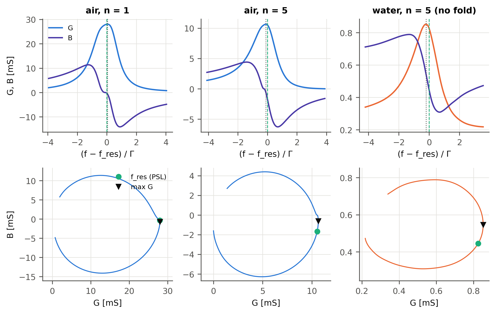
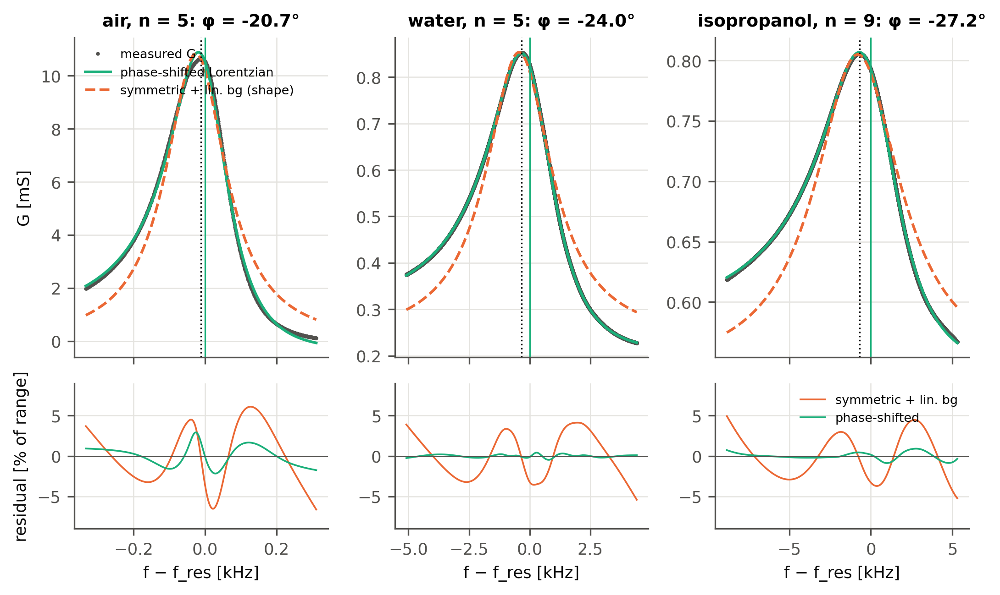
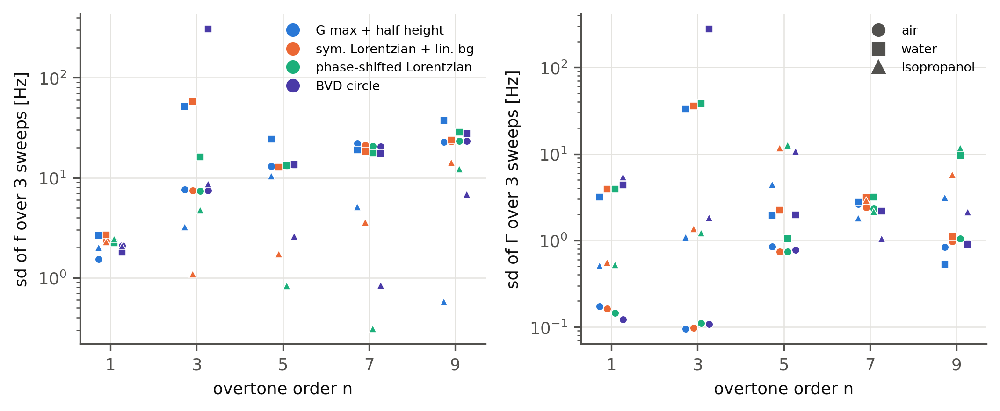
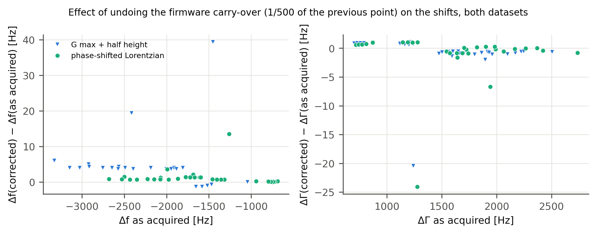
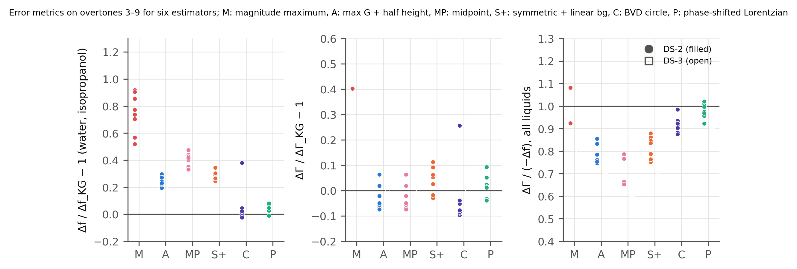
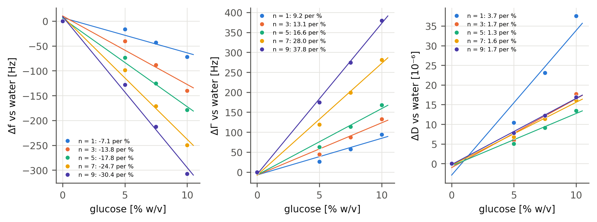
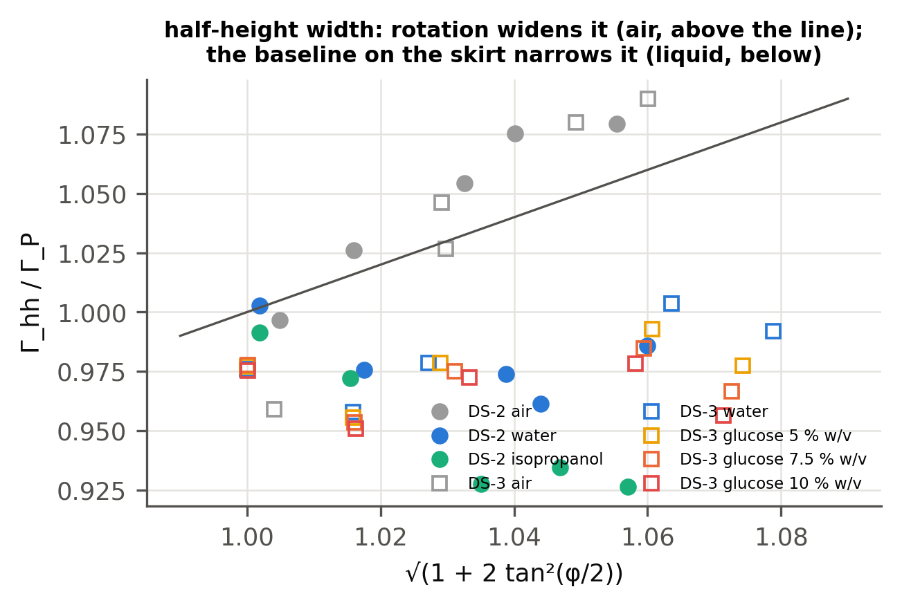
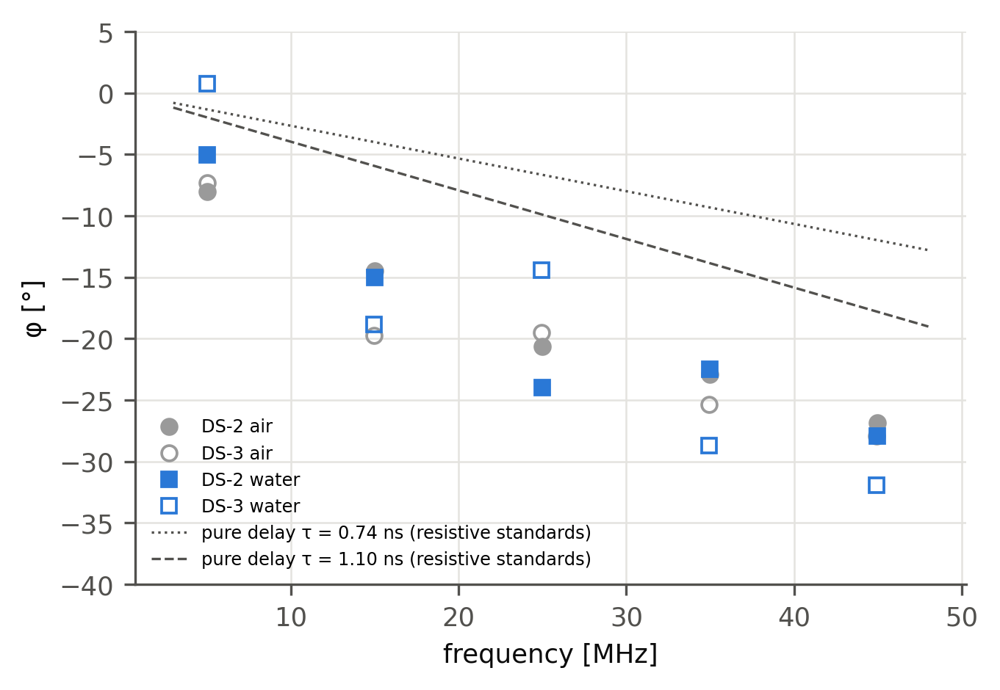
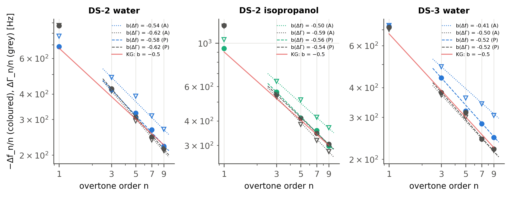

*Every number in this document is regenerated from the raw data by the scripts in `research/paper/analysis/` (`run_estimators.py`, `run_glucose.py`, `run_v2.py`, `run_bias_theory.py`, `run_forward_model.py`, `make_figures_v2.py`, `make_si.py`); the tables below are written by `make_si.py` from `results/v2/asis/*.csv`. Variant "as acquired" unless stated; the firmware-corrected variant is in `results/v2/fwfix/` and Section S7.*

# S1. Literature comparison, full table

The full comparison table (hardware architecture, sweep method, measured quantities, phase measured, complex $Y/Z$ reconstructed, BVD fitting, Lorentzian fitting, frequency estimator, dissipation estimator, liquid validation, multi-overtone, real-time suitability, computational complexity, cost class), with the verification grade of each entry, is `research/paper/literature/comparison_table.md`; the literature review and the novelty assessment are `literature_review.md` and `novelty_assessment.md` in the same folder. The compact Table 1 of the main text is its first block.

# S2. Small-load approximation to Kanazawa–Gordon: sources and checks

The derivation of main-text Eqs. (1)–(4) was carried out twice independently (`notes/derivations.md` §6 and `notes/theory_sla_to_kg_check.md`). The points verified against the sources: (i) the SLA normalises the complex shift to the *fundamental* $f_F$ and is applied at the overtone frequency $f_n = nf_F$ inside the load impedance, which is what produces $\Delta f_n \propto \sqrt n$ [@Johannsmann2008; @Johannsmann2021]; (ii) with $\exp(i\omega t)$ the imaginary part of the shift is $+\Delta\Gamma$ and the Newtonian impedance is $(1+i)\sqrt{\omega\rho\eta/2}$, so $\Delta\Gamma_n = -\Delta f_n > 0$; (iii) for $n = 1$ Eq. (4) is the relation of Kanazawa and Gordon [@KanazawaGordon1985AC]. Numerical check with $\rho_q = 2648$ kg m⁻³, $\mu_q = 2.947\times10^{10}$ Pa ($Z_q = 8.83\times10^6$ kg m⁻² s⁻¹), $f_F$ = 5 004 596 Hz (DS-2) and 5 000 107 Hz (DS-3): coefficient 715.04 and 714.08 Hz per $\sqrt n$ per unit $\sqrt{\rho\eta}$; water ($\sqrt{\rho\eta}$ = 0.9420 kg m⁻² s⁻¹ᐟ², NIST Chemistry WebBook, IAPWS-95 density and IAPWS 2008 viscosity [@NISTWebBookWater]) 673.6 and 672.7 Hz·$\sqrt n$; isopropanol (1.2616, handbook values 781.0 kg m⁻³ and 2.038 mPa s; Kerscher et al. [@Kerscher2024] measure 780.9 and 2.07) 902.1 Hz·$\sqrt n$ (910 Hz with Kerscher's values). The 2021 tutorial writes the SLA as its Eq. (23) with $f_0$ the fundamental and derives its Eq. (29), $(-1+i)\sqrt n\sqrt{f_0}\sqrt{\rho\eta}/(\sqrt\pi Z_q)$, for the Newtonian liquid, which is Eq. (4) of the main text; the 2008 and 1985 primary texts were not reachable from this session and their equation numbers are not cited (see `notes/theory_sla_to_kg_check.md` for the grading). Temperature sensitivity of the prediction: $\partial\ln\sqrt{\rho\eta}/\partial T = -1.15$ %/K for water near 25 °C (NIST values at 23 and 27 °C) and $-1.6$ %/K for isopropanol [@Kerscher2024], so ±2 K on the unmeasured liquid temperature is ±2–3 % on $\Delta f_\mathrm{KG}$ and $\Delta\Gamma_\mathrm{KG}$ and nothing on KG-1 and KG-2. The water constants of the earlier internal document (1.102933 g cm⁻³, 0.010665 g cm⁻¹ s⁻¹) would raise the prediction by $\sqrt{1.102933\cdot1.0665/(0.99705\cdot0.890)} = 1.151$, i.e. by 15 %; they are not used.

# S3. The phase reading: fold detection, offset, sign, and the locus

**Model and rule.** $r(f) = |\phi(f) + \phi_b| - \delta$ (main text, Section 4). The instrument declares a fold when the reading's minimum reaches at least 88 % of the way from its off-resonance level to 0° and sits within 5 Γ of the conductance maximum; the decision is latched over two consecutive sweeps. With a fold, $\delta = -\min r$ is subtracted and the branch past the vertex is negated for $B$; without a fold the reading is used unsigned and uncorrected. On DS-2 the fold is present on all overtones in air (vertex from +0.6° at $n$ = 9 to −6.4° at $n$ = 5, i.e. δ = −0.6…+6.4°), on the fundamental in both liquids, and on none of the overtones $n \ge 3$ in liquid, where the minimum stays 9–45° above zero; on DS-3 the same, with the fold also on $n = 3$ in all four liquids. One sweep of 120 (DS-2, water, $n = 3$, third replica) has a minimum depth of 0.880, exactly at the threshold: the instrument's datalog shows the logged pair alternating between two states 105 Hz and 7.7 × 10⁻⁶ apart from 13:12 onwards, and the 0.2 % firmware correction flips its decision (Section S7). This is the fragility of the rule, and it is the one failure observed.

**Why $G$ is even in the sign and not in the offset.** $G$ depends on $\phi$ through $\cos\phi$ and $\sin^2\phi$ only, so the unsigned reading suffices for $G$ and for everything derived from it; $B$ depends on $\sin\phi$ and needs the sign. An additive $\delta$ is not removed: $\partial G/\partial\phi \propto \sin\phi$ vanishes at resonance and not on the flanks, so an uncorrected offset distorts the peak shape more than its position; the forward model (S6) gives ≤11 Hz on $f_\mathrm{res}$ (15 Hz where the offset triggers a spurious fold) and ≤7 Hz on Γ for ±5° in liquid, and an almost one-to-one entry of $\delta$ into the fitted angle, $\varphi_\mathrm{fit} \approx \phi_b - \delta$.

**What the rule must not do.** Flipping the sign on a damped load (no fold) splits the locus into two arcs (step of 28–89 % of the range of $B$); zeroing the minimum on a damped load subtracts 9–45° and takes $r_n$ to 0.5–0.8; estimating $\delta$ by making the locus round buys roundness by breaking the trajectory. The repository documents these three failed variants (`research/air-ipa-water-1920-2026-09-11/fold-hypothesis.md`). The locus $B(G)$ is a circle to 1–7 % of its radius in air and 5–18 % in liquid, visibly rotated with respect to the $G$ axis (Fig. S2); the out-of-roundness in liquid coincides with the divider ratio sitting at −22 to −37 dB, the edge of the AD8302's specified range, and with the Möbius distortion of a phase error (S6).

**Fold rounding.** The smoothing (Savitzky–Golay 51/3 + spline) rounds the V of the fold over 20–50 Hz; on synthetic air-like data the recovered $\delta$ is 1.0–1.8° more negative than the true offset, with no effect on $f_\mathrm{res}$ or Γ when a fold exists. The rounded fold under the narrow air peaks is what leaves the fit residual at 1–3 % of the range in air (Fig. S3) and the closed-form bias of the maximum 5–8 Hz short there (main text Fig. 5).

# S4. Closed-form biases of the simple estimators for a rotated Lorentzian

With $\Delta = f_\mathrm{res} - f$ and $G - G_\mathrm{off} = A(\Gamma\cos\varphi - \Delta\sin\varphi)/(\Delta^2 + \Gamma^2)$, $dG/d\Delta = 0 \iff \sin\varphi\,\Delta^2 - 2\Gamma\cos\varphi\,\Delta - \Gamma^2\sin\varphi = 0$, whose maximum is $\Delta_\mathrm{max} = \Gamma(\cos\varphi - 1)/\sin\varphi = -\Gamma\tan(\varphi/2)$, hence $f_{G\max} = f_\mathrm{res} + \Gamma\tan(\varphi/2)$. The peak height above $G_\mathrm{off}$ is $(A/\Gamma)\cos^2(\varphi/2)$ and the curve has a negative lobe $-(A/\Gamma)\sin^2(\varphi/2)$ at $\Delta = \Gamma/\tan(\varphi/2)$. The half-height crossings (level $G_\mathrm{off}$ + half the peak height, $c = \cos^2(\varphi/2)$) solve $c\Delta^2 + 2\Gamma\sin\varphi\,\Delta + \Gamma^2(c - 2\cos\varphi) = 0$, $\Delta_\pm = \Gamma[-\sin\varphi \pm \sqrt{c(2-c)}]/c$, so $\Gamma_\mathrm{hh} = (\Delta_+ - \Delta_-)/2 = \Gamma\sqrt{(2-c)/c} = \Gamma\sqrt{1 + 2\tan^2(\varphi/2)}$ and $f_\mathrm{mid} = f_\mathrm{res} + 2\Gamma\tan(\varphi/2)$. Checked on noise-free model curves on the 1 Hz grid (`results/closed_forms_check.csv`): argmax bias numerical/theory −3.0/−2.8 Hz (φ = −5°, Γ = 65 Hz) … −582/−582 Hz (−40°, 1600 Hz); Γ_hh/Γ 1.0014/1.0019 … 1.1198/1.1247; midpoint −5.7/−5.7 … −1048/−1165 Hz (the midpoint deviates from its closed form at large |φ| because the grid and the window truncate the far crossing). A symmetric Lorentzian with constant background fitted to a rotated one is biased by 1.9–2.1 Γ tan(φ/2) in frequency and over-estimates Γ by 2–35 % between −8° and −28°; with a linear background Γ is right to 0.2 % and the frequency bias is ≈1.25 Γ tan(φ/2).

**Sign convention.** Johannsmann et al. print Eq. 13 with $+\Delta\sin\varphi$ in $G$ and $+\Delta\cos\varphi$ in $B$; with one $\varphi$ in both lines that is not a single rotation (the lines correspond to $\varphi$ and $-\varphi$). Fitting $G$ alone, the two conventions are observationally identical and differ only in the sign quoted for $\varphi$; the main text uses the rotation form, in which the fitted angle is negative on both boards and the maximum of $G$ lies below $f_\mathrm{res}$. On the data the measured $f_{G\max} - f_\mathrm{res}$ is negative on every liquid sweep and on every air sweep with $n \ge 3$ (Table S8), as the convention requires.

# S5. Fitting: window, initialisation, acceptance gate, fallback rate, residuals, repeatability

Window $|f - f_{G\max}| \le 3\Gamma_\mathrm{hh}$ (clipped by the sweep edge on the right for $n \ge 5$ in isopropanol, 2.2–3.0 Γ available, and at $n = 9$ in DS-3, 2.8–2.9 Γ in water and 2.5–2.6 Γ in the glucose solutions); seeds $f_{G\max}$, $\Gamma_\mathrm{hh}$, $\varphi = 0$, $G_\mathrm{off} = \min G$, $G_\mathrm{max}$ = range of $G$; frequencies scaled to kHz about the seed and conductances to mS; Levenberg–Marquardt with tolerances 10⁻¹². Gate (instrument constants): convergence, $f_\mathrm{res}$ inside the window, $0.3 \le \Gamma/\Gamma_\mathrm{hh} \le 3$, $|\varphi| \le 60^\circ$, rms residual ≤ 5 % of the range; the limits were set at about ten times the observed values on DS-2 and never fired: 45/45 fits of DS-2 and 75/75 of DS-3 converged and were accepted (fallback rate 0 %). Residuals (rms, percent of the range of $G$): phase-shifted 1.0–2.7 % in air and 0.15–0.65 % in liquid on DS-2, 0.9–1.4 % and 0.2–0.8 % on DS-3; symmetric Lorentzian with linear background 3.0–4.2 % and 0.8–3.5 % (DS-2), 1.8–4.2 % and 0.7–3.8 % (DS-3), always S-shaped (Fig. S3). The fit's covariance gives 0.1–0.8 Hz on $f_\mathrm{res}$, an order of magnitude below the replica scatter, because the residual is structured; the replica scatter is the number quoted. Repeatability over the three sweeps of a plateau (Fig. S4): DS-2, $f_\mathrm{res}$ 1.5–23 Hz in air (the air baseline was still drifting at −0.3 to −2 Hz/min) and 0.3–29 Hz in liquid, Γ ≤ 2.3 Hz in air and ≤ 38 Hz in liquid (the two-state sweep; ≤ 13 Hz otherwise); DS-3, $f_\mathrm{res}$ ≤ 2.4 Hz in air and ≤ 7.6 Hz in liquid, Γ ≤ 0.7 and ≤ 4.5 Hz. The magnitude estimator's −3 dB width is undefined inside the window on 15 of 45 (DS-2) and 33 of 75 (DS-3) sweeps; the half-height width of $G$ is two-sided on all 120.

# S6. Forward model, board phase, resistive standards

A board phase does not multiply the admittance; it multiplies the measured transfer function, $H_\mathrm{meas} = He^{j\phi_b}$. Inverting exactly with that phase gives $Y' = 1/[(Z_\mathrm{el} + R_{17})e^{-j\phi_b} - R_{17}]$, a Möbius transformation of $Y_\mathrm{el} = 1/Z_\mathrm{el}$ that reduces to the rotation $Y_\mathrm{el}e^{j\phi_b}$ only when $|Z_\mathrm{el}| \gg R_{17}$. A Butterworth–Van Dyke crystal of known $f_s$, Γ, $R_1$, $C_0$ was sent through the divider and the detector laws with a board phase on $\angle H$, an offset δ, the fold, the ADC quantisation and the firmware carry-over, and through the same chain and estimators (`run_forward_model.py`, `results/forward_model.md`). Findings: (i) the fitted angle equals the imposed board phase to 0.7° on the liquid-like cases and to 1° on the air-like ones, except the one case where the offset triggers a spurious fold; (ii) with $\phi_b = 0$ both estimators recover $f_s$ to the grid; (iii) with $\phi_b = -8$ to $-25^\circ$ the maximum of $G$ is off by −91 to −743 Hz on liquid-like cases, the phase-shifted fit by −9 to −59 Hz (≤2 % of Γ), the symmetric fit by −96 to −833 Hz; (iv) the residual of the phase-shifted fit scales as $\approx -0.34\,\Gamma\,(R_{17}/R_1)$ at $\phi_b = -20^\circ$: −344 Hz at $R_1 = R_{17}$ and −12 Hz at 1.6 kΩ for Γ = 1 kHz, so for air-like cases (Γ = 65–190 Hz, $R_1$ = 36–204 Ω) −12 to −39 Hz, a third to a half of the argmax bias for $R_1/R_{17} \ge 1.8$ and three quarters or more at $R_1/R_{17}$ = 0.7; (v) with a fold, δ is removed and does not move $f_\mathrm{res}$ or Γ (≤0.5 Hz for δ = −3…+7°); (vi) without a fold, ±5° of δ enters the fitted angle almost one to one and moves $f_\mathrm{res}$ by ≤11 Hz (15 Hz where a spurious fold is declared) and Γ by ≤7 Hz; (vii) ±5 % on the magnitude slope moves $f_\mathrm{res}$ by ≤17 Hz and Γ by ≤1 %, but $R_m = 1/G_\mathrm{max}$ by 6–16 %, and even with an ideal magnitude channel $R_m$ is 24–39 % low in liquid; (viii) the firmware carry-over moves $f_\mathrm{res}$ by ≈2 Hz; (ix) the smoothing widens a 65 Hz half-bandwidth by 6.5 Hz (+10 %) and a 190 Hz one by 3.5 Hz, negligible in liquid.

The repository's two-channel forward model, which fits a BVD crystal through the divider and the detector laws to $V_\mathrm{MAG}$ and $V_\mathrm{PHS}$ jointly with a board phase inside the modulus, gives $\phi_b = -7.6, -13.8, -19.9, -22.1, -20.4^\circ$ in air on board 1920, equal to the P angle within 0.4–0.8° on $n = 1$–7. The short and 50 Ω standards measured on the same front end (1–51 MHz) give phase slopes of 0.27–0.40° MHz⁻¹ (0.74–1.10 ns), i.e. 1.4–2.0° at 5 MHz and 12–18° at 45 MHz, and read $M$ 4–16 % low (8–14 % at 5 MHz); the fitted angle grows roughly as $f^{0.55}$ (Fig. S11). A least-squares decomposition $\varphi = \varphi_0 - 360^\circ f\tau$ gives $\varphi_0 = -7.0^\circ$, τ = 1.28 ns (rms 1.2°) for board 1920 in air and $\varphi_0 = -8.2^\circ$, τ = 1.31 ns (rms 2.6°) for the second instrument, an approximation whose parameters move when $n = 1$ is excluded.

# S7. Firmware carry-over

Firmware versions up to 0.1.5c did not reset the per-point sums, so each printed point carried 1/500 of the previous one (+0.2 % on the counts). The recursion is exact and was undone offline on the counts ($m_i = v_i - v_{i-1}/500$). On DS-2 it changes $f_\mathrm{res}$ by ≤2.2 Hz and Γ by ≤1.7 Hz on 43 of 45 sweeps with P and φ by ≤0.2°; the exceptions are the threshold sweep of S3, whose fold decision flips ($f_\mathrm{res}$ +37 Hz with P, +111 Hz with A; φ +4.3°), and one water sweep at $n$ = 9 (+10 Hz on $f_\mathrm{res}$, −18 Hz on Γ). With A the changes are larger (≤2 Hz on 21 of 45 sweeps, up to 111 Hz). On DS-3 it changes $f_\mathrm{res}$ by ≤2 Hz (P; ≤6 Hz with A), Γ by ≤2 Hz and φ by ≤0.2°. Over the 120 sweeps the fit moves by ≤2 Hz on 115 and by ≤4 Hz on 118. The A and P ranges of Table 2 move by ≤2 percentage points (the M rows by up to 3.4) (corrected variant: DS-2 P $\epsilon_f$ = −1.6…+7.8 %, $\epsilon_\Gamma$ = −4.3…+7.3 %; DS-3 P +6.0…+13.0 %, −4.4…+4.6 %); the bias law gives +14 ± 30 Hz on 120 sweeps. Fig. S6 shows the differences on the shifts.

# S8. The raw-magnitude baseline and the production datalogs

**Magnitude-only estimator from the sweeps (M).** Maximum of the divider ratio in dB on the same grid and its −3 dB full width where it exists (Table S3 and Fig. S7): $\epsilon_f$ = +52…+92 % (DS-2) and +50…+116 % (DS-3) on $n$ = 3–9, growing with the overtone; the width is undefined inside the window for $n \ge 7$ in liquid and reaches 6 kHz at $n$ = 5. **Production datalog of board 1920** (same instants as the impedance datalog, Fig. S8): maximum of the baseline-corrected magnitude and its −0.3 dB width; on the last 10 min of each plateau of 2026-09-11 (95 of 486 rows were exact duplicates written in bursts and were dropped) $\epsilon_f$ = +51, +69, +76, +89 % (water, $n$ = 3–9) and +57, +74, +85, +90 % (isopropanol), against +23, +29, +22, +18 % and +22, +27, +22, +22 % for the live A estimator; the −0.3 dB width changes by 0.8–3.7 kHz (water) and 1.1–6.4 kHz (isopropanol) where the theory's ΔΓ is 1.2–2.7 kHz. The 2026-09-10 run (2.5 min plateaus, 36 of 175 rows duplicated) gives +51…+98 % and +22…+30 %. The live A estimator reproduces the offline analysis of the dumped sweeps within the plateau drift (Table S11).

# S9. Glucose series: concentration lines, the 5 % offset, the fit window

Relative to water, the fitted resonance moves by −72 Hz (fundamental) to −307 Hz (9th) at 10 % w/v (−17 to −128 Hz at 5 %) and broadens by +94 to +379 Hz at 10 %; lines through the four concentrations have slopes −7.1, −13.8, −17.8, −24.7, −30.4 Hz per % w/v in $\Delta f_n$ and +9.2, +13.1, +16.6, +28.0, +37.8 Hz per % in $\Delta\Gamma_n$ (Fig. S9). The 5 % plateau is less loaded than the line on every overtone: +10 to +18 Hz in Δf and −9 to −14 Hz in ΔΓ, constant in hertz over $n$ rather than ∝ √n, so not an error of ρη. Drift cannot explain it: the slope of $f_\mathrm{res}$ over the three replicas is ≤0.4 Hz/min inside the glucose plateaus and −0.2 to −1.0 Hz/min in water, the 5 % plateau is 4.3 min off the line of plateau times against concentration, so a time-linear drift maps into at most ≈4 Hz, and explaining the residual by drift alone would need −2 to −4 Hz/min, three to sixteen times what is measured (`results/glucose_tables_asis.md`). Without a return to water between concentrations the experiment cannot tell a property of the first solution from a step of the instrument. The ratio $\rho\eta/(\rho\eta)_w$ from the bandwidth exceeds that from the frequency on $n$ = 7 and 9 (1.36 and 1.42 against 1.27 and 1.30 at 10 %); the ±3Γ fit window is clipped by the sweep edge there (2.5–2.6 Γ on the right at $n$ = 9), and refitting with a symmetric window limited by the edge moves the $n$ = 9 ratio from 1.418 to 1.395, a fifth of the gap, and nothing at $n$ = 7; the rest is unexplained. A roughness term, which in the Daikhin–Urbakh description adds to Δf without a counterpart in ΔΓ [@DaikhinUrbakh1996; @DaikhinUrbakh1997], would act in the opposite direction and is not supported.

# S10. Tables

**Table S1.** Resonance frequency, half-bandwidth, dissipation and rotation angle per dataset, medium and overtone (mean ± sd of three sweeps). A = maximum of $G$ + half height; P = phase-shifted Lorentzian; fold = number of sweeps on which the phase reading folds.

| dataset | medium | n | f (A) [Hz] | f (P) [Hz] | Γ (A) [Hz] | Γ (P) [Hz] | D (A) [10⁻⁶] | D (P) [10⁻⁶] | φ (P) [°] | fold |
|---|---|---|---|---|---|---|---|---|---|---|
| DS-2 | air | 1 | 5004598 ± 2 | 5004596 ± 2 | 65.4 ± 0.2 | 65.6 ± 0.1 | 26.1 | 26.2 | -8.0 ± 0.05 | 3/3 |
| DS-2 | air | 3 | 14988738 ± 8 | 14988740 ± 7 | 78.0 ± 0.1 | 76.0 ± 0.1 | 10.4 | 10.1 | -14.5 ± 0.03 | 3/3 |
| DS-2 | air | 5 | 24973688 ± 13 | 24973699 ± 13 | 108.0 ± 0.8 | 102.4 ± 0.7 | 8.6 | 8.2 | -20.6 ± 0.06 | 3/3 |
| DS-2 | air | 7 | 34957566 ± 22 | 34957593 ± 21 | 158.7 ± 2.6 | 147.6 ± 2.3 | 9.1 | 8.4 | -22.9 ± 0.04 | 3/3 |
| DS-2 | air | 9 | 44943110 ± 23 | 44943157 ± 23 | 203.7 ± 0.8 | 188.7 ± 1.0 | 9.1 | 8.4 | -26.8 ± 0.00 | 3/3 |
| DS-2 | water | 1 | 5003826 ± 3 | 5003909 ± 2 | 937.0 ± 3.2 | 934.5 ± 3.9 | 374.5 | 373.5 | -5.0 ± 0.02 | 3/3 |
| DS-2 | water | 3 | 14987288 ± 52 | 14987478 ± 16 | 1318.2 ± 33.1 | 1351.4 ± 38.2 | 175.9 | 180.3 | -15.0 ± 2.45 | 1/3 |
| DS-2 | water | 5 | 24971737 ± 24 | 24972088 ± 13 | 1582.0 ± 2.0 | 1645.6 ± 1.0 | 126.7 | 131.8 | -24.0 ± 0.04 | 0/3 |
| DS-2 | water | 7 | 34955379 ± 19 | 34955726 ± 18 | 1822.9 ± 2.8 | 1871.6 ± 3.2 | 104.3 | 107.1 | -22.5 ± 0.05 | 0/3 |
| DS-2 | water | 9 | 44940695 ± 37 | 44941165 ± 29 | 2099.7 ± 0.5 | 2130.1 ± 9.6 | 93.4 | 94.8 | -27.9 ± 0.23 | 0/3 |
| DS-2 | isopropanol | 1 | 5003555 ± 2 | 5003656 ± 2 | 1285.6 ± 0.5 | 1296.9 ± 0.5 | 513.9 | 518.4 | -5.0 ± 0.02 | 3/3 |
| DS-2 | isopropanol | 3 | 14986825 ± 3 | 14987054 ± 5 | 1670.5 ± 1.1 | 1718.6 ± 1.2 | 222.9 | 229.3 | -14.2 ± 0.18 | 0/3 |
| DS-2 | isopropanol | 5 | 24971122 ± 10 | 24971627 ± 1 | 2025.1 ± 4.4 | 2166.8 ± 12.6 | 162.2 | 173.5 | -24.7 ± 0.17 | 0/3 |
| DS-2 | isopropanol | 7 | 34954645 ± 5 | 34955093 ± 0 | 2383.2 ± 1.8 | 2569.8 ± 2.2 | 136.4 | 147.0 | -21.4 ± 0.11 | 0/3 |
| DS-2 | isopropanol | 9 | 44939783 ± 1 | 44940476 ± 12 | 2709.8 ± 3.1 | 2925.5 ± 11.6 | 120.6 | 130.2 | -27.2 ± 0.04 | 0/3 |
| DS-3 | air | 1 | 5000106 ± 1 | 5000107 ± 1 | 110.0 ± 0.7 | 114.7 ± 0.7 | 44.0 | 45.9 | -7.3 ± 0.13 | 3/3 |
| DS-3 | air | 3 | 14977476 ± 0 | 14977481 ± 0 | 52.6 ± 0.1 | 51.3 ± 0.1 | 7.0 | 6.8 | -19.7 ± 0.02 | 3/3 |
| DS-3 | air | 5 | 24955252 ± 1 | 24955258 ± 1 | 70.0 ± 0.1 | 66.9 ± 0.1 | 5.6 | 5.4 | -19.5 ± 0.02 | 3/3 |
| DS-3 | air | 7 | 34931726 ± 2 | 34931742 ± 2 | 106.2 ± 0.3 | 98.3 ± 0.2 | 6.1 | 5.6 | -25.3 ± 0.05 | 3/3 |
| DS-3 | air | 9 | 44909699 ± 3 | 44909726 ± 2 | 152.3 ± 0.1 | 139.8 ± 0.1 | 6.8 | 6.2 | -27.9 ± 0.05 | 3/3 |
| DS-3 | water | 1 | 4999377 ± 3 | 4999384 ± 1 | 811.1 ± 1.4 | 831.0 ± 1.5 | 324.5 | 332.5 | 0.7 ± 0.03 | 3/3 |
| DS-3 | water | 3 | 14976009 ± 3 | 14976163 ± 3 | 1170.8 ± 1.3 | 1196.4 ± 1.9 | 156.4 | 159.8 | -18.8 ± 0.03 | 3/3 |
| DS-3 | water | 5 | 24953443 ± 5 | 24953662 ± 4 | 1571.3 ± 1.1 | 1640.4 ± 0.6 | 125.9 | 131.5 | -14.4 ± 0.02 | 0/3 |
| DS-3 | water | 7 | 34929332 ± 3 | 34929765 ± 5 | 1806.6 ± 2.3 | 1800.1 ± 0.1 | 103.4 | 103.1 | -28.7 ± 0.01 | 0/3 |
| DS-3 | water | 9 | 44906947 ± 36 | 44907503 ± 8 | 2111.9 ± 2.4 | 2129.1 ± 4.5 | 94.1 | 94.8 | -31.9 ± 0.03 | 0/3 |
| DS-3 | glucose 5 % | 1 | 4999359 ± 2 | 4999367 ± 0 | 837.5 ± 0.4 | 857.1 ± 0.8 | 335.0 | 342.9 | 0.9 ± 0.01 | 3/3 |
| DS-3 | glucose 5 % | 3 | 14975959 ± 2 | 14976123 ± 0 | 1214.3 ± 0.2 | 1240.7 ± 0.2 | 162.2 | 165.7 | -19.5 ± 0.01 | 3/3 |
| DS-3 | glucose 5 % | 5 | 24953369 ± 3 | 24953588 ± 1 | 1627.6 ± 2.4 | 1703.3 ± 0.5 | 130.5 | 136.5 | -14.4 ± 0.00 | 0/3 |
| DS-3 | glucose 5 % | 7 | 34929237 ± 4 | 34929667 ± 1 | 1905.2 ± 0.8 | 1918.9 ± 0.3 | 109.1 | 109.9 | -28.1 ± 0.01 | 0/3 |
| DS-3 | glucose 5 % | 9 | 44906784 ± 7 | 44907375 ± 1 | 2251.6 ± 4.0 | 2303.8 ± 0.8 | 100.3 | 102.6 | -31.0 ± 0.04 | 0/3 |
| DS-3 | glucose 7.5 % | 1 | 4999332 ± 3 | 4999341 ± 0 | 869.0 ± 0.2 | 888.7 ± 0.9 | 347.6 | 355.5 | 1.1 ± 0.01 | 3/3 |
| DS-3 | glucose 7.5 % | 3 | 14975895 ± 4 | 14976075 ± 1 | 1252.1 ± 0.3 | 1284.0 ± 0.5 | 167.2 | 171.5 | -20.2 ± 0.01 | 3/3 |
| DS-3 | glucose 7.5 % | 5 | 24953306 ± 5 | 24953536 ± 1 | 1672.6 ± 1.8 | 1754.4 ± 0.8 | 134.1 | 140.6 | -14.5 ± 0.01 | 0/3 |
| DS-3 | glucose 7.5 % | 7 | 34929154 ± 14 | 34929594 ± 1 | 1968.6 ± 1.1 | 1999.1 ± 0.2 | 112.7 | 114.5 | -27.8 ± 0.00 | 0/3 |
| DS-3 | glucose 7.5 % | 9 | 44906672 ± 3 | 44907291 ± 0 | 2323.1 ± 5.7 | 2403.7 ± 1.4 | 103.5 | 107.1 | -30.7 ± 0.02 | 0/3 |
| DS-3 | glucose 10 % | 1 | 4999304 ± 3 | 4999311 ± 0 | 902.1 ± 0.7 | 924.9 ± 0.9 | 360.9 | 370.0 | 1.2 ± 0.01 | 3/3 |
| DS-3 | glucose 10 % | 3 | 14975822 ± 2 | 14976023 ± 0 | 1292.4 ± 0.9 | 1329.0 ± 0.8 | 172.6 | 177.5 | -20.8 ± 0.03 | 3/3 |
| DS-3 | glucose 10 % | 5 | 24953248 ± 3 | 24953483 ± 1 | 1719.4 ± 1.6 | 1808.4 ± 0.8 | 137.8 | 144.9 | -14.6 ± 0.02 | 0/3 |
| DS-3 | glucose 10 % | 7 | 34929080 ± 7 | 34929516 ± 1 | 2036.5 ± 0.9 | 2081.6 ± 2.2 | 116.6 | 119.2 | -27.5 ± 0.02 | 0/3 |
| DS-3 | glucose 10 % | 9 | 44906553 ± 2 | 44907196 ± 3 | 2398.9 ± 2.4 | 2508.4 ± 1.2 | 106.8 | 111.7 | -30.4 ± 0.07 | 0/3 |

**Table S2.** Air-to-liquid shifts for A and P, all datasets and liquids, with the three tests. $\epsilon$ only where ρη is tabulated (water, isopropanol).

| dataset | liquid | n | est. | Δf [Hz] | Δf/n | ΔΓ [Hz] | ΔΓ/n | Δf_KG | ε_f [%] | ε_Γ [%] | r = ΔΓ/(−Δf) | ΔD [10⁻⁶] |
|---|---|---|---|---|---|---|---|---|---|---|---|---|
| DS-2 | water | 1 | A | -772 ± 3 | -772 | 872 ± 3 | 872 | -674 | +14.7 | +29.4 | 1.129 | 348.4 |
| DS-2 | water | 3 | A | -1451 ± 52 | -484 | 1240 ± 33 | 413 | -1167 | +24.3 | +6.3 | 0.855 | 165.5 |
| DS-2 | water | 5 | A | -1951 ± 28 | -390 | 1474 ± 2 | 295 | -1506 | +29.5 | -2.1 | 0.756 | 118.1 |
| DS-2 | water | 7 | A | -2187 ± 29 | -312 | 1664 ± 4 | 238 | -1782 | +22.7 | -6.6 | 0.761 | 95.2 |
| DS-2 | water | 9 | A | -2415 ± 44 | -268 | 1896 ± 1 | 211 | -2021 | +19.5 | -6.2 | 0.785 | 84.4 |
| DS-2 | water | 1 | P | -687 ± 3 | -687 | 869 ± 4 | 869 | -674 | +2.0 | +29.0 | 1.265 | 347.3 |
| DS-2 | water | 3 | P | -1262 ± 18 | -421 | 1275 ± 38 | 425 | -1167 | +8.2 | +9.3 | 1.011 | 170.2 |
| DS-2 | water | 5 | P | -1611 ± 19 | -322 | 1543 ± 1 | 309 | -1506 | +7.0 | +2.5 | 0.958 | 123.6 |
| DS-2 | water | 7 | P | -1868 ± 27 | -267 | 1724 ± 4 | 246 | -1782 | +4.8 | -3.3 | 0.923 | 98.6 |
| DS-2 | water | 9 | P | -1991 ± 37 | -221 | 1941 ± 10 | 216 | -2021 | -1.4 | -3.9 | 0.975 | 86.4 |
| DS-2 | isopropanol | 1 | A | -1043 ± 3 | -1043 | 1220 ± 1 | 1220 | -902 | +15.7 | +35.3 | 1.169 | 487.7 |
| DS-2 | isopropanol | 3 | A | -1914 ± 8 | -638 | 1593 ± 1 | 531 | -1562 | +22.5 | +1.9 | 0.832 | 212.5 |
| DS-2 | isopropanol | 5 | A | -2566 ± 17 | -513 | 1917 ± 4 | 383 | -2017 | +27.2 | -5.0 | 0.747 | 153.5 |
| DS-2 | isopropanol | 7 | A | -2921 ± 23 | -417 | 2224 ± 3 | 318 | -2387 | +22.4 | -6.8 | 0.762 | 127.3 |
| DS-2 | isopropanol | 9 | A | -3327 ± 23 | -370 | 2506 ± 3 | 278 | -2706 | +22.9 | -7.4 | 0.753 | 111.5 |
| DS-2 | isopropanol | 1 | P | -940 ± 3 | -940 | 1231 ± 1 | 1231 | -902 | +4.2 | +36.5 | 1.310 | 492.2 |
| DS-2 | isopropanol | 3 | P | -1686 ± 9 | -562 | 1643 ± 1 | 548 | -1562 | +7.9 | +5.1 | 0.974 | 219.2 |
| DS-2 | isopropanol | 5 | P | -2072 ± 13 | -414 | 2064 ± 13 | 413 | -2017 | +2.7 | +2.3 | 0.996 | 165.3 |
| DS-2 | isopropanol | 7 | P | -2501 ± 21 | -357 | 2422 ± 3 | 346 | -2387 | +4.8 | +1.5 | 0.969 | 138.6 |
| DS-2 | isopropanol | 9 | P | -2681 ± 26 | -298 | 2737 ± 12 | 304 | -2706 | -1.0 | +1.1 | 1.021 | 121.8 |
| DS-3 | water | 1 | A | -729 ± 3 | -729 | 701 ± 2 | 701 | -673 | +8.4 | +4.2 | 0.962 | 280.5 |
| DS-3 | water | 3 | A | -1467 ± 3 | -489 | 1118 ± 1 | 373 | -1165 | +25.9 | -4.0 | 0.762 | 149.3 |
| DS-3 | water | 5 | A | -1808 ± 5 | -362 | 1501 ± 1 | 300 | -1504 | +20.2 | -0.2 | 0.830 | 120.3 |
| DS-3 | water | 7 | A | -2394 ± 4 | -342 | 1700 ± 2 | 243 | -1780 | +34.5 | -4.5 | 0.710 | 97.4 |
| DS-3 | water | 9 | A | -2752 ± 36 | -306 | 1960 ± 2 | 218 | -2018 | +36.4 | -2.9 | 0.712 | 87.3 |
| DS-3 | water | 1 | P | -723 ± 1 | -723 | 716 ± 2 | 716 | -673 | +7.5 | +6.5 | 0.991 | 286.6 |
| DS-3 | water | 3 | P | -1318 ± 3 | -439 | 1145 ± 2 | 382 | -1165 | +13.1 | -1.7 | 0.869 | 152.9 |
| DS-3 | water | 5 | P | -1596 ± 4 | -319 | 1573 ± 1 | 315 | -1504 | +6.1 | +4.6 | 0.986 | 126.1 |
| DS-3 | water | 7 | P | -1976 ± 6 | -282 | 1702 ± 0 | 243 | -1780 | +11.0 | -4.4 | 0.861 | 97.4 |
| DS-3 | water | 9 | P | -2223 ± 8 | -247 | 1989 ± 5 | 221 | -2018 | +10.1 | -1.4 | 0.895 | 88.6 |
| DS-3 | glucose 5 % | 1 | A | -747 ± 2 | -747 | 727 ± 1 | 727 | — | — | — | 0.974 | 291.0 |
| DS-3 | glucose 5 % | 3 | A | -1517 ± 2 | -506 | 1162 ± 0 | 387 | — | — | — | 0.766 | 155.1 |
| DS-3 | glucose 5 % | 5 | A | -1883 ± 3 | -377 | 1558 ± 2 | 312 | — | — | — | 0.827 | 124.8 |
| DS-3 | glucose 5 % | 7 | A | -2489 ± 4 | -356 | 1799 ± 1 | 257 | — | — | — | 0.723 | 103.0 |
| DS-3 | glucose 5 % | 9 | A | -2915 ± 8 | -324 | 2099 ± 4 | 233 | — | — | — | 0.720 | 93.5 |
| DS-3 | glucose 5 % | 1 | P | -739 ± 1 | -739 | 742 ± 1 | 742 | — | — | — | 1.004 | 297.0 |
| DS-3 | glucose 5 % | 3 | P | -1358 ± 1 | -453 | 1189 ± 0 | 396 | — | — | — | 0.876 | 158.9 |
| DS-3 | glucose 5 % | 5 | P | -1670 ± 1 | -334 | 1636 ± 1 | 327 | — | — | — | 0.980 | 131.2 |
| DS-3 | glucose 5 % | 7 | P | -2075 ± 2 | -296 | 1821 ± 0 | 260 | — | — | — | 0.877 | 104.2 |
| DS-3 | glucose 5 % | 9 | P | -2351 ± 3 | -261 | 2164 ± 1 | 240 | — | — | — | 0.921 | 96.4 |
| DS-3 | glucose 7.5 % | 1 | A | -775 ± 3 | -775 | 759 ± 1 | 759 | — | — | — | 0.980 | 303.7 |
| DS-3 | glucose 7.5 % | 3 | A | -1581 ± 4 | -527 | 1199 ± 0 | 400 | — | — | — | 0.759 | 160.2 |
| DS-3 | glucose 7.5 % | 5 | A | -1946 ± 5 | -389 | 1603 ± 2 | 321 | — | — | — | 0.824 | 128.4 |
| DS-3 | glucose 7.5 % | 7 | A | -2572 ± 14 | -367 | 1862 ± 1 | 266 | — | — | — | 0.724 | 106.6 |
| DS-3 | glucose 7.5 % | 9 | A | -3027 ± 5 | -336 | 2171 ± 6 | 241 | — | — | — | 0.717 | 96.7 |
| DS-3 | glucose 7.5 % | 1 | P | -766 ± 1 | -766 | 774 ± 1 | 774 | — | — | — | 1.011 | 309.7 |
| DS-3 | glucose 7.5 % | 3 | P | -1406 ± 1 | -469 | 1233 ± 1 | 411 | — | — | — | 0.877 | 164.6 |
| DS-3 | glucose 7.5 % | 5 | P | -1722 ± 1 | -344 | 1687 ± 1 | 337 | — | — | — | 0.980 | 135.2 |
| DS-3 | glucose 7.5 % | 7 | P | -2148 ± 2 | -307 | 1901 ± 0 | 272 | — | — | — | 0.885 | 108.8 |
| DS-3 | glucose 7.5 % | 9 | P | -2435 ± 2 | -271 | 2264 ± 1 | 252 | — | — | — | 0.930 | 100.8 |
| DS-3 | glucose 10 % | 1 | A | -802 ± 3 | -802 | 792 ± 1 | 792 | — | — | — | 0.988 | 316.9 |
| DS-3 | glucose 10 % | 3 | A | -1654 ± 2 | -551 | 1240 ± 1 | 413 | — | — | — | 0.749 | 165.6 |
| DS-3 | glucose 10 % | 5 | A | -2003 ± 3 | -401 | 1649 ± 2 | 330 | — | — | — | 0.823 | 132.2 |
| DS-3 | glucose 10 % | 7 | A | -2646 ± 7 | -378 | 1930 ± 1 | 276 | — | — | — | 0.730 | 110.5 |
| DS-3 | glucose 10 % | 9 | A | -3146 ± 3 | -350 | 2247 ± 2 | 250 | — | — | — | 0.714 | 100.1 |
| DS-3 | glucose 10 % | 1 | P | -795 ± 1 | -795 | 810 ± 1 | 810 | — | — | — | 1.019 | 324.1 |
| DS-3 | glucose 10 % | 3 | P | -1458 ± 1 | -486 | 1278 ± 1 | 426 | — | — | — | 0.876 | 170.6 |
| DS-3 | glucose 10 % | 5 | P | -1775 ± 1 | -355 | 1742 ± 1 | 348 | — | — | — | 0.981 | 139.6 |
| DS-3 | glucose 10 % | 7 | P | -2226 ± 2 | -318 | 1983 ± 2 | 283 | — | — | — | 0.891 | 113.6 |
| DS-3 | glucose 10 % | 9 | P | -2530 ± 4 | -281 | 2369 ± 1 | 263 | — | — | — | 0.936 | 105.5 |

**Table S3.** The same for the other estimators: M (magnitude maximum, Γ = half of the −3 dB width where defined), MP (midpoint of the half-height crossings), S (symmetric Lorentzian, constant background), S+ (symmetric + linear background), C (BVD admittance circle of the repository).

| dataset | liquid | n | est. | Δf [Hz] | Δf/n | ΔΓ [Hz] | ΔΓ/n | Δf_KG | ε_f [%] | ε_Γ [%] | r = ΔΓ/(−Δf) | ΔD [10⁻⁶] |
|---|---|---|---|---|---|---|---|---|---|---|---|---|
| DS-2 | water | 1 | M | -788 ± 4 | -788 | 779 ± 1 | 779 | -674 | +17.0 | +15.6 | 0.988 | 311.2 |
| DS-2 | water | 3 | M | -1771 ± 10 | -590 | 1636 ± 1 | 545 | -1167 | +51.8 | +40.3 | 0.924 | 218.4 |
| DS-2 | water | 5 | M | -2567 ± 26 | -513 | 6163 ± 71 | 1233 | -1506 | +70.4 | +309.2 | 2.401 | 493.6 |
| DS-2 | water | 7 | M | -3158 ± 29 | -451 | — | — | -1782 | +77.2 | — | — | — |
| DS-2 | water | 9 | M | -3879 ± 88 | -431 | — | — | -2021 | +91.9 | — | — | — |
| DS-2 | water | 1 | MP | -755 ± 4 | -755 | 872 ± 3 | 872 | -674 | +12.1 | +29.4 | 1.155 | 348.4 |
| DS-2 | water | 3 | MP | -1577 ± 75 | -526 | 1240 ± 33 | 413 | -1167 | +35.1 | +6.3 | 0.787 | 165.5 |
| DS-2 | water | 5 | MP | -2220 ± 19 | -444 | 1474 ± 2 | 295 | -1506 | +47.4 | -2.1 | 0.664 | 118.1 |
| DS-2 | water | 7 | MP | -2516 ± 29 | -359 | 1664 ± 4 | 238 | -1782 | +41.2 | -6.6 | 0.661 | 95.2 |
| DS-2 | water | 9 | MP | -2907 ± 29 | -323 | 1896 ± 1 | 211 | -2021 | +43.9 | -6.2 | 0.652 | 84.4 |
| DS-2 | water | 1 | S | -756 ± 4 | -756 | 869 ± 4 | 869 | -674 | +12.3 | +29.0 | 1.149 | 347.3 |
| DS-2 | water | 3 | S | -1592 ± 86 | -531 | 1362 ± 75 | 454 | -1167 | +36.4 | +16.8 | 0.856 | 181.8 |
| DS-2 | water | 5 | S | -2287 ± 18 | -457 | 1904 ± 7 | 381 | -1506 | +51.8 | +26.4 | 0.832 | 152.5 |
| DS-2 | water | 7 | S | -2566 ± 29 | -367 | 2090 ± 3 | 299 | -1782 | +44.0 | +17.3 | 0.815 | 119.6 |
| DS-2 | water | 9 | S | -3019 ± 29 | -335 | 2631 ± 20 | 292 | -2021 | +49.4 | +30.2 | 0.872 | 117.1 |
| DS-2 | water | 1 | S+ | -734 ± 4 | -734 | 869 ± 4 | 869 | -674 | +8.9 | +29.0 | 1.184 | 347.3 |
| DS-2 | water | 3 | S+ | -1476 ± 59 | -492 | 1273 ± 36 | 424 | -1167 | +26.5 | +9.1 | 0.863 | 169.9 |
| DS-2 | water | 5 | S+ | -2024 ± 18 | -405 | 1545 ± 2 | 309 | -1506 | +34.4 | +2.6 | 0.763 | 123.7 |
| DS-2 | water | 7 | S+ | -2299 ± 28 | -328 | 1729 ± 4 | 247 | -1782 | +29.0 | -3.0 | 0.752 | 98.9 |
| DS-2 | water | 9 | S+ | -2601 ± 33 | -289 | 1985 ± 1 | 221 | -2021 | +28.7 | -1.8 | 0.763 | 88.4 |
| DS-2 | water | 1 | C | -694 ± 3 | -694 | 886 ± 4 | 886 | -674 | +3.1 | +31.5 | 1.276 | 354.0 |
| DS-2 | water | 3 | C | -1609 ± 309 | -536 | 1466 ± 280 | 489 | -1167 | +37.9 | +25.7 | 0.911 | 195.7 |
| DS-2 | water | 5 | C | -1528 ± 19 | -306 | 1428 ± 2 | 286 | -1506 | +1.5 | -5.2 | 0.934 | 114.3 |
| DS-2 | water | 7 | C | -1829 ± 27 | -261 | 1615 ± 3 | 231 | -1782 | +2.6 | -9.4 | 0.883 | 92.4 |
| DS-2 | water | 9 | C | -2021 ± 36 | -225 | 1827 ± 1 | 203 | -2021 | +0.0 | -9.6 | 0.904 | 81.3 |
| DS-2 | isopropanol | 1 | M | -1072 ± 2 | -1072 | 1083 ± 0 | 1083 | -902 | +18.8 | +20.1 | 1.010 | 433.0 |
| DS-2 | isopropanol | 3 | M | -2448 ± 8 | -816 | 2648 ± 13 | 883 | -1562 | +56.7 | +69.5 | 1.082 | 353.5 |
| DS-2 | isopropanol | 5 | M | -3506 ± 14 | -701 | — | — | -2017 | +73.8 | — | — | — |
| DS-2 | isopropanol | 7 | M | -4428 ± 23 | -633 | — | — | -2387 | +85.5 | — | — | — |
| DS-2 | isopropanol | 9 | M | -5158 ± 23 | -573 | — | — | -2706 | +90.6 | — | — | — |
| DS-2 | isopropanol | 1 | MP | -1034 ± 3 | -1034 | 1220 ± 1 | 1220 | -902 | +14.6 | +35.3 | 1.180 | 487.7 |
| DS-2 | isopropanol | 3 | MP | -2079 ± 8 | -693 | 1593 ± 1 | 531 | -1562 | +33.0 | +1.9 | 0.766 | 212.5 |
| DS-2 | isopropanol | 5 | MP | -2881 ± 15 | -576 | 1917 ± 4 | 383 | -2017 | +42.8 | -5.0 | 0.665 | 153.5 |
| DS-2 | isopropanol | 7 | MP | -3348 ± 22 | -478 | 2224 ± 3 | 318 | -2387 | +40.3 | -6.8 | 0.664 | 127.3 |
| DS-2 | isopropanol | 9 | MP | -3839 ± 24 | -427 | 2506 ± 3 | 278 | -2706 | +41.9 | -7.4 | 0.653 | 111.5 |
| DS-2 | isopropanol | 1 | S | -1039 ± 3 | -1039 | 1235 ± 1 | 1235 | -902 | +15.2 | +36.9 | 1.189 | 493.6 |
| DS-2 | isopropanol | 3 | S | -2084 ± 8 | -695 | 1747 ± 5 | 582 | -1562 | +33.4 | +11.8 | 0.838 | 233.1 |
| DS-2 | isopropanol | 5 | S | -2999 ± 14 | -600 | 2557 ± 7 | 511 | -2017 | +48.7 | +26.8 | 0.853 | 204.8 |
| DS-2 | isopropanol | 7 | S | -3379 ± 22 | -483 | 2662 ± 5 | 380 | -2387 | +41.6 | +11.5 | 0.788 | 152.3 |
| DS-2 | isopropanol | 9 | S | -3923 ± 31 | -436 | 2925 ± 28 | 325 | -2706 | +45.0 | +8.1 | 0.746 | 130.2 |
| DS-2 | isopropanol | 1 | S+ | -1007 ± 3 | -1007 | 1232 ± 1 | 1232 | -902 | +11.7 | +36.6 | 1.223 | 492.5 |
| DS-2 | isopropanol | 3 | S+ | -1946 ± 7 | -649 | 1645 ± 1 | 548 | -1562 | +24.5 | +5.3 | 0.845 | 219.5 |
| DS-2 | isopropanol | 5 | S+ | -2630 ± 13 | -526 | 2070 ± 12 | 414 | -2017 | +30.4 | +2.6 | 0.787 | 165.8 |
| DS-2 | isopropanol | 7 | S+ | -3037 ± 22 | -434 | 2535 ± 4 | 362 | -2387 | +27.2 | +6.2 | 0.835 | 145.1 |
| DS-2 | isopropanol | 9 | S+ | -3427 ± 27 | -381 | 3012 ± 6 | 335 | -2706 | +26.6 | +11.3 | 0.879 | 134.1 |
| DS-2 | isopropanol | 1 | C | -941 ± 3 | -941 | 1332 ± 5 | 1332 | -902 | +4.3 | +47.7 | 1.416 | 532.4 |
| DS-2 | isopropanol | 3 | C | -1545 ± 11 | -515 | 1425 ± 2 | 475 | -1562 | -1.1 | -8.8 | 0.922 | 190.2 |
| DS-2 | isopropanol | 5 | C | -1967 ± 14 | -393 | 1939 ± 11 | 388 | -2017 | -2.5 | -3.9 | 0.986 | 155.3 |
| DS-2 | isopropanol | 7 | C | -2493 ± 20 | -356 | 2183 ± 2 | 312 | -2387 | +4.4 | -8.5 | 0.876 | 124.9 |
| DS-2 | isopropanol | 9 | C | -2765 ± 24 | -307 | 2496 ± 2 | 277 | -2706 | +2.2 | -7.8 | 0.903 | 111.1 |
| DS-3 | water | 1 | M | -769 ± 3 | -769 | 733 ± 1 | 733 | -673 | +14.3 | +9.0 | 0.954 | 293.3 |
| DS-3 | water | 3 | M | -1741 ± 3 | -580 | 1356 ± 2 | 452 | -1165 | +49.5 | +16.4 | 0.779 | 181.1 |
| DS-3 | water | 5 | M | -2523 ± 6 | -505 | 6012 ± 9 | 1202 | -1504 | +67.7 | +299.7 | 2.383 | 481.9 |
| DS-3 | water | 7 | M | -3387 ± 9 | -484 | — | — | -1780 | +90.3 | — | — | — |
| DS-3 | water | 9 | M | -4354 ± 14 | -484 | — | — | -2018 | +115.8 | — | — | — |
| DS-3 | water | 1 | MP | -700 ± 1 | -700 | 701 ± 2 | 701 | -673 | +4.0 | +4.2 | 1.002 | 280.5 |
| DS-3 | water | 3 | MP | -1698 ± 4 | -566 | 1118 ± 1 | 373 | -1165 | +45.8 | -4.0 | 0.658 | 149.3 |
| DS-3 | water | 5 | MP | -1961 ± 4 | -392 | 1501 ± 1 | 300 | -1504 | +30.4 | -0.2 | 0.766 | 120.3 |
| DS-3 | water | 7 | MP | -2825 ± 8 | -404 | 1700 ± 2 | 243 | -1780 | +58.7 | -4.5 | 0.602 | 97.4 |
| DS-3 | water | 9 | MP | -3300 ± 5 | -367 | 1960 ± 2 | 218 | -2018 | +63.5 | -2.9 | 0.594 | 87.3 |
| DS-3 | water | 1 | S | -699 ± 1 | -699 | 713 ± 2 | 713 | -673 | +3.8 | +6.0 | 1.021 | 285.3 |
| DS-3 | water | 3 | S | -1694 ± 4 | -565 | 1306 ± 3 | 435 | -1165 | +45.4 | +12.1 | 0.771 | 174.4 |
| DS-3 | water | 5 | S | -1975 ± 4 | -395 | 1666 ± 1 | 333 | -1504 | +31.3 | +10.7 | 0.843 | 133.5 |
| DS-3 | water | 7 | S | -2927 ± 6 | -418 | 2392 ± 1 | 342 | -1780 | +64.5 | +34.4 | 0.817 | 137.0 |
| DS-3 | water | 9 | S | -3492 ± 7 | -388 | 3048 ± 9 | 339 | -2018 | +73.0 | +51.0 | 0.873 | 135.8 |
| DS-3 | water | 1 | S+ | -707 ± 1 | -707 | 716 ± 2 | 716 | -673 | +5.2 | +6.4 | 1.012 | 286.3 |
| DS-3 | water | 3 | S+ | -1554 ± 4 | -518 | 1138 ± 2 | 379 | -1165 | +33.4 | -2.4 | 0.732 | 151.9 |
| DS-3 | water | 5 | S+ | -1840 ± 4 | -368 | 1569 ± 1 | 314 | -1504 | +22.4 | +4.3 | 0.852 | 125.7 |
| DS-3 | water | 7 | S+ | -2541 ± 6 | -363 | 1730 ± 0 | 247 | -1780 | +42.8 | -2.8 | 0.681 | 99.0 |
| DS-3 | water | 9 | S+ | -2943 ± 8 | -327 | 2070 ± 1 | 230 | -2018 | +45.8 | +2.6 | 0.703 | 92.2 |
| DS-3 | water | 1 | C | -733 ± 1 | -733 | 734 ± 2 | 734 | -673 | +9.0 | +9.1 | 1.001 | 293.6 |
| DS-3 | water | 3 | C | -1284 ± 3 | -428 | 1376 ± 3 | 459 | -1165 | +10.2 | +18.1 | 1.072 | 183.8 |
| DS-3 | water | 5 | C | -1696 ± 5 | -339 | 1463 ± 0 | 293 | -1504 | +12.8 | -2.7 | 0.862 | 117.2 |
| DS-3 | water | 7 | C | -1887 ± 6 | -270 | 1743 ± 0 | 249 | -1780 | +6.0 | -2.1 | 0.924 | 99.8 |
| DS-3 | water | 9 | C | -2202 ± 8 | -245 | 2022 ± 1 | 225 | -2018 | +9.1 | +0.2 | 0.918 | 90.1 |
| DS-3 | glucose 5 % | 1 | M | -789 ± 2 | -789 | 759 ± 1 | 759 | — | — | — | 0.962 | 303.7 |
| DS-3 | glucose 5 % | 3 | M | -1802 ± 1 | -601 | 1430 ± 1 | 477 | — | — | — | 0.794 | 191.0 |
| DS-3 | glucose 5 % | 5 | M | -2697 ± 4 | -539 | — | — | — | — | — | — | — |
| DS-3 | glucose 5 % | 7 | M | -3568 ± 3 | -510 | — | — | — | — | — | — | — |
| DS-3 | glucose 5 % | 9 | M | -4579 ± 5 | -509 | — | — | — | — | — | — | — |
| DS-3 | glucose 5 % | 1 | MP | -713 ± 1 | -713 | 727 ± 1 | 727 | — | — | — | 1.020 | 291.0 |
| DS-3 | glucose 5 % | 3 | MP | -1767 ± 1 | -589 | 1162 ± 0 | 387 | — | — | — | 0.657 | 155.1 |
| DS-3 | glucose 5 % | 5 | MP | -2047 ± 1 | -409 | 1558 ± 2 | 312 | — | — | — | 0.761 | 124.8 |
| DS-3 | glucose 5 % | 7 | MP | -2954 ± 3 | -422 | 1799 ± 1 | 257 | — | — | — | 0.609 | 103.0 |
| DS-3 | glucose 5 % | 9 | MP | -3462 ± 5 | -385 | 2099 ± 4 | 233 | — | — | — | 0.606 | 93.5 |
| DS-3 | glucose 5 % | 1 | S | -713 ± 1 | -713 | 739 ± 1 | 739 | — | — | — | 1.038 | 295.7 |
| DS-3 | glucose 5 % | 3 | S | -1764 ± 1 | -588 | 1371 ± 1 | 457 | — | — | — | 0.777 | 183.1 |
| DS-3 | glucose 5 % | 5 | S | -2064 ± 1 | -413 | 1736 ± 1 | 347 | — | — | — | 0.841 | 139.1 |
| DS-3 | glucose 5 % | 7 | S | -3059 ± 2 | -437 | 2529 ± 1 | 361 | — | — | — | 0.827 | 144.8 |
| DS-3 | glucose 5 % | 9 | S | -3652 ± 3 | -406 | 3112 ± 9 | 346 | — | — | — | 0.852 | 138.6 |
| DS-3 | glucose 5 % | 1 | S+ | -722 ± 1 | -722 | 742 ± 1 | 742 | — | — | — | 1.027 | 296.7 |
| DS-3 | glucose 5 % | 3 | S+ | -1612 ± 1 | -537 | 1181 ± 0 | 394 | — | — | — | 0.733 | 157.8 |
| DS-3 | glucose 5 % | 5 | S+ | -1924 ± 1 | -385 | 1632 ± 0 | 326 | — | — | — | 0.848 | 130.8 |
| DS-3 | glucose 5 % | 7 | S+ | -2660 ± 2 | -380 | 1845 ± 1 | 264 | — | — | — | 0.693 | 105.6 |
| DS-3 | glucose 5 % | 9 | S+ | -3093 ± 2 | -344 | 2296 ± 2 | 255 | — | — | — | 0.742 | 102.3 |
| DS-3 | glucose 5 % | 1 | C | -751 ± 1 | -751 | 762 ± 0 | 762 | — | — | — | 1.015 | 304.8 |
| DS-3 | glucose 5 % | 3 | C | -1325 ± 1 | -442 | 1448 ± 1 | 483 | — | — | — | 1.093 | 193.4 |
| DS-3 | glucose 5 % | 5 | C | -1771 ± 1 | -354 | 1529 ± 1 | 306 | — | — | — | 0.863 | 122.5 |
| DS-3 | glucose 5 % | 7 | C | -1976 ± 2 | -282 | 1853 ± 1 | 265 | — | — | — | 0.938 | 106.1 |
| DS-3 | glucose 5 % | 9 | C | -2301 ± 2 | -256 | 2182 ± 1 | 242 | — | — | — | 0.948 | 97.2 |
| DS-3 | glucose 7.5 % | 1 | M | -818 ± 6 | -818 | 791 ± 1 | 791 | — | — | — | 0.966 | 316.3 |
| DS-3 | glucose 7.5 % | 3 | M | -1868 ± 1 | -623 | 1506 ± 1 | 502 | — | — | — | 0.806 | 201.1 |
| DS-3 | glucose 7.5 % | 5 | M | -2821 ± 3 | -564 | — | — | — | — | — | — | — |
| DS-3 | glucose 7.5 % | 7 | M | -3701 ± 3 | -529 | — | — | — | — | — | — | — |
| DS-3 | glucose 7.5 % | 9 | M | -4720 ± 4 | -524 | — | — | — | — | — | — | — |
| DS-3 | glucose 7.5 % | 1 | MP | -737 ± 1 | -737 | 759 ± 1 | 759 | — | — | — | 1.030 | 303.7 |
| DS-3 | glucose 7.5 % | 3 | MP | -1841 ± 1 | -614 | 1199 ± 0 | 400 | — | — | — | 0.651 | 160.2 |
| DS-3 | glucose 7.5 % | 5 | MP | -2113 ± 1 | -423 | 1603 ± 2 | 321 | — | — | — | 0.758 | 128.4 |
| DS-3 | glucose 7.5 % | 7 | MP | -3049 ± 2 | -436 | 1862 ± 1 | 266 | — | — | — | 0.611 | 106.6 |
| DS-3 | glucose 7.5 % | 9 | MP | -3568 ± 5 | -396 | 2171 ± 6 | 241 | — | — | — | 0.608 | 96.7 |
| DS-3 | glucose 7.5 % | 1 | S | -736 ± 1 | -736 | 771 ± 1 | 771 | — | — | — | 1.048 | 308.4 |
| DS-3 | glucose 7.5 % | 3 | S | -1845 ± 1 | -615 | 1438 ± 1 | 479 | — | — | — | 0.779 | 192.0 |
| DS-3 | glucose 7.5 % | 5 | S | -2132 ± 1 | -426 | 1793 ± 2 | 359 | — | — | — | 0.841 | 143.7 |
| DS-3 | glucose 7.5 % | 7 | S | -3159 ± 2 | -451 | 2627 ± 5 | 375 | — | — | — | 0.832 | 150.4 |
| DS-3 | glucose 7.5 % | 9 | S | -3756 ± 3 | -417 | 3132 ± 14 | 348 | — | — | — | 0.834 | 139.5 |
| DS-3 | glucose 7.5 % | 1 | S+ | -747 ± 1 | -747 | 773 ± 1 | 773 | — | — | — | 1.036 | 309.3 |
| DS-3 | glucose 7.5 % | 3 | S+ | -1679 ± 1 | -560 | 1225 ± 1 | 408 | — | — | — | 0.729 | 163.6 |
| DS-3 | glucose 7.5 % | 5 | S+ | -1986 ± 1 | -397 | 1684 ± 0 | 337 | — | — | — | 0.848 | 135.0 |
| DS-3 | glucose 7.5 % | 7 | S+ | -2749 ± 2 | -393 | 1925 ± 2 | 275 | — | — | — | 0.700 | 110.2 |
| DS-3 | glucose 7.5 % | 9 | S+ | -3191 ± 2 | -355 | 2422 ± 2 | 269 | — | — | — | 0.759 | 107.9 |
| DS-3 | glucose 7.5 % | 1 | C | -779 ± 1 | -779 | 795 ± 1 | 795 | — | — | — | 1.021 | 318.2 |
| DS-3 | glucose 7.5 % | 3 | C | -1373 ± 1 | -458 | 1517 ± 1 | 506 | — | — | — | 1.105 | 202.6 |
| DS-3 | glucose 7.5 % | 5 | C | -1825 ± 1 | -365 | 1580 ± 0 | 316 | — | — | — | 0.866 | 126.7 |
| DS-3 | glucose 7.5 % | 7 | C | -2041 ± 2 | -292 | 1925 ± 1 | 275 | — | — | — | 0.943 | 110.2 |
| DS-3 | glucose 7.5 % | 9 | C | -2373 ± 2 | -264 | 2276 ± 1 | 253 | — | — | — | 0.959 | 101.4 |
| DS-3 | glucose 10 % | 1 | M | -839 ± 8 | -839 | 822 ± 0 | 822 | — | — | — | 0.981 | 329.0 |
| DS-3 | glucose 10 % | 3 | M | -1937 ± 1 | -646 | 1586 ± 2 | 529 | — | — | — | 0.819 | 211.8 |
| DS-3 | glucose 10 % | 5 | M | -2929 ± 2 | -586 | — | — | — | — | — | — | — |
| DS-3 | glucose 10 % | 7 | M | -3828 ± 5 | -547 | — | — | — | — | — | — | — |
| DS-3 | glucose 10 % | 9 | M | -4875 ± 4 | -542 | — | — | — | — | — | — | — |
| DS-3 | glucose 10 % | 1 | MP | -765 ± 1 | -765 | 792 ± 1 | 792 | — | — | — | 1.036 | 316.9 |
| DS-3 | glucose 10 % | 3 | MP | -1921 ± 1 | -640 | 1240 ± 1 | 413 | — | — | — | 0.645 | 165.6 |
| DS-3 | glucose 10 % | 5 | MP | -2179 ± 1 | -436 | 1649 ± 2 | 330 | — | — | — | 0.757 | 132.2 |
| DS-3 | glucose 10 % | 7 | MP | -3148 ± 3 | -450 | 1930 ± 1 | 276 | — | — | — | 0.613 | 110.5 |
| DS-3 | glucose 10 % | 9 | MP | -3688 ± 3 | -410 | 2247 ± 2 | 250 | — | — | — | 0.609 | 100.1 |
| DS-3 | glucose 10 % | 1 | S | -762 ± 0 | -762 | 807 ± 1 | 807 | — | — | — | 1.059 | 323.0 |
| DS-3 | glucose 10 % | 3 | S | -1932 ± 1 | -644 | 1507 ± 2 | 502 | — | — | — | 0.780 | 201.2 |
| DS-3 | glucose 10 % | 5 | S | -2202 ± 1 | -440 | 1854 ± 2 | 371 | — | — | — | 0.842 | 148.6 |
| DS-3 | glucose 10 % | 7 | S | -3263 ± 2 | -466 | 2710 ± 4 | 387 | — | — | — | 0.831 | 155.2 |
| DS-3 | glucose 10 % | 9 | S | -3872 ± 4 | -430 | 3148 ± 8 | 350 | — | — | — | 0.813 | 140.2 |
| DS-3 | glucose 10 % | 1 | S+ | -774 ± 0 | -774 | 809 ± 1 | 809 | — | — | — | 1.046 | 323.8 |
| DS-3 | glucose 10 % | 3 | S+ | -1751 ± 1 | -584 | 1270 ± 1 | 423 | — | — | — | 0.726 | 169.7 |
| DS-3 | glucose 10 % | 5 | S+ | -2050 ± 1 | -410 | 1738 ± 1 | 348 | — | — | — | 0.848 | 139.3 |
| DS-3 | glucose 10 % | 7 | S+ | -2840 ± 2 | -406 | 2017 ± 2 | 288 | — | — | — | 0.710 | 115.5 |
| DS-3 | glucose 10 % | 9 | S+ | -3301 ± 3 | -367 | 2561 ± 1 | 285 | — | — | — | 0.776 | 114.0 |
| DS-3 | glucose 10 % | 1 | C | -810 ± 1 | -810 | 832 ± 1 | 832 | — | — | — | 1.028 | 333.0 |
| DS-3 | glucose 10 % | 3 | C | -1423 ± 1 | -474 | 1589 ± 1 | 530 | — | — | — | 1.117 | 212.2 |
| DS-3 | glucose 10 % | 5 | C | -1879 ± 1 | -376 | 1635 ± 1 | 327 | — | — | — | 0.870 | 131.0 |
| DS-3 | glucose 10 % | 7 | C | -2110 ± 2 | -301 | 1998 ± 1 | 285 | — | — | — | 0.947 | 114.4 |
| DS-3 | glucose 10 % | 9 | C | -2460 ± 3 | -273 | 2368 ± 1 | 263 | — | — | — | 0.963 | 105.5 |

**Table S4.** Summary on overtones 3–9 (range over $n$; over water and isopropanol for $\epsilon$; over all liquids for $r_n$), every estimator and dataset.

| dataset | estimator | ε_f [%] | ε_Γ [%] | r_n (water) | r_n (all liquids) | max |ε_f| [%] |
|---|---|---|---|---|---|---|
| DS-2 | M | +51.8 … +91.9 | +40.3 … +309.2 | 0.92 … 2.40 | 0.92 … 2.40 | 91.9 |
| DS-2 | A | +19.5 … +29.5 | -7.4 … +6.3 | 0.76 … 0.85 | 0.75 … 0.85 | 29.5 |
| DS-2 | MP | +33.0 … +47.4 | -7.4 … +6.3 | 0.65 … 0.79 | 0.65 … 0.79 | 47.4 |
| DS-2 | S | +33.4 … +51.8 | +8.1 … +30.2 | 0.81 … 0.87 | 0.75 … 0.87 | 51.8 |
| DS-2 | S+ | +24.5 … +34.4 | -3.0 … +11.3 | 0.75 … 0.86 | 0.75 … 0.88 | 34.4 |
| DS-2 | C | -2.5 … +37.9 | -9.6 … +25.7 | 0.88 … 0.93 | 0.88 … 0.99 | 37.9 |
| DS-2 | P | -1.4 … +8.2 | -3.9 … +9.3 | 0.92 … 1.01 | 0.92 … 1.02 | 8.2 |
| DS-3 | M | +49.5 … +115.8 | +16.4 … +299.7 | 0.78 … 2.38 | 0.78 … 2.38 | 115.8 |
| DS-3 | A | +20.2 … +36.4 | -4.5 … -0.2 | 0.71 … 0.83 | 0.71 … 0.83 | 36.4 |
| DS-3 | MP | +30.4 … +63.5 | -4.5 … -0.2 | 0.59 … 0.77 | 0.59 … 0.77 | 63.5 |
| DS-3 | S | +31.3 … +73.0 | +10.7 … +51.0 | 0.77 … 0.87 | 0.77 … 0.87 | 73.0 |
| DS-3 | S+ | +22.4 … +45.8 | -2.8 … +4.3 | 0.68 … 0.85 | 0.68 … 0.85 | 45.8 |
| DS-3 | C | +6.0 … +12.8 | -2.7 … +18.1 | 0.86 … 1.07 | 0.86 … 1.12 | 12.8 |
| DS-3 | P | +6.1 … +13.1 | -4.4 … +4.6 | 0.86 … 0.99 | 0.86 … 0.99 | 13.1 |

**Table S5.** KG-2: log–log slopes, √n slopes through the origin and coefficients of variation of the √n-normalised shifts, A and P, fits on $n$ = 1–9 and 3–9.

| dataset | liquid | est. | fit | b(Δf) | b(ΔΓ) | k(−Δf) [Hz/√n] | k(ΔΓ) | k_KG | CV(−Δf/√n) [%] | CV(ΔΓ/√n) [%] |
|---|---|---|---|---|---|---|---|---|---|---|
| DS-2 | isopropanol | A | n=1-9 | -0.470 | -0.677 | 1112 | 867 | 902 | 3.4 | 17.5 |
| DS-2 | isopropanol | A | n=3-9 | -0.503 | -0.589 | 1115 | 852 | 902 | 1.9 | 4.5 |
| DS-2 | isopropanol | P | n=1-9 | -0.517 | -0.638 | 926 | 932 | 902 | 3.1 | 14.0 |
| DS-2 | isopropanol | P | n=3-9 | -0.564 | -0.536 | 925 | 920 | 902 | 3.6 | 1.8 |
| DS-2 | water | A | n=1-9 | -0.473 | -0.654 | 827 | 656 | 674 | 4.5 | 14.4 |
| DS-2 | water | A | n=3-9 | -0.539 | -0.621 | 829 | 647 | 674 | 3.4 | 6.1 |
| DS-2 | water | P | n=1-9 | -0.506 | -0.639 | 696 | 677 | 674 | 3.7 | 12.7 |
| DS-2 | water | P | n=3-9 | -0.576 | -0.625 | 696 | 669 | 674 | 4.1 | 6.1 |
| DS-3 | glucose 5 % | A | n=1-9 | -0.389 | -0.520 | 917 | 691 | — | 10.1 | 3.1 |
| DS-3 | glucose 5 % | A | n=3-9 | -0.395 | -0.471 | 924 | 690 | — | 6.5 | 2.0 |
| DS-3 | glucose 5 % | P | n=1-9 | -0.477 | -0.516 | 775 | 711 | — | 2.9 | 3.6 |
| DS-3 | glucose 5 % | P | n=3-9 | -0.493 | -0.474 | 776 | 710 | — | 2.4 | 3.3 |
| DS-3 | glucose 7.5 % | A | n=1-9 | -0.390 | -0.524 | 950 | 714 | — | 10.1 | 3.5 |
| DS-3 | glucose 7.5 % | A | n=3-9 | -0.400 | -0.468 | 957 | 713 | — | 6.5 | 1.9 |
| DS-3 | glucose 7.5 % | P | n=1-9 | -0.478 | -0.516 | 802 | 740 | — | 3.0 | 3.6 |
| DS-3 | glucose 7.5 % | P | n=3-9 | -0.492 | -0.464 | 803 | 739 | — | 2.6 | 3.1 |
| DS-3 | glucose 10 % | A | n=1-9 | -0.392 | -0.528 | 983 | 739 | — | 10.2 | 3.9 |
| DS-3 | glucose 10 % | A | n=3-9 | -0.408 | -0.466 | 991 | 737 | — | 6.7 | 1.9 |
| DS-3 | glucose 10 % | P | n=1-9 | -0.478 | -0.517 | 831 | 771 | — | 3.2 | 3.8 |
| DS-3 | glucose 10 % | P | n=3-9 | -0.490 | -0.454 | 832 | 769 | — | 2.9 | 3.2 |
| DS-3 | water | A | n=1-9 | -0.401 | -0.532 | 876 | 655 | 673 | 9.1 | 3.6 |
| DS-3 | water | A | n=3-9 | -0.413 | -0.499 | 882 | 653 | 673 | 5.8 | 2.0 |
| DS-3 | water | P | n=1-9 | -0.493 | -0.536 | 739 | 668 | 673 | 2.5 | 4.6 |
| DS-3 | water | P | n=3-9 | -0.515 | -0.517 | 740 | 666 | 673 | 2.6 | 3.8 |

**Table S6.** Experiment 1 reproducibility: the air → water step of DS-2 and DS-3 (A and P) and the live A estimator of board 1920 on two days.

| n | Δf/n A DS-2 | DS-3 | Δf/n P DS-2 | DS-3 | ΔΓ/n A DS-2 | DS-3 | ΔΓ/n P DS-2 | DS-3 | ε_f P DS-2 [%] | DS-3 | ε_Γ P DS-2 [%] | DS-3 | r P DS-2 | DS-3 | φ_water DS-2 [°] | DS-3 | ε_f A live 09-11 [%] | 09-10 |
|---|---|---|---|---|---|---|---|---|---|---|---|---|---|---|---|---|---|---|
| 1 | -772 | -729 | -687 | -723 | 872 | 701 | 869 | 716 | +2.0 | +7.5 | +29.0 | +6.5 | 1.26 | 0.99 | -5.0 | 0.7 | +14.2 | +12.1 |
| 3 | -484 | -489 | -421 | -439 | 413 | 373 | 425 | 382 | +8.2 | +13.1 | +9.3 | -1.7 | 1.01 | 0.87 | -15.0 | -18.8 | +23.1 | +30.4 |
| 5 | -390 | -362 | -322 | -319 | 295 | 300 | 309 | 315 | +7.0 | +6.1 | +2.5 | +4.6 | 0.96 | 0.99 | -24.0 | -14.4 | +29.3 | +30.2 |
| 7 | -312 | -342 | -267 | -282 | 238 | 243 | 246 | 243 | +4.8 | +11.0 | -3.3 | -4.4 | 0.92 | 0.86 | -22.5 | -28.7 | +21.7 | +25.1 |
| 9 | -268 | -306 | -221 | -247 | 211 | 218 | 216 | 221 | -1.4 | +10.1 | -3.9 | -1.4 | 0.97 | 0.90 | -27.9 | -31.9 | +17.5 | +26.1 |

**Table S7.** The '8 %' claim per overtone: P and A against KG.

| dataset | liquid | n | ε_f P [%] | ε_Γ P [%] | ε_f A [%] | ε_Γ A [%] | P within 8 % (f / Γ) | A within 8 % (f / Γ) |
|---|---|---|---|---|---|---|---|---|
| DS-2 | water | 1 | +2.0 | +29.0 | +14.7 | +29.4 | yes / no | no / no |
| DS-2 | water | 3 | +8.2 | +9.3 | +24.3 | +6.3 | no / no | no / yes |
| DS-2 | water | 5 | +7.0 | +2.5 | +29.5 | -2.1 | yes / yes | no / yes |
| DS-2 | water | 7 | +4.8 | -3.3 | +22.7 | -6.6 | yes / yes | no / yes |
| DS-2 | water | 9 | -1.4 | -3.9 | +19.5 | -6.2 | yes / yes | no / yes |
| DS-2 | isopropanol | 1 | +4.2 | +36.5 | +15.7 | +35.3 | yes / no | no / no |
| DS-2 | isopropanol | 3 | +7.9 | +5.1 | +22.5 | +1.9 | yes / yes | no / yes |
| DS-2 | isopropanol | 5 | +2.7 | +2.3 | +27.2 | -5.0 | yes / yes | no / yes |
| DS-2 | isopropanol | 7 | +4.8 | +1.5 | +22.4 | -6.8 | yes / yes | no / yes |
| DS-2 | isopropanol | 9 | -1.0 | +1.1 | +22.9 | -7.4 | yes / yes | no / yes |
| DS-3 | water | 1 | +7.5 | +6.5 | +8.4 | +4.2 | yes / yes | no / yes |
| DS-3 | water | 3 | +13.1 | -1.7 | +25.9 | -4.0 | no / yes | no / yes |
| DS-3 | water | 5 | +6.1 | +4.6 | +20.2 | -0.2 | yes / yes | no / yes |
| DS-3 | water | 7 | +11.0 | -4.4 | +34.5 | -4.5 | no / yes | no / yes |
| DS-3 | water | 9 | +10.1 | -1.4 | +36.4 | -2.9 | no / yes | no / yes |

**Table S8.** Bias of the conductance maximum and of the half-height width per dataset, medium and overtone (mean of three sweeps).

| dataset | medium | n | Γ_P [Hz] | φ [°] | f_Gmax − f_res [Hz] | Γ tan(φ/2) [Hz] | meas − pred [Hz] | (meas − pred)/Γ | Γ_hh/Γ_P | √(1+2tan²(φ/2)) |
|---|---|---|---|---|---|---|---|---|---|---|
| DS-2 | air | 1 | 66 | -8.0 | +3 ± 1 | -5 | +7 | +0.110 | 0.997 | 1.005 |
| DS-2 | air | 3 | 76 | -14.5 | -2 ± 0 | -10 | +8 | +0.103 | 1.026 | 1.016 |
| DS-2 | air | 5 | 102 | -20.6 | -11 ± 0 | -19 | +7 | +0.073 | 1.054 | 1.033 |
| DS-2 | air | 7 | 148 | -22.9 | -28 ± 2 | -30 | +2 | +0.014 | 1.075 | 1.040 |
| DS-2 | air | 9 | 189 | -26.8 | -47 ± 1 | -45 | -2 | -0.009 | 1.080 | 1.055 |
| DS-2 | isopropanol | 1 | 1297 | -5.0 | -101 ± 0 | -56 | -44 | -0.034 | 0.991 | 1.002 |
| DS-2 | isopropanol | 3 | 1719 | -14.2 | -230 ± 2 | -215 | -15 | -0.009 | 0.972 | 1.015 |
| DS-2 | isopropanol | 5 | 2167 | -24.7 | -505 ± 10 | -475 | -31 | -0.014 | 0.935 | 1.047 |
| DS-2 | isopropanol | 7 | 2570 | -21.4 | -448 ± 5 | -486 | +38 | +0.015 | 0.927 | 1.035 |
| DS-2 | isopropanol | 9 | 2925 | -27.2 | -693 ± 12 | -708 | +16 | +0.005 | 0.926 | 1.057 |
| DS-2 | water | 1 | 934 | -5.0 | -83 ± 2 | -41 | -42 | -0.045 | 1.003 | 1.002 |
| DS-2 | water | 3 | 1351 | -15.0 | -191 ± 37 | -179 | -12 | -0.009 | 0.976 | 1.018 |
| DS-2 | water | 5 | 1646 | -24.0 | -351 ± 14 | -349 | -2 | -0.001 | 0.961 | 1.044 |
| DS-2 | water | 7 | 1872 | -22.5 | -347 ± 2 | -372 | +25 | +0.014 | 0.974 | 1.039 |
| DS-2 | water | 9 | 2130 | -27.9 | -470 ± 15 | -529 | +59 | +0.028 | 0.986 | 1.060 |
| DS-3 | air | 1 | 115 | -7.3 | -0 ± 0 | -7 | +7 | +0.062 | 0.959 | 1.004 |
| DS-3 | air | 3 | 51 | -19.7 | -5 ± 0 | -9 | +4 | +0.085 | 1.027 | 1.030 |
| DS-3 | air | 5 | 67 | -19.5 | -6 ± 0 | -12 | +5 | +0.077 | 1.046 | 1.029 |
| DS-3 | air | 7 | 98 | -25.3 | -16 ± 0 | -22 | +6 | +0.064 | 1.080 | 1.049 |
| DS-3 | air | 9 | 140 | -27.9 | -27 ± 1 | -35 | +8 | +0.055 | 1.090 | 1.060 |
| DS-3 | glucose 5 % | 1 | 857 | 0.9 | -8 ± 2 | +7 | -14 | -0.017 | 0.977 | 1.000 |
| DS-3 | glucose 5 % | 3 | 1241 | -19.5 | -164 ± 2 | -213 | +49 | +0.039 | 0.979 | 1.029 |
| DS-3 | glucose 5 % | 5 | 1703 | -14.4 | -219 ± 2 | -215 | -4 | -0.002 | 0.956 | 1.016 |
| DS-3 | glucose 5 % | 7 | 1919 | -28.1 | -430 ± 3 | -480 | +50 | +0.026 | 0.993 | 1.061 |
| DS-3 | glucose 5 % | 9 | 2304 | -31.0 | -591 ± 7 | -639 | +48 | +0.021 | 0.977 | 1.074 |
| DS-3 | glucose 7.5 % | 1 | 889 | 1.1 | -9 ± 3 | +8 | -17 | -0.019 | 0.978 | 1.000 |
| DS-3 | glucose 7.5 % | 3 | 1284 | -20.2 | -180 ± 3 | -228 | +48 | +0.038 | 0.975 | 1.031 |
| DS-3 | glucose 7.5 % | 5 | 1754 | -14.5 | -230 ± 4 | -224 | -7 | -0.004 | 0.953 | 1.016 |
| DS-3 | glucose 7.5 % | 7 | 1999 | -27.8 | -440 ± 13 | -494 | +55 | +0.027 | 0.985 | 1.059 |
| DS-3 | glucose 7.5 % | 9 | 2404 | -30.7 | -619 ± 3 | -660 | +40 | +0.017 | 0.966 | 1.073 |
| DS-3 | glucose 10 % | 1 | 925 | 1.2 | -7 ± 3 | +10 | -17 | -0.018 | 0.975 | 1.000 |
| DS-3 | glucose 10 % | 3 | 1329 | -20.8 | -201 ± 2 | -244 | +43 | +0.033 | 0.973 | 1.033 |
| DS-3 | glucose 10 % | 5 | 1808 | -14.6 | -234 ± 2 | -232 | -2 | -0.001 | 0.951 | 1.016 |
| DS-3 | glucose 10 % | 7 | 2082 | -27.5 | -436 ± 6 | -509 | +74 | +0.036 | 0.978 | 1.058 |
| DS-3 | glucose 10 % | 9 | 2508 | -30.4 | -643 ± 2 | -682 | +39 | +0.015 | 0.956 | 1.071 |
| DS-3 | water | 1 | 831 | 0.7 | -6 ± 1 | +5 | -12 | -0.014 | 0.976 | 1.000 |
| DS-3 | water | 3 | 1196 | -18.8 | -154 ± 1 | -198 | +44 | +0.037 | 0.979 | 1.027 |
| DS-3 | water | 5 | 1640 | -14.4 | -218 ± 1 | -208 | -11 | -0.006 | 0.958 | 1.016 |
| DS-3 | water | 7 | 1800 | -28.7 | -434 ± 2 | -461 | +27 | +0.015 | 1.004 | 1.064 |
| DS-3 | water | 9 | 2129 | -31.9 | -556 ± 29 | -609 | +53 | +0.025 | 0.992 | 1.079 |

**Table S9.** The rotation angle: every dataset and medium; stability per overtone; between boards and days; monotonicity.

(a) every dataset and medium

| dataset | medium | n | f [MHz] | φ [°] | sd | min | max | sweeps |
|---|---|---|---|---|---|---|---|---|
| DS-2 | air | 1 | 5.005 | -8.0 | 0.05 | -8.0 | -7.9 | 3 |
| DS-2 | air | 3 | 14.989 | -14.5 | 0.03 | -14.5 | -14.5 | 3 |
| DS-2 | air | 5 | 24.974 | -20.6 | 0.06 | -20.7 | -20.5 | 3 |
| DS-2 | air | 7 | 34.958 | -22.9 | 0.04 | -22.9 | -22.8 | 3 |
| DS-2 | air | 9 | 44.943 | -26.8 | 0.00 | -26.8 | -26.8 | 3 |
| DS-2 | isopropanol | 1 | 5.004 | -5.0 | 0.02 | -5.0 | -5.0 | 3 |
| DS-2 | isopropanol | 3 | 14.987 | -14.2 | 0.18 | -14.4 | -14.0 | 3 |
| DS-2 | isopropanol | 5 | 24.972 | -24.7 | 0.17 | -24.9 | -24.6 | 3 |
| DS-2 | isopropanol | 7 | 34.955 | -21.4 | 0.11 | -21.5 | -21.3 | 3 |
| DS-2 | isopropanol | 9 | 44.940 | -27.2 | 0.04 | -27.3 | -27.2 | 3 |
| DS-2 | water | 1 | 5.004 | -5.0 | 0.02 | -5.1 | -5.0 | 3 |
| DS-2 | water | 3 | 14.987 | -15.0 | 2.45 | -17.9 | -13.6 | 3 |
| DS-2 | water | 5 | 24.972 | -24.0 | 0.04 | -24.0 | -23.9 | 3 |
| DS-2 | water | 7 | 34.956 | -22.5 | 0.05 | -22.5 | -22.5 | 3 |
| DS-2 | water | 9 | 44.941 | -27.9 | 0.23 | -28.1 | -27.7 | 3 |
| DS-3 | air | 1 | 5.000 | -7.3 | 0.13 | -7.4 | -7.2 | 3 |
| DS-3 | air | 3 | 14.977 | -19.7 | 0.02 | -19.7 | -19.7 | 3 |
| DS-3 | air | 5 | 24.955 | -19.5 | 0.02 | -19.5 | -19.5 | 3 |
| DS-3 | air | 7 | 34.932 | -25.3 | 0.05 | -25.4 | -25.3 | 3 |
| DS-3 | air | 9 | 44.910 | -27.9 | 0.05 | -28.0 | -27.9 | 3 |
| DS-3 | glucose 5 % | 1 | 4.999 | 0.9 | 0.01 | 0.9 | 0.9 | 3 |
| DS-3 | glucose 5 % | 3 | 14.976 | -19.5 | 0.01 | -19.5 | -19.5 | 3 |
| DS-3 | glucose 5 % | 5 | 24.954 | -14.4 | 0.00 | -14.4 | -14.4 | 3 |
| DS-3 | glucose 5 % | 7 | 34.930 | -28.1 | 0.01 | -28.1 | -28.1 | 3 |
| DS-3 | glucose 5 % | 9 | 44.907 | -31.0 | 0.04 | -31.0 | -31.0 | 3 |
| DS-3 | glucose 7.5 % | 1 | 4.999 | 1.1 | 0.01 | 1.1 | 1.1 | 3 |
| DS-3 | glucose 7.5 % | 3 | 14.976 | -20.2 | 0.01 | -20.2 | -20.1 | 3 |
| DS-3 | glucose 7.5 % | 5 | 24.954 | -14.5 | 0.01 | -14.5 | -14.5 | 3 |
| DS-3 | glucose 7.5 % | 7 | 34.930 | -27.8 | 0.00 | -27.8 | -27.8 | 3 |
| DS-3 | glucose 7.5 % | 9 | 44.907 | -30.7 | 0.02 | -30.7 | -30.7 | 3 |
| DS-3 | glucose 10 % | 1 | 4.999 | 1.2 | 0.01 | 1.2 | 1.2 | 3 |
| DS-3 | glucose 10 % | 3 | 14.976 | -20.8 | 0.03 | -20.9 | -20.8 | 3 |
| DS-3 | glucose 10 % | 5 | 24.953 | -14.6 | 0.02 | -14.6 | -14.6 | 3 |
| DS-3 | glucose 10 % | 7 | 34.930 | -27.5 | 0.02 | -27.5 | -27.5 | 3 |
| DS-3 | glucose 10 % | 9 | 44.907 | -30.4 | 0.07 | -30.5 | -30.4 | 3 |
| DS-3 | water | 1 | 4.999 | 0.7 | 0.03 | 0.7 | 0.8 | 3 |
| DS-3 | water | 3 | 14.976 | -18.8 | 0.03 | -18.9 | -18.8 | 3 |
| DS-3 | water | 5 | 24.954 | -14.4 | 0.02 | -14.5 | -14.4 | 3 |
| DS-3 | water | 7 | 34.930 | -28.7 | 0.01 | -28.7 | -28.7 | 3 |
| DS-3 | water | 9 | 44.908 | -31.9 | 0.03 | -32.0 | -31.9 | 3 |
| air 2026-09-03 (board 1920 class) | air | 1 | 4.999 | -7.8 | — | -7.8 | -7.8 | 1 |
| air 2026-09-03 (board 1920 class) | air | 3 | 14.974 | -17.5 | — | -17.5 | -17.5 | 1 |
| air 2026-09-03 (board 1920 class) | air | 5 | 24.951 | -22.6 | — | -22.6 | -22.6 | 1 |
| air 2026-09-03 (board 1920 class) | air | 7 | 34.926 | -25.7 | — | -25.7 | -25.7 | 1 |
| air 2026-09-03 (board 1920 class) | air | 9 | 44.903 | -28.9 | — | -28.9 | -28.9 | 1 |
| water 2026-07-28 (board not recorded) | water | 1 | 4.998 | 2.2 | — | 2.2 | 2.2 | 1 |

(b) stability per overtone

| dataset | n | φ air | φ liquids (min … max) | range over liquids | air − mean(liquids) | range over all media | max replica sd |
|---|---|---|---|---|---|---|---|
| DS-2 | 1 | -8.0 | -5.0 … -5.0 | 0.1 | -3.0 | 3.0 | 0.05 |
| DS-2 | 3 | -14.5 | -15.0 … -14.2 | 0.8 | +0.2 | 0.8 | 2.45 |
| DS-2 | 5 | -20.6 | -24.7 … -24.0 | 0.8 | +3.7 | 4.1 | 0.17 |
| DS-2 | 7 | -22.9 | -22.5 … -21.4 | 1.1 | -0.9 | 1.5 | 0.11 |
| DS-2 | 9 | -26.8 | -27.9 … -27.2 | 0.7 | +0.7 | 1.1 | 0.23 |
| DS-3 | 1 | -7.3 | 0.7 … 1.2 | 0.5 | -8.3 | 8.5 | 0.13 |
| DS-3 | 3 | -19.7 | -20.8 … -18.8 | 2.0 | +0.1 | 2.0 | 0.03 |
| DS-3 | 5 | -19.5 | -14.6 … -14.4 | 0.2 | -5.0 | 5.1 | 0.02 |
| DS-3 | 7 | -25.3 | -28.7 … -27.5 | 1.2 | +2.7 | 3.4 | 0.05 |
| DS-3 | 9 | -27.9 | -31.9 … -30.4 | 1.5 | +3.1 | 4.0 | 0.07 |

(c) between boards and days, air

| n | φ air DS-2 (board 1920, 09-11) | air 2026-09-03 | φ air DS-3 (2024) | 09-03 − DS-2 | DS-3 − DS-2 |
|---|---|---|---|---|---|
| 1 | -8.0 | -7.8 | -7.3 | +0.2 | +0.7 |
| 3 | -14.5 | -17.5 | -19.7 | -3.0 | -5.2 |
| 5 | -20.6 | -22.6 | -19.5 | -2.0 | +1.1 |
| 7 | -22.9 | -25.7 | -25.3 | -2.8 | -2.4 |
| 9 | -26.8 | -28.9 | -27.9 | -2.0 | -1.1 |

(d) monotonicity

| dataset | medium | φ(n = 1 … 9) [°] | monotonic in n | largest step in the wrong direction [°] |
|---|---|---|---|---|
| DS-2 | air | -8.0 / -14.5 / -20.6 / -22.9 / -26.8 | yes | 0.0 |
| DS-2 | isopropanol | -5.0 / -14.2 / -24.7 / -21.4 / -27.2 | no | 3.3 |
| DS-2 | water | -5.0 / -15.0 / -24.0 / -22.5 / -27.9 | no | 1.4 |
| DS-3 | air | -7.3 / -19.7 / -19.5 / -25.3 / -27.9 | no | 0.2 |
| DS-3 | glucose 5 % | 0.9 / -19.5 / -14.4 / -28.1 / -31.0 | no | 5.0 |
| DS-3 | glucose 7.5 % | 1.1 / -20.2 / -14.5 / -27.8 / -30.7 | no | 5.6 |
| DS-3 | glucose 10 % | 1.2 / -20.8 / -14.6 / -27.5 / -30.4 | no | 6.2 |
| DS-3 | water | 0.7 / -18.8 / -14.4 / -28.7 / -31.9 | no | 4.4 |
| air 2026-09-03 (board 1920 class) | air | -7.8 / -17.5 / -22.6 / -25.7 / -28.9 | yes | 0.0 |

**Table S10.** Glucose: data-derived relative $\sqrt{\rho\eta}$, its dependence on concentration, steps between concentrations in units of the replica scatter, and the resolution.

(a) relative √(ρη) from the data, x = √(ρη)/√(ρη)_water

| est. | liquid | % w/v | x from Δf, n = 1…9 | mean 3–9 ± sd_n | x from ΔΓ | mean ± sd_n | x from both | mean ± sd_n |
|---|---|---|---|---|---|---|---|---|
| A | water | 0.0 | 1.000 / 1.000 / 1.000 / 1.000 / 1.000 | 1.000 ± 0.000 | 1.000 / 1.000 / 1.000 / 1.000 / 1.000 | 1.000 ± 0.000 | 1.000 / 1.000 / 1.000 / 1.000 / 1.000 | 1.000 ± 0.000 |
| A | glucose 5 % | 5.0 | 1.025 / 1.034 / 1.041 / 1.040 / 1.059 | 1.044 ± 0.011 | 1.038 / 1.039 / 1.037 / 1.058 / 1.071 | 1.051 ± 0.016 | 1.031 / 1.036 / 1.040 / 1.047 / 1.064 | 1.047 ± 0.013 |
| A | glucose 7.5 % | 7.5 | 1.063 / 1.078 / 1.076 / 1.074 / 1.100 | 1.082 ± 0.012 | 1.083 / 1.073 / 1.067 / 1.095 / 1.108 | 1.086 ± 0.019 | 1.072 / 1.076 / 1.072 / 1.083 / 1.103 | 1.083 ± 0.014 |
| A | glucose 10 % | 10.0 | 1.100 / 1.127 / 1.108 / 1.105 / 1.143 | 1.121 ± 0.018 | 1.130 / 1.109 / 1.099 / 1.135 / 1.146 | 1.122 ± 0.022 | 1.115 / 1.119 / 1.104 / 1.118 / 1.144 | 1.121 ± 0.017 |
| P | water | 0.0 | 1.000 / 1.000 / 1.000 / 1.000 / 1.000 | 1.000 ± 0.000 | 1.000 / 1.000 / 1.000 / 1.000 / 1.000 | 1.000 ± 0.000 | 1.000 / 1.000 / 1.000 / 1.000 / 1.000 | 1.000 ± 0.000 |
| P | glucose 5 % | 5.0 | 1.023 / 1.030 / 1.046 / 1.050 / 1.058 | 1.046 ± 0.011 | 1.036 / 1.039 / 1.040 / 1.070 / 1.088 | 1.059 ± 0.024 | 1.030 / 1.034 / 1.043 / 1.059 / 1.072 | 1.052 ± 0.017 |
| P | glucose 7.5 % | 7.5 | 1.060 / 1.067 / 1.079 / 1.087 / 1.096 | 1.082 ± 0.012 | 1.081 / 1.076 / 1.072 / 1.117 / 1.138 | 1.101 ± 0.032 | 1.070 / 1.071 / 1.076 / 1.101 / 1.116 | 1.091 ± 0.021 |
| P | glucose 10 % | 10.0 | 1.100 / 1.106 / 1.112 / 1.126 / 1.138 | 1.121 ± 0.014 | 1.131 / 1.116 / 1.107 / 1.165 / 1.191 | 1.145 ± 0.040 | 1.115 / 1.111 / 1.109 / 1.144 / 1.163 | 1.132 ± 0.026 |

(b) x against concentration (least squares with intercept on 0, 5, 7.5, 10 % w/v)

| est. | x_rel | slope [per % w/v] | intercept | residual of the 5 % point | rms |
|---|---|---|---|---|---|
| A | from Δf, n = 3–9 | 0.01198 | 0.9942 | -0.0106 | 0.0070 |
| A | from ΔΓ, n = 3–9 | 0.01214 | 0.9966 | -0.0059 | 0.0041 |
| A | from both, n = 3–9 | 0.01203 | 0.9952 | -0.0086 | 0.0058 |
| P | from Δf, n = 3–9 | 0.01194 | 0.9950 | -0.0087 | 0.0061 |
| P | from ΔΓ, n = 3–9 | 0.01436 | 0.9954 | -0.0081 | 0.0056 |
| P | from both, n = 3–9 | 0.01307 | 0.9952 | -0.0084 | 0.0058 |

(c) steps and resolution; σ_x = replica sd / slope, slope = the water shift of the same overtone

| est. | n | sd f [Hz] | sd Γ [Hz] | slope f [Hz per x] | slope Γ | σ_x from f | σ_x from Γ | water→5 %: Δx_f (σ) | Δx_Γ (σ) | 5→7.5 %: Δx_f (σ) | Δx_Γ (σ) | 7.5→10 %: Δx_f (σ) | Δx_Γ (σ) |
|---|---|---|---|---|---|---|---|---|---|---|---|---|---|
| A | 1 | 2.7 | 0.6 | 729 | 701 | 0.0037 | 0.0008 | 0.025 (6) | 0.038 (18) | 0.038 (8) | 0.045 (63) | 0.037 (7) | 0.047 (47) |
| A | 3 | 2.3 | 0.6 | 1467 | 1118 | 0.0016 | 0.0005 | 0.034 (15) | 0.039 (32) | 0.044 (16) | 0.034 (106) | 0.050 (18) | 0.036 (44) |
| A | 5 | 3.6 | 1.7 | 1808 | 1501 | 0.0020 | 0.0011 | 0.041 (13) | 0.037 (21) | 0.035 (12) | 0.030 (15) | 0.032 (11) | 0.031 (19) |
| A | 7 | 5.3 | 1.0 | 2394 | 1700 | 0.0022 | 0.0006 | 0.040 (20) | 0.058 (41) | 0.035 (6) | 0.037 (47) | 0.031 (5) | 0.040 (48) |
| A | 9 | 5.2 | 3.2 | 2752 | 1960 | 0.0019 | 0.0016 | 0.059 (4) | 0.071 (30) | 0.041 (14) | 0.036 (10) | 0.043 (31) | 0.039 (12) |
| P | 1 | 0.3 | 0.9 | 723 | 716 | 0.0004 | 0.0012 | 0.023 (14) | 0.036 (15) | 0.037 (58) | 0.044 (26) | 0.040 (79) | 0.051 (29) |
| P | 3 | 0.5 | 0.7 | 1318 | 1145 | 0.0004 | 0.0006 | 0.030 (14) | 0.039 (23) | 0.037 (65) | 0.038 (77) | 0.039 (66) | 0.039 (46) |
| P | 5 | 0.9 | 0.7 | 1596 | 1573 | 0.0006 | 0.0004 | 0.046 (17) | 0.040 (81) | 0.032 (59) | 0.032 (52) | 0.033 (41) | 0.034 (46) |
| P | 7 | 0.8 | 0.2 | 1976 | 1702 | 0.0004 | 0.0001 | 0.050 (19) | 0.070 (427) | 0.037 (67) | 0.047 (232) | 0.040 (70) | 0.048 (38) |
| P | 9 | 1.7 | 1.3 | 2223 | 1989 | 0.0008 | 0.0006 | 0.058 (17) | 0.088 (38) | 0.038 (105) | 0.050 (64) | 0.043 (34) | 0.053 (58) |

**Table S11.** Live datalogs of board 1920 (A as published by the instrument): plateau shifts against KG.

| run | liquid | n | Δf [Hz] | ε_f [%] | ΔΓ [Hz] | ε_Γ [%] | r_n |
|---|---|---|---|---|---|---|---|
| DS-2 datalog 2026-09-11 | water | 1 | -769 ± 2 | +14.2 | 870 ± 1 | +29.2 | 1.13 |
| DS-2 datalog 2026-09-11 | water | 3 | -1436 ± 48 | +23.1 | 1239 ± 27 | +6.2 | 0.86 |
| DS-2 datalog 2026-09-11 | water | 5 | -1948 ± 5 | +29.3 | 1473 ± 1 | -2.2 | 0.76 |
| DS-2 datalog 2026-09-11 | water | 7 | -2169 ± 6 | +21.7 | 1663 ± 2 | -6.7 | 0.77 |
| DS-2 datalog 2026-09-11 | water | 9 | -2373 ± 17 | +17.5 | 1898 ± 2 | -6.1 | 0.80 |
| DS-2 datalog 2026-09-11 | isopropanol | 1 | -1042 ± 1 | +15.5 | 1220 ± 0 | +35.2 | 1.17 |
| DS-2 datalog 2026-09-11 | isopropanol | 3 | -1904 ± 7 | +21.9 | 1592 ± 1 | +1.9 | 0.84 |
| DS-2 datalog 2026-09-11 | isopropanol | 5 | -2560 ± 4 | +26.9 | 1919 ± 3 | -4.9 | 0.75 |
| DS-2 datalog 2026-09-11 | isopropanol | 7 | -2908 ± 6 | +21.8 | 2223 ± 2 | -6.9 | 0.76 |
| DS-2 datalog 2026-09-11 | isopropanol | 9 | -3312 ± 8 | +22.4 | 2507 ± 3 | -7.4 | 0.76 |
| datalog 2026-09-10 (air → ipa → water) | water | 1 | -755 ± 1 | +12.1 | 794 ± 0 | +17.9 | 1.05 |
| datalog 2026-09-10 (air → ipa → water) | water | 3 | -1521 ± 1 | +30.4 | 1254 ± 0 | +7.4 | 0.82 |
| datalog 2026-09-10 (air → ipa → water) | water | 5 | -1961 ± 2 | +30.2 | 1451 ± 0 | -3.7 | 0.74 |
| datalog 2026-09-10 (air → ipa → water) | water | 7 | -2230 ± 3 | +25.1 | 1660 ± 1 | -6.8 | 0.74 |
| datalog 2026-09-10 (air → ipa → water) | water | 9 | -2549 ± 5 | +26.1 | 1931 ± 5 | -4.4 | 0.76 |
| datalog 2026-09-10 (air → ipa → water) | isopropanol | 1 | -1016 ± 29 | +12.6 | 1093 ± 47 | +21.2 | 1.08 |
| datalog 2026-09-10 (air → ipa → water) | isopropanol | 3 | -1913 ± 8 | +22.4 | 1545 ± 4 | -1.1 | 0.81 |
| datalog 2026-09-10 (air → ipa → water) | isopropanol | 5 | -2603 ± 14 | +29.0 | 1862 ± 9 | -7.7 | 0.72 |
| datalog 2026-09-10 (air → ipa → water) | isopropanol | 7 | -2950 ± 18 | +23.6 | 2186 ± 6 | -8.4 | 0.74 |
| datalog 2026-09-10 (air → ipa → water) | isopropanol | 9 | -3374 ± 47 | +24.7 | 2515 ± 23 | -7.1 | 0.75 |

# S11. Remaining experiments before submission

1. Reference impedance analyser on the same crystal, same day, air and water (thru configuration): absolute $f_\mathrm{res}$, Γ, $R_m$, and the reference's own φ (expected ≈ 0).
2. A dedicated air → water acquisition with raw sweeps on both instruments, with the liquid temperature logged at the interface, repeated on two days: the reproducibility of Experiment 1 without the confounding of a board and crystal change.
3. Two boards × two sensors in air and water, overtones 1–9: is φ(n) a board constant, and does the fundamental excess follow the sensor or the board.
4. Liquid temperature measured, or a water–glycerol series at controlled temperature with tabulated ρη: the absolute KG-3 test over a range, and the absolute ρη of the glucose solutions (literature values at 25 °C to be adopted and cited).
5. Bench calibration of the phase channel: a known phase ramp through 0° (δ and the fold rounding) and an RLC standard in the operating range (0.5–5 kΩ) for $\phi_b(f)$.
6. Long plateau (≥ 1 h) in water with the fit running live beside the conductance maximum: drift, noise, fallback rate, and the two-state behaviour of the 3rd overtone.
7. Larger or switchable divider resistor (0.5–1 kΩ) for liquids: the out-of-roundness and the residual frequency excess against the AD8302 operating point.
8. Sweep window scaled with Γ (±6 Γ): removes the clipping of the fit window and the baseline-on-skirt bias.
9. Re-acquisition with firmware 0.1.5d (no carry-over) and, for the concentration series, a return to water between solutions and a repeated 5 % point.
10. A third liquid (20–40 % glycerol) and a viscoelastic film: the estimator where $r_n \ne 1$ is expected.
